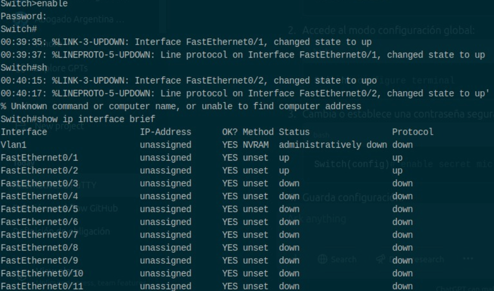
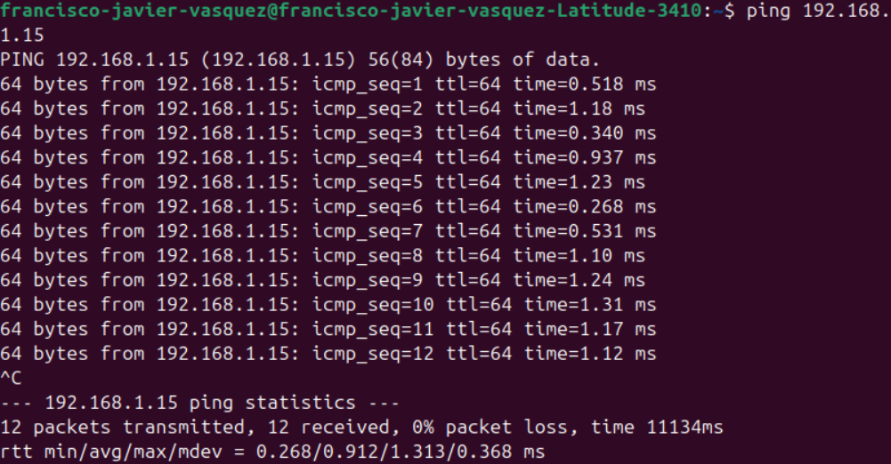
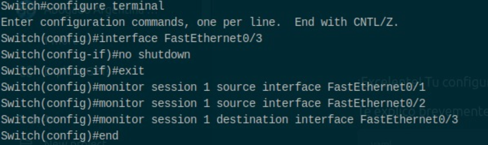
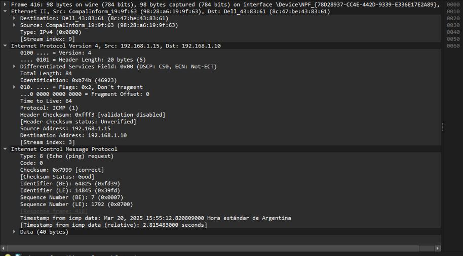
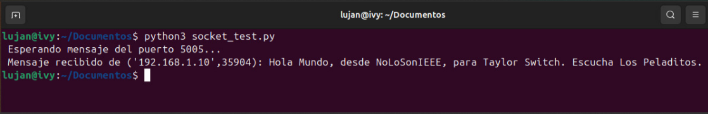
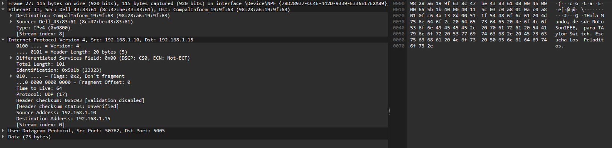
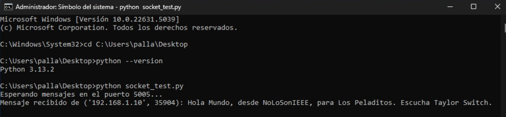

# Anexo TP1: Implementación Física de la Red Propuesta

## Resumen de Características - Cisco Catalyst 2950 Series

### 1. Concepto General
- **Switches fijos y gestionados de capa 2:** Conmutación 10/100 Mbps con uplinks Gigabit.
- **Cisco IOS Standard Image (SI):** Funcionalidades básicas de datos, voz y video.
- **Administración web integrada:** Cisco Device Manager y Cisco Network Assistant.

### 2. Modelos Principales
| Modelo                 | Puertos Fast Ethernet | Uplinks |
|------------------------|----------------------|---------|
| **Cisco Catalyst 2950SX-48** | 48 × 10/100 Mbps  | 2 × 1000BASE-SX (fibra) |
| **Cisco Catalyst 2950T-48**  | 48 × 10/100 Mbps  | 2 × 10/100/1000BASE-T (cobre) |
| **Cisco Catalyst 2950SX-24** | 24 × 10/100 Mbps  | 2 × 1000BASE-SX (fibra) |
| **Cisco Catalyst 2950-24**   | 24 × 10/100 Mbps  | No |
| **Cisco Catalyst 2950-12**   | 12 × 10/100 Mbps  | No |

### 3. Rendimiento y Disponibilidad
- **Ancho de banda de conmutación:** Hasta **13.6 Gbps**.
- **Wire-speed switching** en todos los puertos.
- **Spanning Tree Protocol (STP, RSTP, MSTP, PVST+):** Redundancia sin bucles.
- **EtherChannel / LACP:** Agregación de enlaces para mayor ancho de banda.
- **Soporte de RPS (fuente de alimentación redundante).**

### 4. Funciones de Seguridad
- **802.1X (autenticación por puerto).**
- **Port Security:** Control de acceso por MAC address.
- **SSHv2:** Administración segura por CLI.
- **TACACS+ / RADIUS:** Integración con servidores de autenticación.
- **Private VLAN Edge:** Aislamiento de puertos en el switch.
- **SNMPv3 (no criptográfico):** Monitoreo seguro.

### 5. Calidad de Servicio (QoS)
- **802.1p (CoS) y clasificación de tráfico por puerto.**
- **4 colas de prioridad por puerto (Strict Priority / WRR).**
- **Soporte para priorización de tráfico de voz y video.**

### 6. Administración
- **Cisco Device Manager:** Configuración vía navegador.
- **Cisco Express Setup:** Inicio rápido sin CLI.
- **Cisco Network Assistant:** Gestión centralizada de múltiples switches.
- **SNMP (v1, v2, v3) y RMON:** Monitoreo y estadísticas.
- **CiscoWorks:** Gestión avanzada de red.

### 7. Características Físicas y Consumo
- **Factor de forma:** 1U, rackeable.
- **Dimensiones:** De **9.52” a 13” de profundidad** (según modelo).
- **Peso:** Entre **6.5 lb y 10.5 lb**.
- **Temperatura de operación:** 0°C a 45°C.
- **Consumo:** Entre **30W y 45W** según el modelo.


## Procedimientos realizados para la Configuración y Administración de la Red

### a. Conectar una PC al puerto de consola del switch Cisco a 9600 baudios utilizando PuTTY
- [x] **Preparar conexión física:**
  - [x] Conectar el cable de consola (RJ-45 a DB-9 o USB a RJ-45) entre la PC y el switch.
  - [x] Verificar el puerto COM asignado en la PC (p. ej., usando el Administrador de Dispositivos).
- [x] **Configurar y abrir PuTTY:**
  - [x] Ejecutar PuTTY.
  - [x] Seleccionar el modo **Serial**.
  - [x] Ingresar los parámetros:
    - **Puerto COM:** (ejemplo: COM3)
    - **Baud rate:** 9600
    - **Data bits:** 8
    - **Parity:** Ninguna
    - **Stop bits:** 1
    - **Flow control:** Ninguno
  - [ ] (Opcional) Iniciar PuTTY desde la línea de comandos\
    ***Fue realizado mediante la GUI***
    ```
    putty.exe -serial COM3 -sercfg 9600,8,n,1,N
    ```

### b. Acceder a las opciones de administración del switch y modificar claves de acceso
  > *Para esta parte de la experiencia y la configuración en general, se utilizó una cuarta PC, perteneciente a uno de los integrantes de Los Peladitos, aunque fue hecha de manera inter-grupal entre Los Peladitos, NoLoSonIEEE y Taylor Switch.*

- [x] **Acceder al switch:**
  


  - [x] Conectar la PC al switch (vía consola o mediante conexión Ethernet a la IP de administración).
  - [x] Iniciar sesión usando PuTTY (o navegador si es vía web).
- [x] **Ingresar al modo privilegiado y de configuración:**
  - [x] Ingresar el comando para modo privilegiado:
    ```
    enable
    ```
  - [x] Entrar al modo de configuración global:
    ```
    configure terminal
    ```
- [x] **Modificar claves de acceso:**
  > Una vez concluída la actividad, la contraseña fue reestablecida a la original ilustrada en el rótulo del dispositivo conmutador.

  - [x] Cambiar la contraseña del modo privilegiado:
    ```
    enable secret [nueva_contraseña]
    ```
  - [ ] (Opcional) Configurar contraseñas para acceso remoto (línea VTY):  
      **Omisión debido al hecho de que utilizamos la Consola mediante el conector Rs 232.**
    ```
    line vty 0 15
    password [nueva_contraseña_vty]
    login
    exit
    ```
- [x] **Guardar la configuración:**
  - [x] Ejecutar:
    ```
    copy running-config startup-config
    ```

### c. Conectar dos computadoras al switch, configurar una red y testear conectividad
- [x] **Conexión física:**
  - [x] Conectar cada computadora a un puerto del switch usando cables Ethernet (Verificado mediante la Figura a1).
   - [x] Verificar que las luces de enlace en los puertos estén activas.
  
    \
    *Figura a1. Demostración de los puertos del Switch Up & Running desde PC 4 (PC de Configuración).*
 
- [x] **Configurar direcciones IP en cada computadora:**
  - [x] En PC1 (es decir la perteneciente al grupo nuestro, NoLoSonIEEE), asignar la IP estática (192.168.1.10/24).
  - [x] En PC2 (correspondiente al grupo de Taylor Switch), asignar una IP estática (192.168.1.15/24).\
  
  Ambos ítems fueron realizados mediante los comandos:
  ```
  sudo ip addr add 192.168.1.10/24 dev eno1
  ```
  ```
  sudo ip addr add 192.168.1.15/24 dev eno1
  ```
- [x] **Testear conectividad:**
  - [x] En PC1, abrir la terminal y ejecutar:
    ```
    ping 192.168.1.15
    ```
  - [x] Verificar que se reciben respuestas de PC2 (Figura a2).
- 
    \
  *Figura a2. Ping exitoso realizado desde PC1 (NoLoSonIEEE) a PC2 (TaylorSwitch).* 

### d. Configurar un puerto del switch en modo mirroring y monitorear, con una tercera computadora, el tráfico entre las dos computadoras conectadas en el procedimiento c.
- [x] **Conexión física:**
  - [x] Conectar la tercera computadora al switch usando un cable Ethernet.
- [x] **Configurar port mirroring en el switch: (Figura a3)**
  
    \
  *Figura a3. Configuración de Mirroring desde PC 4 (PC de Configuración).*

  - [x] Acceder al modo de configuración:
    ```
    configure terminal
    ```
  - [x] Configurar la sesión de monitorización (ejemplo: sesión 1):
    - [x] Establecer el puerto fuente (GigabitEthernet0/2):
      ```
      monitor session 1 source interface GigabitEthernet0/2
      ```
    - [x] Establecer el puerto de destino (GigabitEthernet0/3, conectado a la PC de monitoreo):
      ```
      monitor session 1 destination interface GigabitEthernet0/3
      ```
  

- [x] **Guardar la configuración:**
  - [x] Ejecutar:
    ```
    copy running-config startup-config
    ```
- [x] **Monitorear tráfico ICMP:**
  - [x] En la tercera computadora, abrir una herramienta de análisis de red (En este caso se utilizo Wireshark).
  - [x] Iniciar la captura en la interfaz correspondiente.
  - [x] Mientras se ejecuta el comando `ping` entre PC1 y PC2 (Figura a2) y viceversa, observar el tráfico capturado (Figura a4).

  
  \
  *Figura a4. Ping exitoso siendo realizado desde PC2 (TaylorSwitch) hacia PC1 (NoLoSonIEEE). Interceptado mediante Wireshark por PC3 (Los Peladitos).*


- [x] **Monitorear tráfico de un paquete UDP personalizado:**
  - [x] Entre PC1 y PC2 se envía, mediante un script de python, el payload "Hola mundo desde NoLoSonIEEE para Taylor Switch. Escucha Los Peladitos" $^1$ (en formato binario; Recepción visualizada en la Figura a5).

    
    ```
    # Código de Emisión
    import socket

    ip_destino = '192.168.1.15'
    puerto = 5005

    mensaje = b'Hola Mundo, desde NoLoSonIEEE, para Taylor Switch. Escucha Los Peladitos.'

    sock = socket.socket(socket.AF_INET, socket.SOCK_DGRAM)
    sock.sendto(mensaje, (ip_destino, puerto))
    sock.close()

    ```

    ```
    # Código de Recepción
    import socket

    # Configurar socket UDP
    ip_local = "192.168.1.10"  
    puerto = 5005         

    sock = socket.socket(socket.AF_INET, socket.SOCK_DGRAM)
    sock.bind((ip_local, puerto))

    print(f"Esperando mensaje del puerto {puerto}...")

    while True:
        data, addr = sock.recvfrom(1024)  # Recibir hasta 1024 bytes
        print(f"Mensaje recibido de {addr}: {data.decode()}")
    ```
    \
  *Figura a5. Recpeción del tráfico UDP por Taylor Switch, enviado por NoLoSonIEEE.*
  - [x] Debido al Mirroring, Los Peladitos escucharán el mensaje y serán capaces de interceptar el payload (Ver Figura a6).
  

  \
  *Figura a6. Intercepción del tráfico UDP desde PC 3 con el mensaje "Hola Mundo, desde NoLoSonIEEE, para Taylor Switch. Escucha Los Peladitos." (Se aprecia a la derecha)*

## Observaciones
- $^1$ En el medio del procedimiento se generó una fe de erratas con respecto a la capitalización de la letra *a* en el nombre del grupo "Taylor Switch". Esto fue corregido en instancias dispares a las capturas, de ahí la discrepancia tipográfica de esta letra entre el mensaje obtenido (Figura a5) y el mensaje interceptado (Figura a6).
- El procedimiento se repitió parcialmente bajo la dinámica "envía NoLoSonIEEE, recibe Los Peladitos, escucha Taylor Switch". Sin embargo, el tiempo se acabo antes de poder culminar con la tarea repetida. De todas maneras, la Figura a7 ilustra el evento de recepción.
\
*Figura a7. Envío alternativo del mensaje UDP, desde NoLoSonIEEE hacia Los Peladitos (Grupo que en la experiencia anterior escuchó en el puerto de mirroring), usando la dirección IP de recepción 192.168.1.11/24*
