# Trabajo Práctico N° 1: Configuración y Análisis de Tráfico IPv4/IPv6

**Grupo**  
*NoLoSonIEEE*

**Integrantes**  
*Fernando E. Stefanovic Carroza*  
*Francisco J. Vásquez*  
*Sofía A. Ávalos*  
*Sofía Viale*  
*Tomás G. Daniel*

**Institución Educativa**  
*Universidad Nacional de Córdoba \- Facultad de Ciencias Exactas, Físicas y Naturales*

**Curso**  
*Cátedra de Redes de Computadoras \- Ciclo Lectivo 2025*

**Profesores**  
*Facundo N. Oliva Cuneo*  
*Santiago M. Henn*

**Fecha**  
*20/03/2025*

### Información de los Autores

**Fernando E. Stefanovic Carroza:** [*fernando.stefanovic@mi.unc.edu.ar*](mailto:fernando.stefanovic@mi.unc.edu.ar)  
**Sofia Viale:** [*sofia.viale@mi.unc.edu.ar*](mailto:sofia.viale@mi.unc.edu.ar)  
**Francisco J. Vásquez:**: [*javier.vasquez@mi.unc.edu.ar*](mailto:javier.vasquez@mi.unc.edu.ar)  
**Tomas G. Daniel:** [*tomas.daniel@mi.unc.edu.ar*](mailto:tomas.daniel@mi.unc.edu.ar)  
**Sofía Aldana Ávalos** [*aldana.avalos@mi.unc.edu.ar*](mailto:aldana.avalos@mi.unc.ed.ar)

## Resumen
En este trabajo se llevó a cabo la configuración y análisis de una red de computadoras con soporte para IPv4 e IPv6. Se implementó un esquema de interconexión utilizando dispositivos de red que permiten la comunicación entre distintas subredes, evaluando la correcta operación del enrutamiento y la resolución de direcciones. Para verificar la integridad de la red, se realizaron pruebas funcionales mediante el uso de comandos ping y herramientas de captura de tráfico, analizando los mensajes ICMP generados. Se inspeccionaron en detalle los protocolos ARP y NDP, observando su rol en la comunicación y comparación en ambos entornos de direccionamiento. Los resultados obtenidos permitieron validar el correcto funcionamiento de la infraestructura de red, asegurando la conectividad entre dispositivos y la efectividad de los protocolos utilizados.

**Palabras clave**: _Redes de computadoras, IPv4, IPv6, ICMP, ARP, NDP, enrutamiento, conectividad._

## Introducción

El crecimiento de las redes de computadoras ha impulsado la necesidad de protocolos eficientes que permitan la comunicación entre dispositivos en distintos entornos. IPv4 ha sido el estándar predominante, pero su limitación en el espacio de direccionamiento ha motivado la transición progresiva hacia IPv6, el cual ofrece mayor escalabilidad y eficiencia en la gestión de la red.

En este trabajo se implementó una infraestructura de red utilizando ambas versiones del protocolo IP para evaluar su funcionamiento y comportamiento en términos de conectividad y resolución de direcciones. Se estableció un esquema de interconexión que involucra múltiples dispositivos y se realizaron pruebas de tráfico utilizando ICMP e ICMPv6.

El objetivo principal fue analizar la integridad de la red a nivel funcional y protocolar, inspeccionando los mecanismos de descubrimiento de vecinos y enrutamiento. Para ello, se utilizaron herramientas de simulación que permitieron evaluar el flujo de paquetes y la interacción entre los protocolos de capa de red y enlace de datos.

Este análisis proporciona una comprensión detallada sobre las diferencias y similitudes en la operación de IPv4 e IPv6, destacando el reemplazo de ARP por NDP en la nueva versión del protocolo y la eliminación del concepto de broadcast en favor de multicast. A través de este estudio, se validó la correcta configuración de la red y se verificó su operatividad en distintos escenarios de comunicación.

## Marco Teórico

### Principio de la Interconexión entre Redes

La interconexión de redes es esencial para el diseño y la operatividad de las infraestructuras de comunicación, ya que **posibilita la comunicación entre dispositivos y sistemas distribuidos en redes diferentes**. Para asegurar la interoperabilidad entre equipos de diversos fabricantes y tecnologías, la comunicación se organiza en capas, según modelos como el OSI (Open Systems Interconnection) y la arquitectura TCP/IP. Cada capa cumple funciones específicas que, en conjunto, facilitan la compatibilidad y el intercambio eficiente de información entre sistemas heterogéneos, como el que se muestra en la Figura 1.

\
_Figura 1. Interconexión típica de Redes._

### Importancia de la Arquitectura en Capas

Dentro del contexto de la interconexión de redes, se evidencia la adopción del patrón arquitectónico basado en capas. Este enfoque permite descomponer funciones complejas en módulos independientes, facilitando tanto el diseño como el mantenimiento de las infraestructuras. Cada capa asume responsabilidades específicas—desde la transmisión de bits hasta el enrutamiento y la gestión de aplicaciones—permitiendo que distintos protocolos y tecnologías interactúen de manera estructurada y eficiente. Esta organización modular no solo simplifica la implementación y solución de problemas, sino que también logra una de las mejores características que puede existir para las tecnologías que gobiernan nuestra actualidad: **la interoperabilidad entre dispositivos heterogéneos**, abarcando diferencias entre fabricantes, arquitecturas, propósitos e incluso grados de obsolescencia.

### Dispositivos de Red

Debido a la adopción de la arquitectura basada en capas en los sistemas de red, **surge de manera natural la especialización de dispositivos para cada capa específica**. Se utilizan, por ejemplo e ilustrados en la Figura 2, enrutadores o routers para gestionar las operaciones de la capa de red, encargados del encaminamiento y la determinación de rutas óptimas, y conmutadores o switches, que operan en la capa de enlace, facilitando la transmisión de datos en el ámbito local. Además, existen otros dispositivos especializados como puntos de acceso, firewalls y servidores proxy, que complementan la infraestructura, contribuyendo a la seguridad y al control del tráfico de datos en la red.

\
_Figura 2. Dispositivos de Red Típicos._

#### El rol de los Switches en las Redes
En una red, los switches desempeñan un papel crucial en la entrega eficiente de tramas Ethernet dentro de una misma subred. Mientras que los routers operan en la Capa 3 (Red) y son responsables de la interconexión entre redes distintas, los switches trabajan en la Capa 2 (Enlace de Datos), facilitando la comunicación entre dispositivos dentro de la misma red local.

Los switches almacenan direcciones MAC en una tabla de conmutación o tabla CAM (Content Addressable Memory), lo que les permite reenviar tramas únicamente a los puertos donde se encuentran los dispositivos de destino, en lugar de retransmitirlas a toda la red. Este proceso optimiza la eficiencia y reduce la congestión dentro del dominio de broadcast.

Dado que el switch no opera en la capa de red, no requiere una dirección IP para su funcionamiento en una red conmutada. Sin embargo, algunos switches administrables permiten configurar direcciones IP para su gestión remota.

En el contexto del presente trabajo, el switch interconecta los hosts h2 y h3, facilitando la transmisión de tramas dentro de la subred 192.168.2.0/24 en IPv4 y 2001:aaaa:cccc:1::/64 en IPv6, permitiendo la comunicación sin necesidad de un router cuando ambos dispositivos se encuentran en la misma red.

### Cómo los Dispositivos de Red Comunican Datos

El proceso de comunicación entre dispositivos de red se basa en el **principio de encapsulación de datos**. Conforme la información desciende por las capas del modelo, cada nivel añade su propia información de control en forma de encabezados (y, en algunos casos, trailers) al paquete original. Estos encabezados contienen datos específicos—como direcciones de origen y destino, protocolos de control y mecanismos de verificación—que aseguran que la información se transmita de forma íntegra y llegue correctamente a su destino. Durante el trayecto, routers y switches realizan **procesos de verificación y decapsulación parcial**, analizando la dirección de destino para elegir la ruta más adecuada mediante el encaminamiento (routing) y transfiriendo el paquete a la siguiente etapa mediante el reenvío (forwarding).

Además, en cada nodo intermedio de la red, los dispositivos aplican algoritmos que analizan factores críticos como la congestión, el número de saltos (hops) y la disponibilidad de rutas, permitiendo así evitar cuellos de botella y optimizar la entrega de datos. **Los mecanismos de control de congestión y calidad de servicio** (QoS) desempeñan un papel clave en redes complejas, priorizando paquetes críticos—como aquellos utilizados en aplicaciones sensibles a la latencia, como VoIP o transmisión en tiempo real—sobre otros tipos de tráfico. En conjunto, estos procesos permiten que, incluso en condiciones de alta demanda o en presencia de fallos, los dispositivos puedan redirigir los paquetes a través de rutas alternativas, manteniendo la integridad y el rendimiento del sistema de comunicación.

### Enfoques de Interconexión: Orientado a Conexión vs. Sin Conexión

La interconexión de redes puede clasificarse en dos enfoques principales: orientado a conexión y sin conexión. Cada uno presenta características distintas que determinan cómo se establece y mantiene la comunicación entre dispositivos.

En el enfoque **orientado a conexión**, se establece un canal de comunicación antes de enviar cualquier dato. Este método garantiza una entrega ordenada y confiable de los paquetes, asegurando que cada uno siga la misma ruta y llegue en el orden correcto. El **Protocolo de Control de Transmisión** (TCP, por sus siglas en inglés) es un ejemplo de este tipo de comunicación. TCP proporciona mecanismos de control de errores y retransmisión en caso de pérdida, asegurando que todos los paquetes enviados sean recibidos y ensamblados correctamente en el destino.

Por otro lado, la **interconexión sin conexión** no requiere la creación previa de un canal antes del envío de datos. Los paquetes se transmiten de manera independiente y pueden tomar rutas distintas según el estado actual de la red. Un ejemplo característico de este enfoque es el **Protocolo de Internet** (IP), el cual no garantiza ni la entrega ni el orden de los paquetes, delegando esta responsabilidad a los dispositivos receptores, que deben encargarse del reensamblado y detección de errores.

El enfoque sin conexión brinda mayor flexibilidad y eficiencia en redes dinámicas, ya que permite que los paquetes tomen rutas distintas en caso de congestión o fallos en la infraestructura. Sin embargo, como IP no garantiza la entrega de los paquetes ni su orden de llegada, es necesario utilizar protocolos adicionales en las capas superiores, como TCP, cuando se requiere una comunicación fiable. TCP complementa a IP proporcionando control de errores, confirmación de entrega y reensamblado de los paquetes en el orden correcto, asegurando así una transmisión de datos más confiable en aplicaciones que lo necesiten.

### Cómo los Dispositivos de Red se Identifican y Enrutan en la Red

En una red, cada dispositivo necesita un identificador único que le permita ser reconocido dentro del entorno de comunicación. En el nivel más básico, esta función es realizada por la **dirección MAC (Media Access Control)**, un identificador asignado de forma única a cada tarjeta de red durante su fabricación. Esta dirección, representada en un formato hexadecimal, está asociada físicamente al hardware y permite la comunicación entre dispositivos dentro de una misma red local.

Sin embargo, en redes más amplias y estructuradas, donde la comunicación no se limita a un solo segmento de red, es necesario un esquema de direccionamiento que permita la identificación y localización de dispositivos a través de múltiples redes. Para ello, entra en juego el **Protocolo de Internet** (IP), que asigna a cada dispositivo una dirección lógica que puede cambiar dependiendo de la red en la que se encuentre. Esta dirección IP, utilizada en conjunto con mecanismos de enrutamiento, permite que los paquetes de datos sean dirigidos de manera eficiente desde un origen hasta su destino, incluso a través de diferentes redes interconectadas.

IP es el pilar fundamental de la comunicación en Internet y en redes privadas, operando en la **capa de red** del modelo OSI y formando parte de la suite de protocolos TCP/IP. A lo largo de su evolución, se han desarrollado dos versiones principales: **IPv4 e IPv6**, cada una con características diseñadas para responder a los desafíos del crecimiento exponencial de dispositivos conectados y la necesidad de mayor seguridad y eficiencia en la transmisión de datos.

#### IPv4: La Base del Protocolo IP

El **Protocolo de Internet versión 4** (IPv4) ha sido el estándar dominante en redes desde la década de 1980\. Utiliza direcciones de 32 bits, lo que permite aproximadamente 4.3 mil millones de direcciones únicas. Si bien esta cantidad era suficiente en sus inicios, el crecimiento exponencial de dispositivos conectados ha generado una escasez de direcciones, lo que ha requerido la implementación de soluciones temporales como la **Traducción de Direcciones de Red** (NAT, Network Address Translation). NAT permite que múltiples dispositivos dentro de una red privada compartan una única dirección IP pública, mitigando la falta de direcciones, pero a costa de generar problemas en ciertas aplicaciones, aumentando la latencia y dificultando la conectividad extremo a extremo.

Otro inconveniente de IPv4 es su dependencia de mecanismos como **DHCP (Dynamic Host Configuration Protocol)** para la asignación de direcciones IP. En redes dinámicas con una alta rotación de dispositivos, este método puede generar una mayor complejidad en la administración y en la configuración inicial de la red.

El protocolo opera mediante el envío de datagramas, donde cada paquete es tratado de forma independiente y puede tomar rutas diferentes hasta su destino. Aunque esto proporciona flexibilidad, también introduce desafíos como el desorden en la recepción o la pérdida de paquetes, problemas que son resueltos mediante protocolos complementarios como **TCP**, que garantiza el reensamblado y la integridad de los datos.

A pesar de haber sido un pilar fundamental en la evolución de Internet, las limitaciones de IPv4 en términos de espacio de direcciones, seguridad y eficiencia en la transmisión fueron evidenciandose al punto en el que cada día esta tecnología se acerca a un estado de obsolescencia.

#### IPv6: La Evolución Necesaria

**El Protocolo de Internet versión 6** (IPv6) fue diseñado para superar las limitaciones inherentes a IPv4 y asegurar un crecimiento sostenible de Internet. La característica más destacada de IPv6 es el uso de direcciones de 128 bits, lo que permite un espacio de direcciones irrisoriamente grande, asegurando la escalabilidad del Internet en el futuro. Esta expansión es crucial ante el crecimiento exponencial del Internet de las Cosas (IoT) y el aumento constante de dispositivos conectados.

Además del aumento en la cantidad de direcciones, IPv6 introduce mejoras sustanciales en la eficiencia y seguridad de las comunicaciones. Su estructura de encabezados está optimizada para reducir la carga de procesamiento en los routers, lo que mejora el rendimiento en la transmisión de paquetes. En términos de seguridad, IPv6 incorpora de manera nativa mecanismos como **IPSec**, que garantizan la autenticación y cifrado de los datos, fortaleciendo la protección frente a ataques e interceptaciones.

Otra característica destacada es la capacidad de los dispositivos para autoconfigurarse sin necesidad de un servidor DHCP, mediante un proceso conocido como **Stateless Address Autoconfiguration** (SLAAC), lo que simplifica la administración de redes. Asimismo, IPv6 ofrece una mejor gestión de la calidad de servicio (*QoS*), permitiendo la priorización de ciertos tipos de tráfico, como aquellos sensibles a la latencia, optimizando así el rendimiento de aplicaciones en tiempo real como videoconferencias o transmisión de contenido en vivo.

A pesar de sus ventajas, la adopción de IPv6 ha sido gradual debido a la necesidad de compatibilidad con la infraestructura IPv4 existente. Para facilitar la transición, se han desarrollado mecanismos como **dual stack**, que permite el funcionamiento simultáneo de ambos protocolos en una misma red, y **túneles IPv6 sobre IPv4**, utilizados para garantizar la conectividad entre dispositivos en redes mixtas.

En la Figura 3, se ilustra las diferencias entre datagramas de ambas versiones.

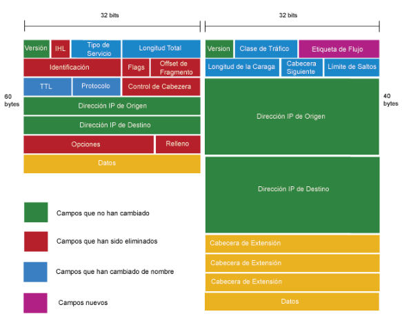\
_Figura 3. Datagrama IPv4 (Izquierda) versus IPv6 (Derecha)._
### Cómo los Dispositivos Encuentran y Contactan a Otros en la Red

Para que los dispositivos en una red puedan comunicarse, es necesario que sepan cómo dirigirse a su destino. Sin embargo, mientras que la **dirección IP** permite identificar de manera lógica a un dispositivo dentro de una red o a través de múltiples redes, la **dirección MAC** es la que realmente permite la entrega de paquetes en el nivel físico dentro de la misma red local. Debido a esto, es esencial contar con mecanismos que permitan asociar estas dos direcciones de manera eficiente.

En **IPv4**, esta tarea es realizada por el **Address Resolution Protocol** (ARP), mientras que en **IPv6** se emplea el **Neighbor Discovery Protocol** (NDP). Ambos protocolos permiten que un dispositivo pueda encontrar la dirección física correspondiente a una dirección IP antes de enviar paquetes de datos.

#### Direcciones Broadcast vs. Multicast en IPv4
Las direcciones broadcast permiten enviar mensajes a todos los dispositivos dentro de una red. Por ejemplo, la dirección 255.255.255.255 alcanza toda la red, mientras que 192.168.2.255 solo impacta a los hosts dentro de la subred 192.168.2.0/24. Este mecanismo es común en protocolos como ARP y DHCP, donde un dispositivo necesita comunicarse con todos los demás para obtener información. Sin embargo, puede generar tráfico innecesario al involucrar equipos que no requieren el mensaje.

Por otro lado, multicast dirige el tráfico solo a un grupo de dispositivos interesados, sin afectar al resto. Funciona dentro del rango de direcciones 224.0.0.0 a 239.255.255.255 y se usa en aplicaciones como streaming de video o protocolos de enrutamiento, optimizando el ancho de banda al evitar envíos masivos innecesarios. Mientras el broadcast impacta a toda la red, el multicast es más eficiente al limitar la difusión solo a quienes lo necesitan.

#### ARP en IPv4: Traducción de Direcciones para la Comunicación Local

En redes basadas en **IPv4**, ARP es el protocolo encargado de encontrar la dirección MAC asociada a una dirección IP dentro de la misma red local (véase la Figura 4). Cuando un dispositivo necesita enviar un paquete, pero desconoce la dirección MAC del destino, realiza una consulta mediante un **mensaje ARP broadcast**, que es recibido por todos los dispositivos en la red.

El dispositivo cuya dirección IP coincide con la consulta responde enviando un **mensaje ARP unicast**, proporcionando su dirección MAC al emisor. Para optimizar futuras comunicaciones, esta información se almacena en la **tabla ARP** del dispositivo solicitante, evitando la necesidad de repetir el proceso con cada nuevo paquete enviado.

Durante simulaciones en **Packet Tracer**, es posible observar este proceso al analizar el tráfico **ICMP** entre dispositivos. Por ejemplo, al ejecutar un **ping** entre dos clientes, el primer dispositivo enviará una solicitud ARP antes de poder comunicarse, asegurando que los paquetes ICMP sean entregados correctamente al destino.

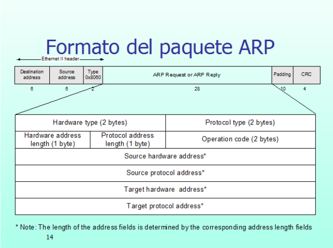\
_Figura 4. Formato del Paquete ARP._

#### Tipos de Direcciones IPv6 y su Uso
IPv6 introduce distintos tipos de direcciones, cada una con un propósito específico:

- Direcciones Link-Local: Se asignan automáticamente a cada interfaz y solo son válidas en el segmento de red local (ejemplo: fe80::1). Se usan para descubrimiento de vecinos y configuración automática.

- Direcciones Unique-Local: Similar a las direcciones privadas en IPv4 (192.168.x.x), utilizadas para redes internas sin necesidad de acceso a Internet (ejemplo: fd00::/8).

- Direcciones Global Unicast: Son únicas en todo Internet y se utilizan para la comunicación global. Se obtienen a través de un proveedor de servicios o asignadas por una autoridad de direcciones IP (ejemplo: 2001:db8::1).

Cada tipo de dirección tiene un caso de uso específico: Link-Local para comunicación interna en la red, Unique-Local para redes privadas y Global Unicast para comunicación externa en Internet.

#### Multicast en IPv6 y Eliminación del Broadcast

IPv6 elimina completamente el concepto de broadcast y en su lugar utiliza multicast para la comunicación con múltiples dispositivos de manera eficiente. Algunas direcciones multicast destacadas en IPv6 incluyen:

FF02::1: Todos los nodos en la red local.

FF02::2: Todos los routers en la red local.

FF02::1:FFXX:XXXX: Dirección especial utilizada en mensajes de Neighbor Solicitation.

#### NDP en IPv6: Más que una Simple Resolución de Direcciones

A diferencia de IPv4, IPv6 no utiliza ARP, sino que emplea el Neighbor Discovery Protocol (NDP), un mecanismo más eficiente que no solo resuelve direcciones IP a MAC, sino que también cumple otras funciones esenciales dentro de la administración de la red.

NDP opera mediante mensajes ICMPv6, eliminando la necesidad de broadcast y reemplazándolo por mensajes multicast dirigidos, lo que reduce la congestión en la red y mejora la escalabilidad. A través de estos mensajes, los dispositivos no solo pueden obtener la dirección MAC de un vecino, sino también detectar su disponibilidad y verificar si ha cambiado de dirección. Además, los routers pueden anunciar su presencia y proporcionar información para que los dispositivos configuren automáticamente sus direcciones sin necesidad de un servidor DHCP.

Los tipos de mensajes NDP incluyen:

- Neighbor Solicitation (NS): Utilizado para solicitar la dirección MAC de una dirección IPv6 específica.

- Neighbor Advertisement (NA): Responde a un NS con la dirección MAC del dispositivo.

- Router Solicitation (RS): Un host lo envía para descubrir routers disponibles en la red.

- Router Advertisement (RA): Un router anuncia su presencia y proporciona información de configuración de red.

- Redirect: Permite a los routers indicar mejores rutas a los hosts.

### Control y Diagnóstico de Redes: Uso de ICMP

Para garantizar el correcto funcionamiento de las redes, el **Protocolo de Control de Mensajes de Internet (ICMP)** permite la detección de errores y la prueba de conectividad entre dispositivos. Herramientas como **ping** y **traceroute** utilizan ICMP para diagnosticar problemas, evaluar tiempos de respuesta y detectar pérdida de paquetes.

Además, herramientas avanzadas como **Wireshark** permiten capturar tráfico ICMP en tiempo real, facilitando la identificación de errores y la optimización del rendimiento de la red. La combinación de ICMP con herramientas de monitoreo es clave para la administración eficiente de redes modernas.

### Emulación y Simulación de Entornos de Red

Los simuladores y emuladores son herramientas fundamentales para el análisis y prueba de infraestructuras de red. Aunque comparten ciertos objetivos, difieren en su metodología y aplicación.

Un **simulador de redes** modela el comportamiento de una red a través de cálculos matemáticos y representaciones lógicas, permitiendo evaluar protocolos, analizar el rendimiento en distintos escenarios y estudiar su comportamiento sin necesidad de hardware físico. Se emplea principalmente en investigación y desarrollo, ya que posibilita pruebas a gran escala con menor costo y mayor flexibilidad. Sin embargo, opera en tiempo no real, lo que permite un análisis más detallado de eventos específicos. Entre los más utilizados destacan **NS-3**, aplicado en estudios de redes móviles y protocolos de comunicación; **OMNeT++**, empleado en simulaciones de redes inalámbricas y sistemas distribuidos; y **QualNet**, diseñado para evaluar redes de gran escala.

En contraste, un **emulador de redes** replica en tiempo real el comportamiento de una red real, procesando tráfico auténtico e interactuando con dispositivos físicos. Esta capacidad lo hace ideal para pruebas de configuración, formación en redes y validación de infraestructuras antes de su implementación. Su uso es frecuente en la industria y la capacitación profesional, especialmente en certificaciones. Ejemplos destacados incluyen **GNS3**, que emula routers y switches de diversas marcas; **EVE-NG**, con una interfaz avanzada para laboratorios virtuales; y **Mininet**, utilizado en la simulación de redes definidas por software (SDN).

La diferencia esencial entre ambas herramientas radica en su propósito y nivel de interacción con el hardware. Mientras los **simuladores** permiten evaluar redes en escenarios hipotéticos sin requerir dispositivos físicos, los **emuladores** reproducen entornos en tiempo real, facilitando pruebas prácticas con configuraciones reales. Así, los primeros resultan idóneos para la investigación y el diseño de nuevos protocolos, mientras que los segundos se orientan al desarrollo, capacitación y validación de configuraciones en condiciones operativas.

En el desarrollo de esta experiencia, se utilizará el simulador **Packet Tracer** desarrollado por Cisco.

## Desarrollo

### Configuración y Arquitectura de la Red

Se ha configurado para esta experiencia una red compuesta por un router, un switch y tres computadoras interconectadas mediante direcciones IPv4 e IPv6, junto con un esquema dual de subredes, tal como se ilustra en la Figura 5.  
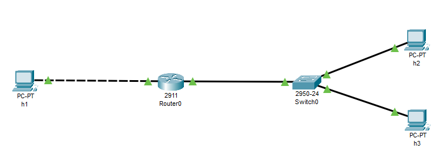\
_Figura 5. Esquema Topológico de la Red Propuesta._

De esta forma, el **Router 1** se configura con dos interfaces de red (Ver Figura 6):

* **eth0**, que conecta con la computadora **h1** en la subred **192.168.1.0/24** y utiliza la dirección **192.168.1.11** con IPv4 y **2001:aaaa:bbbb:1::11/64** con IPv6.  
* **eth1**, que conecta con un switch y pertenece a la subred **192.168.2.0/24**, con la dirección **192.168.2.12** en IPv4 y **2001:aaaa:cccc:1::12/64** en IPv6.

El **Switch 1** interconecta las computadoras **h2** y **h3**, que pertenecen a la subred **192.168.2.0/24**.

* **h2** tiene la dirección **192.168.2.10/24** en IPv4 y **2001:aaaa:cccc:1::10/64** en IPv6.  
* **h3** tiene la dirección **192.168.2.11/24** en IPv4 y **2001:aaaa:cccc:1::11/64** en IPv6.

Por último, la interfaz **eth0** del **Router 1** se conecta con la computadora **h1**, teniendo esta última la dirección **192.168.1.10/24** en IPv4 y **2001:aaaa:bbbb:1::10/64** en IPv6.

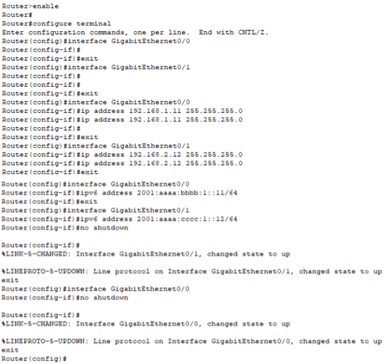\
_Figura 6. Comandos Emitidos para la Configuración del Router._

Cabe destacar que para el correcto funcionamiento del direccionamiento versión 6 es necesario para esta versión de Packet Tracer la activación del modo unicast para ipv6, como se indica en la Figura 7.

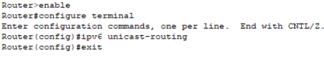\
_Figura 7. Configuración Adicional del Router para IPv6._

### Análisis Cualitativo de la Integridad de la Red

Para esta parte del análisis se intentará emitir el comando ping tanto en un ecosistema de versionado IPv4 como IPv6. De esta forma, se podrá analizar si el sistema funciona o no, con un carácter cualitativo y meramente funcional.

#### Verificación Cualitativa en IPv4: ICMP
En la Figura 8 se muestra con éxito el envío de ping del host 1 a los demás. En la Figura 9, se observa al host 2 enviando un ping exitoso a los otros dos hosts. Por último, en la Figura 10, se aprecia el mismo caso de éxito para el Host 3.

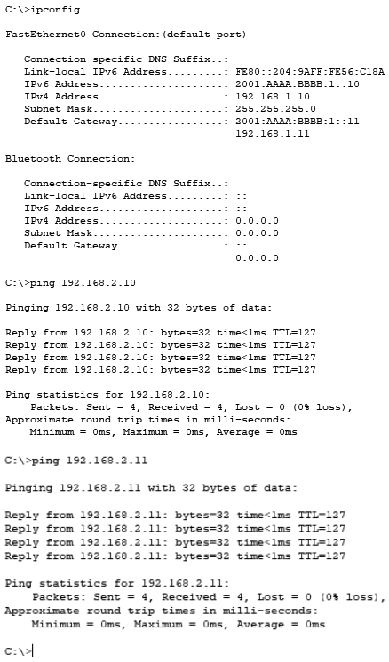\
_Figura 8. Resultado del comando Ping para el Host 1._

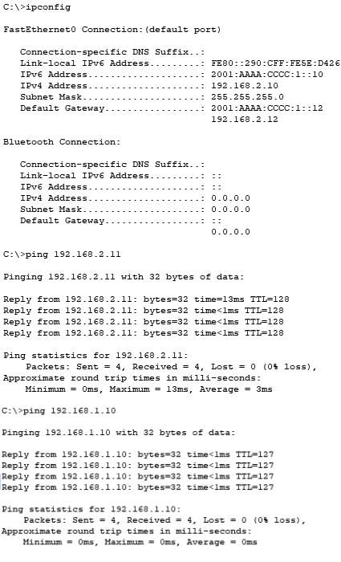\
_Figura 9. Resultado del comando Ping para el Host 2._

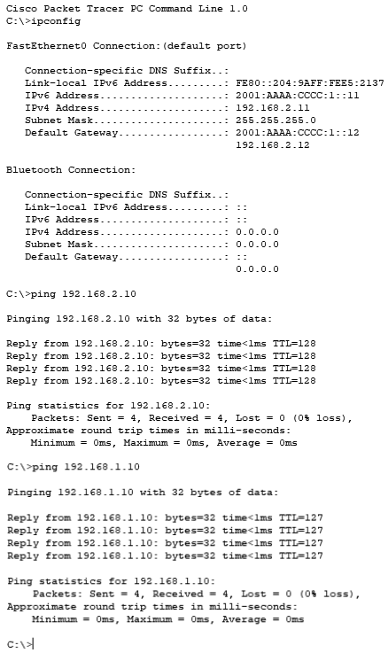\
_Figura 10. Resultado del comando Ping para el Host 3._

#### Verificación Cualitativa en IPv6: ICMPv6
En la figura 11, se muestra que el host 1 logra enviar pings exitosamente a los demás dispositivos. En la figura 12, se observa que el host 2 también consigue comunicarse sin inconvenientes con los otros dos hosts. Finalmente, en la figura 13, se verifica el mismo resultado satisfactorio para el host 3.

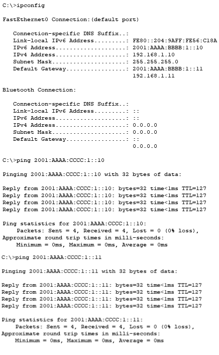\
_Figura 11. Resultado del comando Ping para el Host 1._

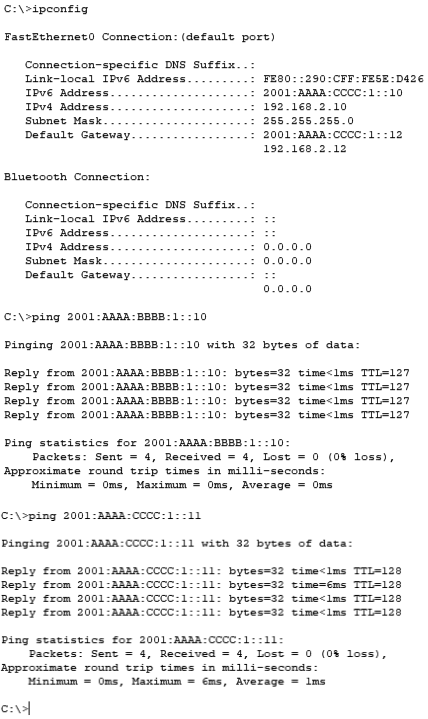\
_Figura 12. Resultado del comando Ping para el Host 2._

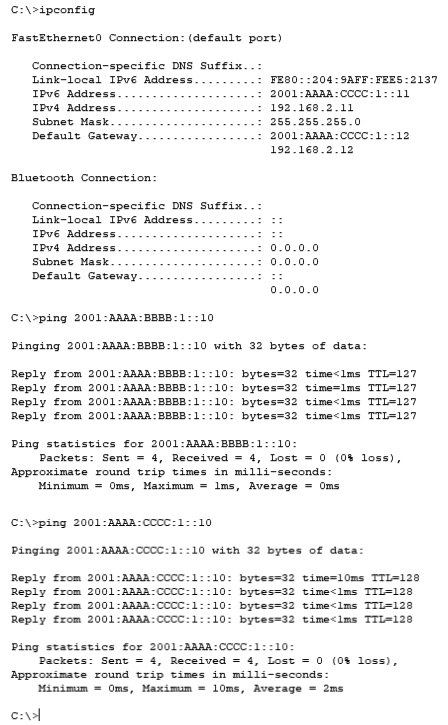\
_Figura 13. Resultado del comando Ping para el Host 3._

### Análisis Cuantitativo de la Integridad de la Red

En este apartado analítico se hará foco sobre el desglose y traducción de los datos y de los mecanismos internos que se manifiestan al realizar el comando ping (más concretamente, el esquema ICMP), por lo que se considerará de carácter cuantitativo y meramente estructural.

#### Verificación Cuantitativa en IPv4: ARP e ICMP

Cuando H1 intenta comunicarse con H2, primero verifica si la dirección MAC de H2 está en su tabla ARP. Como están en diferentes redes, H1 en realidad necesitará la dirección MAC del router (puerta de enlace predeterminada).

El proceso es el siguiente:

1. H1 envía una solicitud ARP, como se aprecia en la Figura 14.
   
   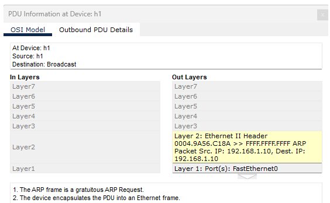\
   _Figura 14. Solicitud ARP de Host 1._
2. El router responde con su dirección MAC (Es el único dispositivo de la red, por lo que es el único que responde), como se aprecia en la Figura 15.
   
   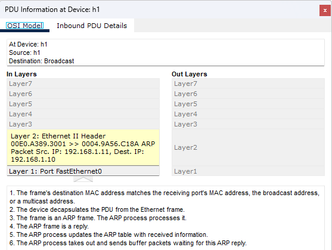\
    _Figura 15. Respuesta ARP del Router._

3. H1 encapsula el paquete ICMP en una trama Ethernet con la dirección MAC del router como destino.
4. El router, al recibir el paquete, verifica la dirección IP de destino y reenvía el paquete a H2 si conoce su dirección MAC.
5. Si el router no tiene la MAC de H2 en su tabla ARP, enviará otra solicitud ARP preguntando por la MAC de H2.
6. H2 responde con su dirección MAC, y entonces el router envía el paquete ICMP a H2.

Esta comunicación ICMP **entiende el origen y destino mediante la sección del datagrama correspondiente a ambas direcciones IP** (192.168.1.10 para el origen, 192.168.2.10 para el destino), tal como se muestra en la Figura 16.

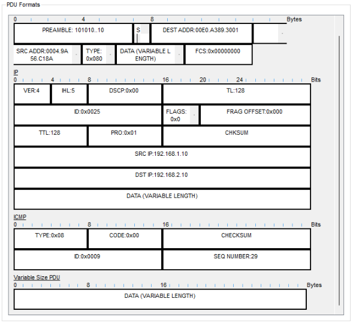\
_Figura 16. PDU del Mensaje ICMP_

Además, esta comunicación entre subredes es posible gracias al concepto de **tabla de enrutamiento**, donde el Router es capaz de discernir que lo mejor es enviar al paquete ICMP desde su interfaz **eth0** hacia su interfaz **eth1**, ya que en esta última se encuentra la **subred 192.168.2.0/24**, la misma que la del dispositivo de destino.

Una vez realizado el proceso, las tablas ARP de cada dispositivo se verá modificada. Si originalmente cada host no analizaba a sus vecinos mediante ARP en modo difusión, entonces la tabla ARP del host no involucrado sería nula. Sin embargo, el simulador Packet Tracer ejecuta solicitudes ARP desde un inicio al ver dispositivos con las tablas vacías, por lo que el resultado final para el Host 3 no es nulo. Para cada tabla ARP se brinda las Figuras 17, 18, 19 y 20 respectivamente para los Host 1, 2, 3 y el Router.

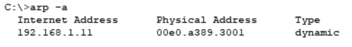\
_Figura 17. Tabla ARP de H1._

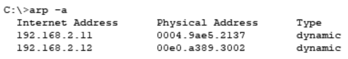\
_Figura 18. Tabla ARP de H2._

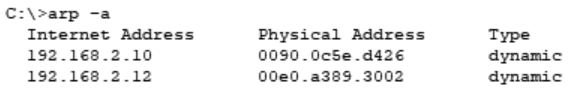\
_Figura 19. Tabla ARP de H3._

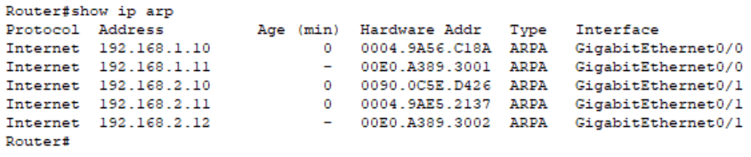\
_Figura 20. Tabla ARP del Router._
