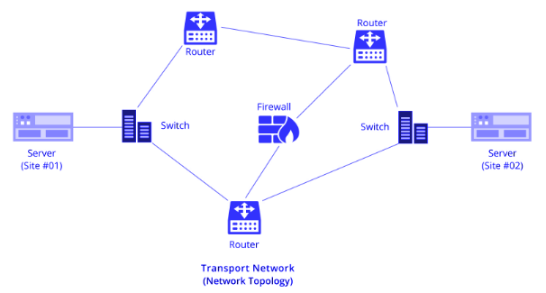
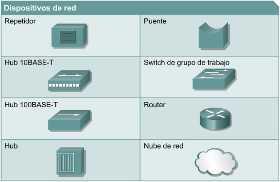

# Trabajo Práctico N° 1: Configuración y Análisis de Tráfico IPv4/IPv6

**Grupo**  
*NoLoSonIEEE*

**Integrantes**  
*Fernando E. Stefanovic Carroza*  
*Francisco J. Vásquez*  
*Sofía A. Ávalos*  
*Sofía Viale*  
*Tomás G. Daniel*

**Institución Educativa**  
*Universidad Nacional de Córdoba \- Facultad de Ciencias Exactas, Físicas y Naturales*

**Curso**  
*Cátedra de Redes de Computadoras \- Ciclo Lectivo 2025*

**Profesores**  
*Facundo N. Oliva Cuneo*  
*Santiago M. Henn*

**Fecha**  
*20/03/2025*

### Información de los Autores

**Fernando E. Stefanovic Carroza:** [*fernando.stefanovic@mi.unc.edu.ar*](mailto:fernando.stefanovic@mi.unc.edu.ar)  
**Sofia Viale:** [*sofia.viale@mi.unc.edu.ar*](mailto:sofia.viale@mi.unc.edu.ar)

\[TODO: Rellenar el resto con sus mails\]

## Resumen
En este trabajo se llevó a cabo la configuración y análisis de una red de computadoras con soporte para IPv4 e IPv6. Se implementó un esquema de interconexión utilizando dispositivos de red que permiten la comunicación entre distintas subredes, evaluando la correcta operación del enrutamiento y la resolución de direcciones. Para verificar la integridad de la red, se realizaron pruebas funcionales mediante el uso de comandos ping y herramientas de captura de tráfico, analizando los mensajes ICMP generados. Se inspeccionaron en detalle los protocolos ARP y NDP, observando su rol en la comunicación y comparación en ambos entornos de direccionamiento. Los resultados obtenidos permitieron validar el correcto funcionamiento de la infraestructura de red, asegurando la conectividad entre dispositivos y la efectividad de los protocolos utilizados.

**Palabras clave**: _Redes de computadoras, IPv4, IPv6, ICMP, ARP, NDP, enrutamiento, conectividad._

## Introducción

El crecimiento de las redes de computadoras ha impulsado la necesidad de protocolos eficientes que permitan la comunicación entre dispositivos en distintos entornos. IPv4 ha sido el estándar predominante, pero su limitación en el espacio de direccionamiento ha motivado la transición progresiva hacia IPv6, el cual ofrece mayor escalabilidad y eficiencia en la gestión de la red.

En este trabajo se implementó una infraestructura de red utilizando ambas versiones del protocolo IP para evaluar su funcionamiento y comportamiento en términos de conectividad y resolución de direcciones. Se estableció un esquema de interconexión que involucra múltiples dispositivos y se realizaron pruebas de tráfico utilizando ICMP e ICMPv6.

El objetivo principal fue analizar la integridad de la red a nivel funcional y protocolar, inspeccionando los mecanismos de descubrimiento de vecinos y enrutamiento. Para ello, se utilizaron herramientas de simulación que permitieron evaluar el flujo de paquetes y la interacción entre los protocolos de capa de red y enlace de datos.

Este análisis proporciona una comprensión detallada sobre las diferencias y similitudes en la operación de IPv4 e IPv6, destacando el reemplazo de ARP por NDP en la nueva versión del protocolo y la eliminación del concepto de broadcast en favor de multicast. A través de este estudio, se validó la correcta configuración de la red y se verificó su operatividad en distintos escenarios de comunicación.

## Marco Teórico

### Principio de la Interconexión entre Redes

La interconexión de redes es esencial para el diseño y la operatividad de las infraestructuras de comunicación, ya que **posibilita la comunicación entre dispositivos y sistemas distribuidos en redes diferentes**. Para asegurar la interoperabilidad entre equipos de diversos fabricantes y tecnologías, la comunicación se organiza en capas, según modelos como el OSI (Open Systems Interconnection) y la arquitectura TCP/IP. Cada capa cumple funciones específicas que, en conjunto, facilitan la compatibilidad y el intercambio eficiente de información entre sistemas heterogéneos, como el que se muestra en la Figura 1.

\
_Figura 1. Interconexión típica de Redes._

### Importancia de la Arquitectura en Capas

Dentro del contexto de la interconexión de redes, se evidencia la adopción del patrón arquitectónico basado en capas. Este enfoque permite descomponer funciones complejas en módulos independientes, facilitando tanto el diseño como el mantenimiento de las infraestructuras. Cada capa asume responsabilidades específicas—desde la transmisión de bits hasta el enrutamiento y la gestión de aplicaciones—permitiendo que distintos protocolos y tecnologías interactúen de manera estructurada y eficiente. Esta organización modular no solo simplifica la implementación y solución de problemas, sino que también logra una de las mejores características que puede existir para las tecnologías que gobiernan nuestra actualidad: **la interoperabilidad entre dispositivos heterogéneos**, abarcando diferencias entre fabricantes, arquitecturas, propósitos e incluso grados de obsolescencia.

### Dispositivos de Red

Debido a la adopción de la arquitectura basada en capas en los sistemas de red, **surge de manera natural la especialización de dispositivos para cada capa específica**. Se utilizan, por ejemplo e ilustrados en la Figura 2, enrutadores o routers para gestionar las operaciones de la capa de red, encargados del encaminamiento y la determinación de rutas óptimas, y conmutadores o switches, que operan en la capa de enlace, facilitando la transmisión de datos en el ámbito local. Además, existen otros dispositivos especializados como puntos de acceso, firewalls y servidores proxy, que complementan la infraestructura, contribuyendo a la seguridad y al control del tráfico de datos en la red.

\
_Figura 2. Dispositivos de Red Típicos._