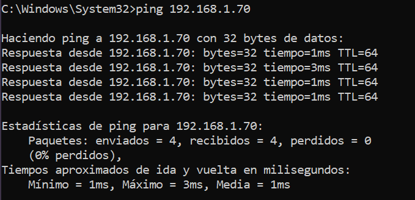
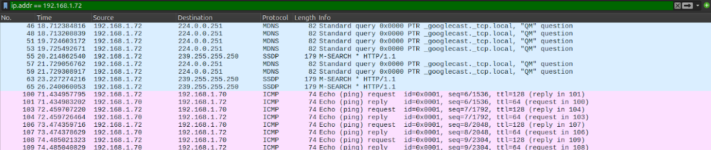
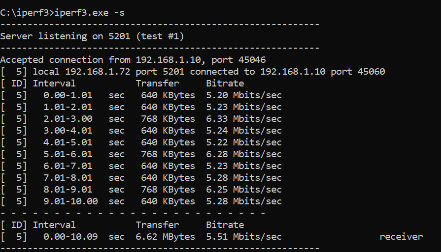
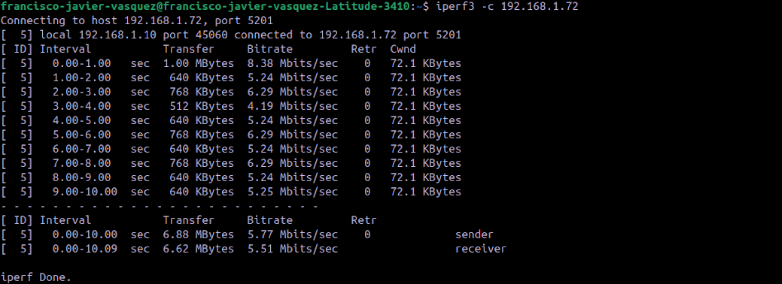
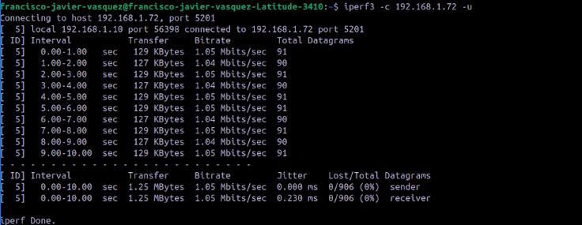
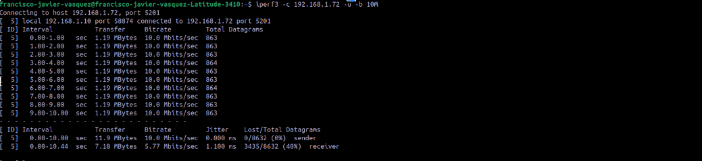
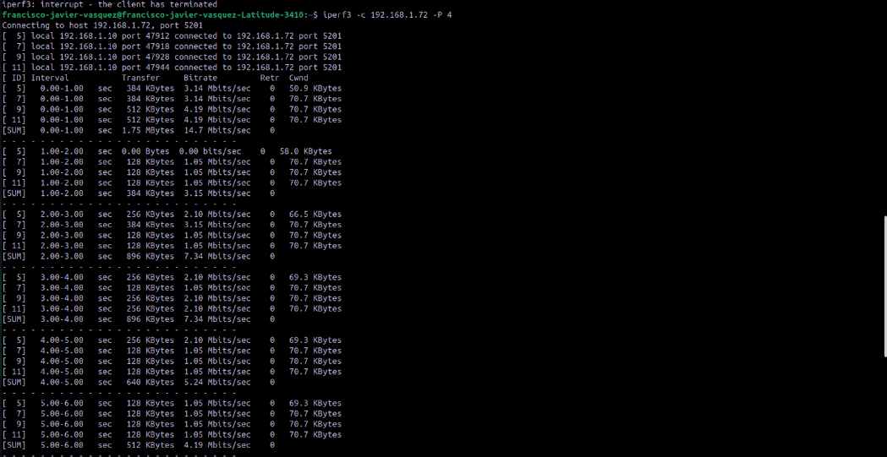
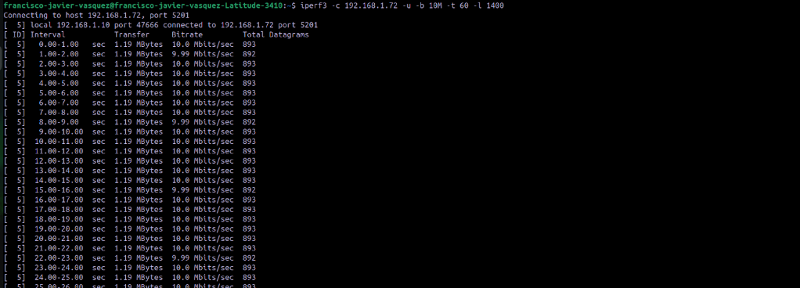
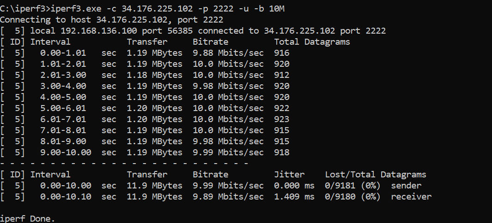
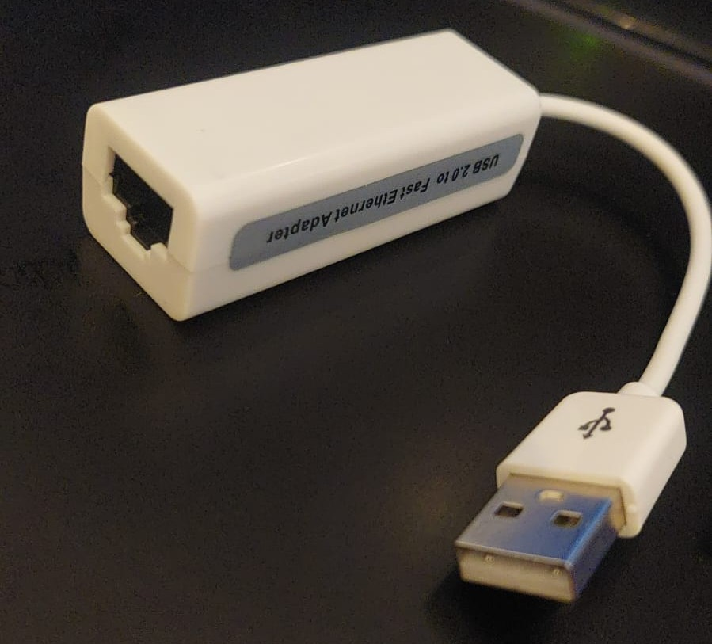

# Trabajo Práctico N° 2: Topologías Multi-path y Evaluación de Performance en Redes

**Grupo**  
*NoLoSonIEEE*

**Integrantes**  
*Fernando E. Stefanovic Carroza*  
*Francisco J. Vásquez*  
*Sofía A. Ávalos*  
*Sofía Viale*  
*Tomás G. Daniel*  

**Institución Educativa**  
*Universidad Nacional de Córdoba - Facultad de Ciencias Exactas, Físicas y Naturales*

**Curso**  
*Cátedra de Redes de Computadoras - Ciclo Lectivo 2025*

**Profesores**  
*Facundo N. Oliva Cuneo*  
*Santiago M. Henn*  

**Fecha**  
*24/04/2025*

### Información de los Autores

**Fernando E. Stefanovic Carroza:** [*fernando.stefanovic@mi.unc.edu.ar*](mailto:fernando.stefanovic@mi.unc.edu.ar)  
**Sofia Viale:** [*sofia.viale@mi.unc.edu.ar*](mailto:sofia.viale@mi.unc.edu.ar)  
**Francisco J. Vásquez:**: [*javier.vasquez@mi.unc.edu.ar*](mailto:javier.vasquez@mi.unc.edu.ar)  
**Tomas G. Daniel:** [*tomas.daniel@mi.unc.edu.ar*](mailto:tomas.daniel@mi.unc.edu.ar)  
**Sofía Aldana Ávalos** [*aldana.avalos@mi.unc.edu.ar*](mailto:aldana.avalos@mi.unc.ed.ar)  

## Resumen

Este trabajo práctico se centró en la configuración básica de redes locales y la evaluación de su performance utilizando herramientas estándar. Se configuraron dos hosts (PCs) con direccionamiento IP estático, conectadas a través de un switch físico previamente configurado. Se verificó la conectividad básica mediante el protocolo ICMP (`ping`), interceptando el tráfico con Wireshark, tanto dentro del mismo grupo como hacia un host de otro grupo. Posteriormente, se utilizó la herramienta `iperf3` para medir el ancho de banda efectivo entre los hosts en diferentes escenarios (intra-grupo, inter-grupo) utilizando los protocolos TCP y UDP con diversos parámetros (tasa, duración, tamaño de paquete, streams paralelos). Finalmente, se realizó una prueba de conectividad y performance hacia un servidor remoto especificado. Los resultados permitieron obtener métricas de rendimiento detalladas y comparar el comportamiento de TCP y UDP en una red local simple, observando limitaciones inesperadas (bajo rendimiento TCP, alta pérdida UDP local a 10 Mbps) y diferencias significativas entre protocolos y escenarios (local vs. remoto).

## Introducción

El presente informe detalla las actividades realizadas en el marco del Trabajo Práctico N°2 de la Cátedra de Redes de Computadoras. El objetivo principal era familiarizarse con la configuración de redes IP, el uso de direccionamiento estático y la evaluación de performance de red mediante herramientas específicas como `ping` e `iperf3`, además de la configuración básica de equipamiento de red (switch) y el uso de herramientas de análisis como Wireshark. Aunque los objetivos iniciales abarcaban topologías multi-path y enrutamiento dinámico, las actividades prácticas se limitaron a una topología simple de red local conmutada debido a las restricciones de tiempo y equipamiento. Se exploró la configuración de hosts y switch, la verificación de conectividad, la captura de tráfico y la medición de parámetros clave como el ancho de banda, comparando los protocolos de transporte TCP y UDP en distintos escenarios de comunicación local y remota, analizando los resultados obtenidos, incluyendo el impacto de parámetros como tamaño de paquete y streams paralelos.

## Marco Teórico

*   **Direccionamiento IP Estático:** Asignación manual y fija de una dirección IP, máscara de subred, y opcionalmente gateway y servidores DNS a un dispositivo de red. A diferencia del direccionamiento dinámico (DHCP), la IP no cambia a menos que se reconfigure manualmente, lo cual es útil para servidores o dispositivos cuya dirección necesita ser conocida y constante.
*   **Switch (Conmutador):** Dispositivo de Capa 2 (Enlace de Datos) del modelo OSI. Opera reenviando tramas Ethernet basándose en las direcciones MAC de destino. Crea dominios de colisión separados por puerto, mejorando el rendimiento de la red local en comparación con los hubs. Mantiene una tabla MAC (CAM Table) para asociar direcciones MAC con los puertos físicos. Su configuración básica implica habilitar puertos.
*   **ICMP (Internet Control Message Protocol):** Protocolo de la capa de red utilizado por dispositivos para enviar mensajes de error y operativos. El comando `ping` utiliza mensajes ICMP Echo Request y Echo Reply para verificar la alcanzabilidad de un host y medir el tiempo de ida y vuelta (RTT).
*   **TCP (Transmission Control Protocol):** Protocolo de transporte orientado a la conexión, fiable y con control de flujo y congestión. Garantiza la entrega ordenada y sin errores de los datos mediante el uso de acuses de recibo (ACKs) y retransmisiones. Establece una conexión (three-way handshake) antes de transmitir datos. El rendimiento puede verse afectado por la latencia, pérdida de paquetes y el tamaño de la ventana de congestión (`cwnd`). Utilizar streams paralelos (`-P`) puede ayudar a saturar enlaces de alta capacidad o superar limitaciones de un solo flujo.
*   **UDP (User Datagram Protocol):** Protocolo de transporte no orientado a la conexión y no fiable. Ofrece una sobrecarga mínima (cabecera más pequeña que TCP) y es más rápido, pero no garantiza la entrega, el orden ni la ausencia de duplicados. Adecuado para aplicaciones donde la velocidad es crítica y se puede tolerar cierta pérdida (e.g., streaming, VoIP, juegos online). Su rendimiento medido con `iperf3` incluye tasa de bits, jitter (variación en el retardo de llegada de paquetes) y pérdida de datagramas. El tamaño del datagrama (`-l`) puede influir en el rendimiento y la probabilidad de fragmentación.
*   **iperf3:** Herramienta de código abierto para la medición activa del máximo ancho de banda alcanzable en redes IP. Funciona en modo cliente-servidor y permite probar el rendimiento con TCP y UDP, configurando diversos parámetros como duración (`-t`), tamaño de paquete (`-l`), ancho de banda objetivo UDP (`-b`), streams paralelos (`-P`), etc.
*   **Wireshark:** Analizador de protocolos de red (packet sniffer) que permite capturar y visualizar el tráfico que pasa por una interfaz de red. Es útil para diagnosticar problemas de red, analizar el comportamiento de protocolos y verificar configuraciones de seguridad. Permite aplicar filtros para aislar el tráfico de interés (e.g., ICMP, o por IPs).

## Desarrollo

Se configuró Wireshark (o una herramienta similar) para capturar tráfico durante las pruebas, aplicando filtros basados en las direcciones IP de origen y destino y/o protocolos.

### 1. Actividades Intra-Grupo (PC1 y PC2)

Se dispuso de dos computadoras (PC1 y PC2) pertenecientes al grupo "NoLoSonIEEE". Ambas PCs se conectaron mediante cables Ethernet a un switch físico proporcionado en el laboratorio.

#### 1.1. Configuración del Switch

Se realizó la configuración básica del switch para asegurar que los puertos a utilizar estuvieran activos. Se accedió a la consola del switch y se ejecutaron los siguientes comandos:

```
enable
configure terminal
interface range fastEthernet 0/1 - 24  # Rango de puertos a habilitar
no shutdown                         # Activa los puertos
exit
exit
```
Esto habilitó todos los puertos FastEthernet del switch, permitiendo la conexión de los hosts del grupo y potencialmente otros grupos.

#### 1.2. Configuración IP Estática

Se procedió a configurar direcciones IP estáticas en cada una de ellas dentro del mismo rango de red:

*   **PC1:**
    *   IP: `192.168.1.72`
    *   Máscara de Subred: `255.255.255.0`
*   **PC2:**
    *   IP: `192.168.1.70`
    *   Máscara de Subred: `255.255.255.0`

#### 1.3. Verificación de Conectividad (ping)

Se verificó la conectividad básica entre PC1 y PC2 utilizando el comando `ping`:

```bash
# En PC1
ping 192.168.1.70

# En PC2
ping 192.168.1.72
```

Se observó respuesta exitosa en ambos casos, confirmando la conectividad local.

\
*Figura 1.1. Resultado del ping de PC1 (`192.168.1.72`) a PC2 (`192.168.1.70`).*

#### 1.4. Intercepción de Conectividad (Wireshark)

Mientras se ejecutaba el comando `ping`, se utilizó Wireshark en una de las PCs para capturar el tráfico. Se aplicó un filtro para visualizar los paquetes ICMP.

\
*Figura 1.2. Captura de Wireshark mostrando paquetes ICMP entre PC1 y PC2.*

#### 1.5. Pruebas de Rendimiento (iperf3)

Se descargó y preparó la herramienta `iperf3`. Se configuró PC1 como servidor y PC2 como cliente para realizar pruebas de rendimiento utilizando diferentes protocolos y parámetros.

*   **Paso 1: Iniciar servidor en PC1:**
    ```bash
    # Setup del Server en PC1 (192.168.1.72)
    iperf3 -s
    ```
    El servidor queda a la escucha de conexiones entrantes en el puerto por defecto (5201).

    \
    *Figura 1.3. Salida del servidor `iperf3` en PC1 (192.168.1.72) al aceptar una conexión TCP desde PC2 (192.168.1.10).*

*   **Paso 2: Ejecutar pruebas desde PC2:**

    *   **Prueba TCP (Básica):**
        ```bash
        # Prueba TCP desde PC2 hacia PC1
        iperf3 -c 192.168.1.72
        ```
        \
        *Figura 1.4. Cliente `iperf3` (TCP): Bitrate promedio de 5.77 Mbps (sender) / 5.51 Mbps (receiver). Cero retransmisiones.*

    *   **Prueba UDP (Básica):**
        ```bash
        # Prueba UDP desde PC2 hacia PC1 (default 1 Mbps)
        iperf3 -c 192.168.1.72 -u
        ```
        \
        *Figura 1.5. Cliente `iperf3` (UDP básico): Bitrate promedio de 1.05 Mbps. Sin pérdida (0/906). Jitter 0.230 ms.*

    *   **Prueba UDP con Ancho de banda específico (10 Mbps):**
        ```bash
        # Prueba UDP desde PC2 hacia PC1, objetivo 10 Mbps
        iperf3 -c 192.168.1.72 -u -b 10M
        ```
        \
        *Figura 1.7. Cliente `iperf3` (UDP -b 10M): Sender logra 10.0 Mbps. Receiver reporta 5.77 Mbps con **40% de pérdida** (3435/8632). Jitter 1.100 ms.*

    *   **Prueba TCP con 4 streams paralelos:**
        ```bash
        # Prueba TCP desde PC2 hacia PC1 con 4 streams
        iperf3 -c 192.168.1.72 -P 4
        ```
        \
        *Figura 1.8. Cliente `iperf3` (TCP -P 4): Bitrate agregado [SUM] promedio de 6.29 Mbps (sender) / 5.36 Mbps (receiver). Cero retransmisiones. Mejora respecto a un solo stream, pero aún bajo.*

    *   **Prueba UDP (Parámetros combinados):**
        ```bash
        # Prueba UDP desde PC2 hacia PC1: 10 Mbps, 60s, paquetes 1400 bytes
        iperf3 -c 192.168.1.72 -u -b 10M -t 60 -l 1400
        ```
        \
        *Figura 1.9. Cliente `iperf3` (UDP combinado): Sender logra 10.0 Mbps. Receiver reporta 5.82 Mbps con **41% de pérdida** (22173/53549). Jitter 1.025 ms. Confirma la alta pérdida a 10 Mbps incluso con paquetes grandes y mayor duración.*

### 2. Actividades Inter-Grupo
*Nota: Esta actividad es un placeholder hasta tener los contenidos multimedia de todos los grupos implicados*

### 3. Prueba Hacia Servidor Remoto

Se realizó una prueba desde una PC del grupo (IP local `192.168.136.100` según captura, diferente a las anteriores) hacia un servidor `iperf3` remoto proporcionado, con IP `34.176.225.102` y puerto `2222`. La PC actuó como cliente.

#### 3.1. Prueba de Rendimiento (iperf3)

Se ejecutó la prueba `iperf3` como cliente UDP, intentando alcanzar 10 Mbps.

*   **Cliente UDP con objetivo 10 Mbps:**
    ```bash
    iperf3 -c 34.176.225.102 -p 2222 -u -b 10M
    ```

\
*Figura 3.1. Cliente `iperf3` (UDP -b 10M) hacia servidor remoto (34.176.225.102:2222). Sender logra 9.99 Mbps. Receiver reporta 9.89 Mbps con **0% de pérdida** (0/9180). Jitter 1.409 ms.*

### 4. Resumen de Comandos Clave Utilizados

*   **Switch:** `enable`, `configure terminal`, `interface range fa0/1-24`, `no shutdown`
*   **Host (Linux/Windows):** `ping <IP>`, `ip address` / `ipconfig` (para verificar IP)
*   **iperf3 Servidor:** `iperf3 -s`
*   **iperf3 Cliente:**
    *   `iperf3 -c <IP>` (TCP básico)
    *   `iperf3 -c <IP> -P <num>` (TCP paralelo)
    *   `iperf3 -c <IP> -u` (UDP básico)
    *   `iperf3 -c <IP> -u -b <tasa>` (UDP con ancho de banda)
    *   `iperf3 -c <IP> -t <segundos>` (Duración)
    *   `iperf3 -c <IP> -u -l <bytes>` (Tamaño paquete UDP)
    *   `iperf3 -c <IP> -p <puerto>` (Puerto específico)
*   **Wireshark:** Captura en la interfaz de red, uso de filtros (e.g., `icmp`, `ip.addr == <IP>`)

## Conclusión

Tras analizar los resultados obtenidos en las pruebas realizadas:

1.  **Conectividad y Configuración:** Se configuró con éxito la red local básica (Switch y IPs estáticas) y se verificó la conectividad mediante `ping` (Fig. 1.1) y captura Wireshark (Fig. 1.2). La conectividad con el servidor remoto también fue exitosa (Fig. 3.1).

2.  **Rendimiento TCP Intra-Grupo:** La prueba TCP básica (Fig. 1.4) mostró un rendimiento bajo (~5.5-5.8 Mbps). La prueba con 4 streams paralelos (Fig. 1.8) mejoró ligeramente el agregado (~5.4-6.3 Mbps), pero aún muy por debajo de la capacidad esperada de Fast Ethernet (100 Mbps) o Gigabit Ethernet. La ausencia de retransmisiones sugiere que la limitación no es por pérdida, sino posiblemente por configuración de los hosts (buffers, ventana TCP) o limitaciones del hardware/cableado.

3.  **Rendimiento UDP Intra-Grupo:**
    *   UDP a 1 Mbps funcionó perfectamente, tanto con tamaño de paquete por defecto (Fig. 1.5) como con 1400 bytes (Fig. 1.6), mostrando 0% de pérdida y bajo jitter.
    *   Al intentar enviar a 10 Mbps (`-b 10M`), se produjo una **pérdida masiva de ~40-41%** (Fig. 1.7 y Fig. 1.9), independientemente de la duración o el tamaño del paquete. Esto indica un cuello de botella severo en la red local (switch, NICs, buffers) que no puede sostener 10 Mbps de tráfico UDP.

4.  **Rendimiento UDP Remoto:** En marcado contraste, la prueba UDP hacia el servidor remoto a 10 Mbps (Fig. 3.1) tuvo un **rendimiento excelente, con ~9.9 Mbps recibidos y 0% de pérdida**. El jitter (1.4 ms) fue mayor que en la LAN, como es normal en WAN, pero la ausencia de pérdidas fue notable.

5.  **Comparación TCP vs UDP:** UDP superó a TCP (single stream) en bitrate *recibido* en la LAN (~5.8 Mbps vs ~5.5 Mbps), pero a costa de una pérdida inaceptable (>40%) cuando se forzó a 10 Mbps. TCP paralelo (~5.4 Mbps recibidos) fue similar a TCP single stream. UDP demostró ser útil para probar la capacidad máxima *bruta* y encontrar cuellos de botella (evidenciados por la pérdida), mientras que TCP se adaptó (aunque a una tasa baja) sin pérdidas reportadas.

6.  **Impacto de Parámetros:**
    *   **`-b` (UDP Bandwidth):** Crítico. Pasar de 1 Mbps (éxito) a 10 Mbps (fracaso por pérdida) en la LAN fue el hallazgo más significativo.
    *   **`-l` (UDP Length):** Cambiar a 1400 bytes no tuvo impacto negativo a 1 Mbps (Fig. 1.6) y tampoco evitó la pérdida a 10 Mbps (Fig. 1.9).
    *   **`-P` (TCP Parallel):** Aumentó ligeramente el throughput agregado en TCP (Fig. 1.8), sugiriendo que la limitación no era puramente del enlace físico.
    *   **`-t` (Time):** Extender la duración a 60s (Fig. 1.9) confirmó que la pérdida a 10 Mbps era sostenida.

7.  **Comparación Local vs Remoto:** La red local mostró limitaciones significativas para UDP a 10 Mbps, mientras que la ruta hacia el servidor WAN remoto, en ese momento, no las tenía. Esto demuestra que el rendimiento "local" no es inherentemente superior si existen cuellos de botella específicos, y que las condiciones de la WAN pueden variar enormemente.

En resumen, la práctica evidenció la importancia de realizar mediciones con diferentes protocolos y parámetros. Se identificó un bajo rendimiento general de TCP en la LAN y un severo problema de pérdida de paquetes para UDP a tasas moderadas (10 Mbps) en la misma LAN, contrastando fuertemente con el excelente rendimiento UDP hacia el servidor remoto.

## Observaciones
- Debido a que la PC 1 no contaba con conector RJ-45 para el protocolo Fast Ethernet, se optó por un adaptador genérico USB 2.0 a RJ-45. Debido a que el impacto de este cambio no pudo ser documentado de manera comparativa, se podría decir que este podría ser una causa de la diferencia con respecto a las velocidades máximas, ya que para la conexión con el servidor remoto se recurrió a una conexión inalámbrica.
- En un momento se modificó la ip de la PC2 de 192.168..1.70 a 192.168.1.10 para acoplarnos mejor a una futura refactorización de direcciones con objetivo de homogenizar ips con el resto de grupos, aunque no lo pudimos concretar. Es por ello que se puede visualizar esa dirección en las capturas de la parte Inter-Grupo.

\
*Figura 3.1. Adaptador RJ-45 a USB 2.0*


## Bibliografía

*   **iperf3 Documentation:** Página oficial y fuente de descarga. Recuperado de: [`https://iperf.fr/`](https://iperf.fr/)
*   **Wireshark Documentation:** Página oficial. Recuperado de: [`https://www.wireshark.org/`](https://www.wireshark.org/)
*   **(Opcional)** Material de configuración de Switches Cisco (según modelo utilizado).
*   **(Opcional)** Kurose, J. F., & Ross, K. W. (2017). *Computer Networking: A Top-Down Approach* (7th ed.). Pearson.
*   **(Opcional)** Tanenbaum, A. S., & Wetherall, D. J. (2011). *Computer Networks* (5th ed.). Prentice Hall.