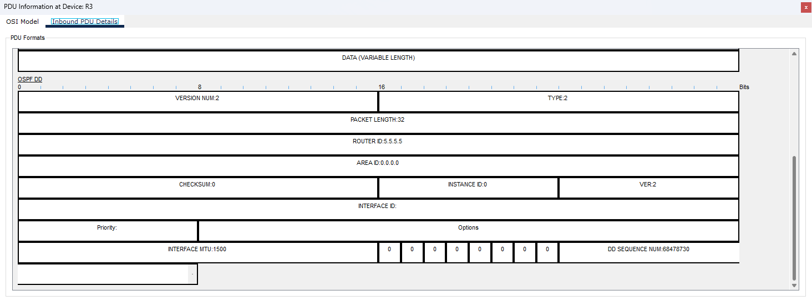
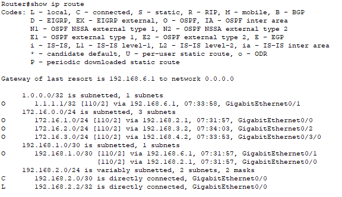
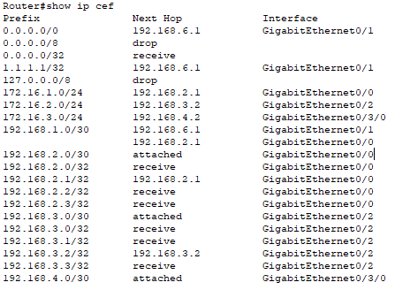

<center>

# Trabajo Práctico N° 3: Evaluación de Performance en Redes y Ruteo Interno Dinámico OSPF


**Grupo**  
*NoLoSonIEEE*  

**Integrantes**  
*Fernando E. Stefanovic Carroza*  
*Francisco J. Vásquez*  
*Sofía A. Ávalos*  
*Sofía Viale*  
*Tomás G. Daniel*  

**Institución Educativa**  
*Universidad Nacional de Córdoba - Facultad de Ciencias Exactas, Físicas y Naturales*

**Curso**  
*Cátedra de Redes de Computadoras - Ciclo Lectivo 2025*

**Profesores**  
*Facundo N. Oliva Cuneo*  
*Santiago M. Henn*

**Fecha**  
*20/03/2025*

### Información de los Autores

**Fernando E. Stefanovic Carroza:** [*fernando.stefanovic@mi.unc.edu.ar*](mailto:fernando.stefanovic@mi.unc.edu.ar)  
**Sofia Viale:** [*sofia.viale@mi.unc.edu.ar*](mailto:sofia.viale@mi.unc.edu.ar)  
**Francisco J. Vásquez:**: [*javier.vasquez@mi.unc.edu.ar*](mailto:javier.vasquez@mi.unc.edu.ar)  
**Tomas G. Daniel:** [*tomas.daniel@mi.unc.edu.ar*](mailto:tomas.daniel@mi.unc.edu.ar)  
**Sofía Aldana Ávalos** [*aldana.avalos@mi.unc.edu.ar*](mailto:aldana.avalos@mi.unc.edu.ar)  

</center>

---

## 1. Resumen
Este trabajo práctico aborda la implementación y evaluación del protocolo de enrutamiento dinámico OSPF (Open Shortest Path First) en un entorno de red simulado. Se inicia con el diseño y configuración de un esquema de direccionamiento IP jerárquico para una topología compuesta por múltiples routers, switches y hosts. Posteriormente, se implementa OSPF, primero en una configuración de área única (Área 0) y luego en una configuración multi-área (Áreas 0 y 1, con un Router de Borde de Área - ABR), verificando en cada etapa la formación de adyacencias, la sincronización de la base de datos de estado de enlace (LSDB) y la correcta población de las tablas de enrutamiento (RIB). Se analiza el ciclo de mensajes OSPF durante la convergencia, se experimenta con la modificación manual de costos para influir en la selección de rutas, y se implementa la redistribución de una ruta estática predeterminada. Adicionalmente, se discute el comportamiento esperado del protocolo ante fallos de enlace y se diferencia conceptual y prácticamente entre la Base de Información de Enrutamiento (RIB) y la Base de Información de Reenvío (FIB). Todo el desarrollo se realiza utilizando el simulador Cisco Packet Tracer, permitiendo la aplicación práctica de los conceptos teóricos de OSPF.

## 2. Introducción

### 2.1. El Enrutamiento Dinámico y su Importancia

En el ámbito de las redes de computadoras, el enrutamiento es el proceso fundamental de seleccionar caminos para dirigir el tráfico IP entre distintos segmentos de red. Si bien el enrutamiento estático, donde las rutas se configuran manualmente, es viable en redes pequeñas y estables, presenta limitaciones significativas en entornos más complejos y dinámicos. La configuración manual es propensa a errores, no se adapta automáticamente a cambios en la topología (como fallos de enlace o adición de nuevos routers) y su gestión se vuelve impracticable a medida que la red crece.

Para superar estas limitaciones, surgen los protocolos de enrutamiento dinámico. Estos protocolos, que se integran a la extensa suite de protocolos que gobiernan internet, permiten a los routers intercambiar información sobre la topología de la red y calcular automáticamente las mejores rutas. Se clasifican principalmente en Protocolos de Gateway Interior (IGP) y Protocolos de Gateway Exterior (EGP), y se diferencian en cómo administran al Sistema Autónomo (AS - Autonomous System).

#### 2.1.1. Sistemas Autónomos (ASs)

Un Sistema Autónomo (AS) representa una colección de redes bajo el control de una única entidad administrativa (como un ISP, una empresa o institución) que presenta una política de enrutamiento común hacia el exterior. 

Internet puede visualizarse como una interconexión de múltiples ASs. Cada AS gestiona su propia red interna y decide cómo enrutar el tráfico dentro de sus límites. Para identificarse globalmente y permitir la comuniación, a cada AS se le asigna un número único conocido como ASN (Autonomous System Number), que permite ser usado como punto de entrada para protocolos de enrutamiento.

#### 2.1.2. Protocolos de Gateway Interior (IGP)

Los Protocolos de Gateway Interior (IGP) están diseñados para operar **dentro** de los límites de un único Sistema Autónomo. Su principal objetivo es descubrir la topología de la red interna del AS y calcular las rutas más eficientes (basadas en métricas como el número de saltos, el ancho de banda, el retardo o el costo) entre los diferentes routers y subredes dentro de ese AS.

Para lograr esto, los IGPs emplean diferentes algoritmos y métodos de intercambio de información, lo que lleva a su clasificación principal en dos familias: protocolos de **Vector Distancia** (que aprenden rutas a través de la información resumida de sus vecinos) y protocolos de **Estado de Enlace** (que construyen un mapa completo de la topología basado en información detallada de todos los routers).

Se encuentran ejemplos de implementación en ambas familias, tales como RIP (un clásico de vector distancia) u OSPF e IS-IS (prominentes ejemplos de estado de enlace), además de enfoques híbridos como EIGRP. Independientemente de su mecanismo subyacente, todos actúan como un *sistema de navegación para los datos dentro de una colección de redes*, determinando las mejores rutas locales dentro de esa colección para conectar orígenes con destinos en la misma.

De esta forma, un IGP adecuado brinda eficiencia en el ruteo y permite una convergencia rápida ante cambios de topología o ajustes de escala que puedan surgir en el Sistema Autónomo donde esté implementado.

#### 2.1.3. Protocolos de Gateway Exterior (EGP)

Los Protocolos de Gateway Exterior (EGP) se utilizan para intercambiar información de enrutamiento **entre** diferentes Sistemas Autónomos. Su función principal es permitir que los ASs se comuniquen entre sí sobre qué redes son alcanzables a través de ellos, basándose en políticas de enrutamiento definidas administrativamente.

En este caso, el enfoque está en brindarle a internet su escalabilidad global tan característica, permitiendo introducir en las decisiones de enrutamiento aspectos que van más allá de lo puramente técnico, como acuerdos comerciales o políticos entre las organizaciones que administran los Sistemas Autónomos.


### 2.2. OSPF (Open Shortest Path First): Un Protocolo de Estado de Enlace

Como se introdujo en la sección anterior (2.1.2), Open Shortest Path First (OSPF) es un protocolo de enrutamiento de **estado de enlace**, estandarizado y ampliamente utilizado dentro de la familia de los IGPs. Su diseño robusto y abierto lo ha convertido en una opción predilecta para redes empresariales y de proveedores de servicios. Existen dos versiones principales: **OSPFv2 (RFC 2328)** para redes IPv4 y **OSPFv3 (RFC 5340)**, que extiende el soporte a IPv6 y puede manejar múltiples familias de direcciones.

A diferencia de los protocolos de vector distancia que dependen de la información fragmentada de los vecinos, la filosofía de OSPF se basa en que cada router obtenga una visión completa y sincronizada de la topología de la red (o al menos, del área a la que pertenece) antes de tomar decisiones de enrutamiento. Esto se logra mediante el intercambio organizado de información detallada sobre la conectividad (LSAs), la construcción de un mapa interno de la red (LSDB) y la ejecución de un algoritmo para calcular las mejores rutas (SPF).

#### 2.2.1. Modelo Operativo del OSPF

El corazón de OSPF reside en su naturaleza de estado de enlace, siguiendo un proceso lógico:

1.  **Descubrimiento de Vecinos**: Los routers OSPF envían paquetes periódicos llamados "Hello" por sus interfaces habilitadas (GigabitEthernet0/0, etc.). Estos mensajes permiten a los routers descubrir otros routers OSPF en los mismos enlaces y establecer relaciones de vecindad (conocidas como *adjacencies*). Esta es la base para poder intercambiar información más detallada.
2.  **Intercambio de Información Topológica (LSAs)**: Una vez establecida la adyacencia, los routers comienzan a intercambiar mensajes detallados sobre el estado de sus propios enlaces y conexiones, denominados **Link-State Advertisements (LSAs)**. Cada router genera LSAs describiendo sus interfaces activas, a qué redes están conectadas, qué vecinos ha alcanzado por esas interfaces y el costo asociado a cada enlace. Estos anuncios son distribuidos (inundados o *flooded*) a todos los demás routers dentro de la misma zona de la red (área).
3.  **Construcción del Mapa de Red (LSDB)**: Cada router recopila todos los LSAs válidos recibidos de los demás routers dentro de su área y los organiza en su propia **base de datos de estado de enlace (Link-State Database - LSDB)**. Idealmente, todos los routers en la misma área construirán LSDBs idénticas, las cuales representan un mapa completo y sincronizado de esa porción de la red.
4.  **Cálculo de las Mejores Rutas (Algoritmo SPF)**: Con este mapa completo (la LSDB) ya construido, cada router ejecuta independientemente el algoritmo **Shortest Path First (SPF)**. Tratándose a sí mismo como el punto de partida, calcula la ruta de menor costo acumulado hacia cada destino (otras redes o routers) basándose en la información del mapa.
5.  **Poblar la Tabla de Enrutamiento (RIB)**: Los resultados del algoritmo SPF (las rutas óptimas calculadas) se instalan en la **Tabla de Información de Enrutamiento (Routing Information Base - RIB)** del router, que es la tabla que el router consulta para reenviar el tráfico de datos.

Este proceso, basado en que todos los routers comparten y calculan sobre la misma visión completa de la topología, asegura que las decisiones de enrutamiento sean consistentes y elimina inherentemente los bucles de enrutamiento dentro del área.

#### 2.2.2. Anuncios de Estado de Enlace (LSAs)

Los **Link-State Advertisements (LSAs)** son las unidades fundamentales de intercambio de información en OSPF. Corresponden a los "mensajes detallados sobre el estado de los propios enlaces" mencionados anteriormente. Cada LSA es un paquete de datos estructurado que describe un aspecto específico de la topología de la red desde la perspectiva del router que lo originó. La distribución controlada (*flooding*) de estos LSAs permite que todos los routers construyan su visión de la red.

Cada LSA tiene un propósito específico, identificado por su **número de Tipo**, y contribuye a la construcción de la LSDB. Los tipos de LSA más fundamentales en OSPFv2 para el enrutamiento unicast son:

*   **LSA Tipo 1 (Router LSA):**
    *   **Generado por:** Cada router OSPF.
    *   **Describe:** Los enlaces (interfaces) directamente conectados del router, su estado (activo/inactivo), su dirección IP, la máscara de subred y el costo OSPF asociado. También indica si el router es un ABR (Router de Borde de Área) o ASBR (Router de Borde de Sistema Autónomo).
    *   **Ámbito:** Se inunda (*flooded*) únicamente dentro del área OSPF a la que pertenece el router que lo originó.

*   **LSA Tipo 2 (Network LSA):**
    *   **Generado por:** El Router Designado (DR) en redes multiacceso (Broadcast o NBMA).
    *   **Describe:** El segmento de red multiacceso en sí y la lista de routers (incluido el DR) conectados a ese segmento.
    *   **Ámbito:** Se inunda únicamente dentro del área donde reside el segmento multiacceso.

*   **LSA Tipo 3 (Summary LSA):**
    *   **Generado por:** Los Routers de Borde de Área (ABRs).
    *   **Describe:** Rutas hacia redes que se encuentran en *otras* áreas (rutas inter-área). Anuncia la dirección de red, la máscara y el costo acumulado desde el ABR hasta esa red. Permite el resumen de rutas entre áreas.
    *   **Ámbito:** Se inunda desde el ABR hacia las áreas conectadas, incluyendo el backbone (Área 0), pero *no* entra en las áreas Stub (y sus variantes, excepto NSSA para rutas internas resumidas).

*   **LSA Tipo 5 (AS External LSA):**
    *   **Generado por:** Los Routers de Borde de Sistema Autónomo (ASBRs).
    *   **Describe:** Rutas hacia destinos *externos* al dominio OSPF (por ejemplo, rutas aprendidas de otro protocolo de enrutamiento como BGP o EIGRP, o rutas estáticas redistribuidas). Anuncia la red externa, máscara, métrica externa y tipo de métrica (E1 o E2).
    *   **Ámbito:** Se inunda a través de *todo* el dominio OSPF (todas las áreas estándar y backbone), excepto las áreas Stub y sus variantes (Stub, Totally Stubby, NSSA).

*   **LSA Tipo 7 (NSSA External LSA):**
    *   **Generado por:** Los ASBRs ubicados *dentro* de un área NSSA (Not-So-Stubby Area).
    *   **Describe:** Rutas externas, de manera similar al LSA Tipo 5, pero específicamente para ser originadas dentro de una NSSA.
    *   **Ámbito:** Se inunda únicamente *dentro* del área NSSA donde se originó. El ABR de esa NSSA es responsable de traducir (si es necesario) estos LSAs Tipo 7 en LSAs Tipo 5 para propagarlos al resto del dominio OSPF (Área 0 y otras áreas).

#### 2.2.3. Base de Datos de Estado de Enlace (LSDB)

La **Link-State Database (LSDB)** es la colección organizada de todos los LSAs válidos que un router OSPF ha recibido y almacenado para un área determinada. Corresponde a la "base de datos topológica" o el "mapa completo de la red" descrito en la sección 2.2.1.

La LSDB se construye a partir de la recepción y validación de los LSAs (Tipo 1, Tipo 2, etc.) inundados dentro del área. Cada router dentro de la misma área OSPF se esfuerza por mantener una LSDB idéntica a la de sus vecinos en esa área, asegurando una visión consistente de la topología. Es precisamente sobre esta base de datos compilada que cada router ejecutará el algoritmo SPF para calcular las rutas más cortas. La LSDB es, por tanto, la representación interna, detallada y sincronizada que tiene el router sobre la topología de su área OSPF.

#### 2.2.4. Cálculo de Rutas: Algoritmo SPF y Teoría de Grafos

El mecanismo de OSPF para determinar las mejores rutas se basa en el algoritmo **Shortest Path First (SPF)**, una implementación del clásico **algoritmo de Dijkstra**, y está intrínsecamente ligado a la teoría de grafos.

OSPF clasifica las interfaces y redes en diferentes tipos (como Broadcast, Point-to-Point, Non-Broadcast Multi-Access - NBMA, Point-to-Multipoint). Esta clasificación influye en cómo los routers descubren vecinos (usando paquetes Hello) y cómo se disemina la información de estado de enlace (LSAs). Por ejemplo, en redes broadcast (como Ethernet), como se detallará más adelante (sección 2.2.7), se eligen un Router Designado (DR) y un Router Designado de Respaldo (BDR) para optimizar el intercambio de LSAs (específicamente, el DR genera el LSA Tipo 2) y reducir el tráfico del protocolo.

Debido a que OSPF se apoya en mecanismos de *path-finding* estrechamente ligados a estructuras de tipo grafo, la relación con la **teoría de grafos** resulta más que evidente. La topología de red dentro de un área OSPF se modela como un **grafo dirigido y ponderado**:

*   **Vértices (Nodos):** Representan los routers OSPF y, en algunos casos (como los LSAs Tipo 2), los segmentos de red multiacceso.
*   **Aristas (Enlaces):** Representan las conexiones (interfaces) entre los routers o entre un router y un segmento de red. Cada conexión bidireccional se representa típicamente como dos aristas dirigidas con su respectivo costo.
*   **Pesos:** Cada arista tiene asociado un peso numérico, que es el **costo OSPF** de esa interfaz o conexión. Este costo, como se verá en la sección 2.2.5, es fundamental para la selección de rutas.

Cada router construye este grafo de forma independiente basándose en la información contenida en su **LSDB**. La LSDB es, esencialmente, una representación distribuida y sincronizada del grafo de la red del área.

Una vez que el router ha construido el grafo a partir de su LSDB, ejecuta el **algoritmo SPF (Dijkstra)** sobre esta estructura. Considerándose a sí mismo como la **raíz del árbol**, el algoritmo calcula las rutas de **menor costo acumulado** hacia todos los demás nodos (routers y redes representadas en el grafo) dentro del área. El resultado es un **árbol de caminos más cortos (*shortest-path tree*)** desde la perspectiva de ese router. Las rutas obtenidas de este árbol son las que finalmente se utilizan para poblar la tabla de enrutamiento del router (Routing Information Base - RIB). La ejecución de este algoritmo por parte de cada router sobre una LSDB idéntica garantiza rutas óptimas (según la métrica de costo) y coherentes en toda el área.

#### 2.2.5. Métrica de Costo en OSPF

OSPF no utiliza el número de saltos como métrica principal (como RIP). En su lugar, utiliza un concepto de **costo**. Cada interfaz habilitada para OSPF tiene un valor de costo asociado. El costo total de una ruta es la **suma de los costos** de todas las interfaces de *salida* a lo largo del camino desde el origen hasta el destino. OSPF siempre preferirá la ruta con el **menor costo acumulado**.

*   **Cálculo por Defecto**: Por defecto, el costo se calcula inversamente proporcional al **ancho de banda** de la interfaz (Costo = Ancho de Banda de Referencia / Ancho de Banda de la Interfaz). El ancho de banda de referencia es configurable (comúnmente 100 Mbps o 1 Gbps por defecto, dependiendo del fabricante y versión). Esto significa que enlaces más rápidos tienen costos más bajos y son preferidos.
*   **Ajuste Manual**: El costo puede ser configurado manually por el administrador en cada interfaz. Esto es crucial para influir en la selección de rutas según políticas específicas, más allá del simple ancho de banda (ej., preferir un enlace de fibra óptica sobre uno satelital, aunque ambos tengan gran ancho de banda, debido a la latencia, o preferir un enlace primario sobre uno de respaldo).

#### 2.2.6. Jerarquía y Escalabilidad en OSPF: El Concepto de Área

Para mejorar la escalabilidad y reducir la sobrecarga en redes OSPF de gran tamaño, el protocolo introduce un concepto de diseño jerárquico basado en **áreas**. Dividir la red OSPF en múltiples áreas interconectadas ofrece beneficios significativos:

*   Reduce el tamaño de la base de datos topológica (LSDB), ya que cada router solo necesita mantener los detalles completos de su propia área.
*   Disminuye la carga computacional del algoritmo SPF, dado que este se ejecuta de forma independiente dentro de cada área.
*   Contiene la distribución ("inundación") de la mayoría de los anuncios de estado de enlace (LSAs) dentro de los límites del área donde se originan, optimizando el uso del ancho de banda y los recursos del router.

Esta estructura jerárquica se articula en torno a un componente central: el **Área Backbone (designada siempre como Área 0)**. Esta área actúa como el núcleo de tránsito principal de la red OSPF; toda la comunicación entre áreas diferentes debe, directa o indirectamente, pasar a través del Área 0. Es el pilar que une toda la estructura OSPF.

Los routers que conectan el Área 0 con otras áreas, o que conectan múltiples áreas entre sí, desempeñan un papel crucial y se denominan **Routers de Borde de Área (ABR - Area Border Routers)**. Estos ABRs son responsables no solo de participar en el enrutamiento de sus áreas conectadas, sino también de **resumir la información topológica** de un área y anunciarla a las otras. Este resumen se realiza mediante anuncios específicos (principalmente LSAs de Tipo 3), permitiendo que los routers conozcan las redes en otras áreas sin necesidad de tener todos los detalles topológicos de ellas.

Las áreas que se conectan al backbone y que no tienen restricciones especiales se consideran **Áreas Estándar** (o normales). Estas áreas mantienen una LSDB completa de su topología interna y también reciben información resumida sobre otras áreas (LSAs Tipo 3) y sobre rutas externas (LSAs Tipo 5, si existen en el dominio OSPF) a través de sus ABRs. Representan el tipo de área OSPF por defecto.

Sin embargo, para optimizar aún más y simplificar la operación en ciertas partes de la red, especialmente en aquellas que se encuentran en la periferia, OSPF define **tipos de Áreas Especiales**. La idea fundamental detrás de estas áreas (como las *Stub Areas*, *Totally Stubby Areas*, o *Not-So-Stubby Areas - NSSA*) es **reducir la cantidad de información de enrutamiento (LSAs)** que necesitan procesar y almacenar. Logran esto filtrando ciertos tipos de LSAs (típicamente los LSAs Tipo 5 que anuncian rutas externas, o incluso los LSAs Tipo 3 en variantes "Totally Stubby") y, a menudo, utilizando una ruta por defecto inyectada por el ABR para alcanzar destinos fuera del área. La elección del tipo de área especial adecuado depende de los requisitos de conectividad específicos de esa sección de la red.

#### 2.2.7. Optimización en Redes Multiacceso: El Rol del DR y BDR

Como se mencionó brevemente en la sección 2.2.4, OSPF implementa optimizaciones para redes donde múltiples routers comparten el mismo medio, conocidas como **redes multiacceso** (ej., Ethernet). En estos entornos, si cada router formara una adyacencia completa con todos los demás, el número de adyacencias (`n*(n-1)/2` para `n` routers) y el tráfico OSPF asociado crecerían cuadráticamente, volviéndose ineficientes.

Para evitar esto, OSPF elige un **Router Designado (DR)** y un **Router Designado de Respaldo (BDR)** en cada segmento multiacceso:

*   **DR (Router Designado):** Actúa como coordinador central. Los demás routers (DROthers) solo forman adyacencia completa con él y con el BDR. Recibe los LSAs de los DROthers y es el responsable de distribuirlos al resto del segmento. Genera el LSA Tipo 2 (Network LSA) para representar al segmento.
*   **BDR (Router Designado de Respaldo):** Es un respaldo activo. Mantiene adyacencias completas y una LSDB sincronizada. Si el DR falla, el BDR asume su rol inmediatamente, asegurando resiliencia y rápida convergencia.

Este mecanismo DR/BDR reduce drásticamente el número de adyacencias y el tráfico OSPF en redes multiacceso, siendo crucial para la escalabilidad del protocolo en topologías LAN comunes.

### 2.3. Objetivos del Trabajo Práctico

Este trabajo práctico tiene como finalidad la aplicación concreta de los conceptos teóricos de OSPF en un entorno controlado. Los objetivos específicos son:

1.  Implementar y gestionar tablas de enrutamiento, incluyendo rutas estáticas y de host.
2.  Aplicar el protocolo de enrutamiento dinámico OSPF de manera criteriosa, comprendiendo sus mecanismos y parámetros fundamentales desde una perspectiva de ingeniería.
3.  Desarrollar habilidades prácticas mediante la implementación y verificación de casos de uso de OSPF en un entorno de red virtualizado.
4.  Analizar el comportamiento del protocolo, incluyendo la estructura de mensajes, la formación de adyacencias, el cálculo de rutas, el impacto de la configuración de áreas y costos, y la resiliencia ante fallos.

### 2.4. Metodología y Entorno de Simulación

Para alcanzar los objetivos propuestos, se empleará un software de simulación o virtualización de redes. La elección recae en Cisco Packet Tracer. Esta herramienta permite simular la topología de red especificada en la consigna, que consta de múltiples routers con conexiones redundantes, varios hosts y switches, proporcionando un entorno realista para la configuración, prueba y análisis del protocolo OSPF. Se configurarán las direcciones IP según un esquema predefinido y se implementará OSPF siguiendo los pasos detallados en la sección de desarrollo, verificando cada etapa mediante comandos de diagnóstico y pruebas de conectividad.

## 3. Desarrollo: Implementación y Análisis de OSPF

### 3.1. Diseño del Esquema de Direccionamiento IP

Para la configuración inicial de la red, se estableció un plan de direccionamiento IP lógico y escalable. Este plan se basa en el uso de direcciones IP privadas (RFC 1918) y distingue entre las necesidades de direccionamiento de las redes de usuarios finales y las conexiones de infraestructura entre routers.

#### 3.1.1. Fundamentos de la Elección de Rangos Base

La selección de los bloques de direcciones IP iniciales se realizó considerando las características generales de los rangos privados disponibles y la naturaleza de los segmentos a direccionar:

*   **Uso de Rangos Privados (RFC 1918):** Se decidió utilizar exclusivamente direcciones IP de los rangos privados para evitar conflictos con el espacio de direccionamiento público de Internet y seguir las convenciones estándar. Los rangos privados disponibles son:
    *   `10.0.0.0` a `10.255.255.255` (Asociado a Clase A)
    *   `172.16.0.0` a `172.31.255.255` (Asociado a Clase B)
    *   `192.168.0.0` a `192.168.255.255` (Asociado a Clase C)

*   **Rango Base para Redes de Hosts:** Se eligió el bloque `172.16.0.0` como punto de partida para las redes que conectan a los dispositivos finales (hosts h1-h5). Este rango, perteneciente al espacio privado asociado a la Clase B, ofrece un número considerable de direcciones, proporcionando flexibilidad para futuras expansiones o segmentaciones adicionales si fuesen necesarias.

*   **Rango Base para Enlaces Inter-Router:** Para las conexiones directas entre los routers (R1-R2, R2-R3, etc.), se seleccionó el bloque `192.168.0.0`. Este rango, asociado al espacio privado de Clase C, es comúnmente utilizado para redes de menor tamaño o segmentos de infraestructura.

*   **Dirección para Interfaz Loopback (R1):** Se decidió asignar la dirección `1.1.1.1` a la interfaz loopback de R1. Aunque pertenece a un rango público, su uso es frecuente en entornos controlados de laboratorio para proporcionar un identificador único y estable al router, útil para protocolos de enrutamiento y gestión.

#### 3.1.2. Estrategia de Subred Aplicada

Una vez seleccionados los rangos base, se aplicó una estrategia de desiganción de subredes para dividir estos bloques en redes más pequeñas y adecuadas para cada segmento específico de la topología:

*   **Subredes para Redes de Hosts:** A partir del rango base `172.16.0.0`, se optó por aplicar una máscara de subred `255.255.255.0` (`/24`). Esta decisión se basa en la necesidad de crear segmentos de red (dominios de broadcast) separados para cada grupo de hosts (h1-h3, h4, h5). La máscara `/24` divide el rango `172.16.x.x` en múltiples subredes, cada una con capacidad para 254 hosts. Este tamaño es considerado estándar y práctico para redes de área local (LAN), permitiendo una gestión clara y conteniendo el tráfico de broadcast. Las subredes específicas asignadas son:
    *   `172.16.1.0/24` (para h1, h2, h3)
    *   `172.16.2.0/24` (para h4)
    *   `172.16.3.0/24` (para h5)

*   **Subredes para Enlaces Inter-Router:** Para los enlaces punto a punto que conectan directamente pares de routers, se aplicó una máscara `255.255.255.252` (`/30`) sobre el rango base `192.168.0.0`. Esta máscara es la más eficiente para este tipo de conexión, ya que crea subredes que contienen solo 4 direcciones IP en total: la dirección de red, la dirección de broadcast y dos direcciones utilizables, exactamente una para cada interfaz del router en el enlace. Esto evita el desperdicio de direcciones IP que ocurriría si se usara una máscara más grande (como /24) en un enlace que solo necesita dos direcciones. Las subredes `/30` asignadas son:
    *   `192.168.1.0/30` (R1-R2)
    *   `192.168.2.0/30` (R2-R3)
    *   `192.168.3.0/30` (R3-R4)
    *   `192.168.4.0/30` (R3-R5)
    *   `192.168.5.0/30` (R4-R5)

*   **Máscara para Interfaz Loopback:** A la dirección `1.1.1.1` de la interfaz loopback de R1 se le asignó la máscara `255.255.255.255` (`/32`). Esta máscara indica que la dirección representa a un único host (el propio router en este caso) y no a una red.

#### 3.1.3. Tabla de Direccionamiento IP

La siguiente tabla resume la asignación específica de direcciones IP a cada interfaz y host, de acuerdo con el esquema de direccionamiento y la estrategia de subneteo definidos previamente.

| Dispositivo | Interfaz             | Dirección IP      | Máscara de Subred | Gateway por Defecto | Red              |
| :---------- | :------------------- | :---------------- | :---------------- | :------------------ | :--------------- |
| **Hosts**   |                      |                   |                   |                     |                  |
| h1          | FastEthernet0        | 172.16.1.10       | 255.255.255.0     | 172.16.1.1          | 172.16.1.0/24    |
| h2          | FastEthernet0        | 172.16.1.11       | 255.255.255.0     | 172.16.1.1          | 172.16.1.0/24    |
| h3          | FastEthernet0        | 172.16.1.12       | 255.255.255.0     | 172.16.1.1          | 172.16.1.0/24    |
| h4          | FastEthernet0        | 172.16.2.10       | 255.255.255.0     | 172.16.2.1          | 172.16.2.0/24    |
| h5          | FastEthernet0        | 172.16.3.10       | 255.255.255.0     | 172.16.3.1          | 172.16.3.0/24    |
| **Routers** |                      |                   |                   |                     |                  |
| **R1**      | Loopback0            | 1.1.1.1           | 255.255.255.255   | N/A                 | 1.1.1.1/32       |
|             | `Gi0/0` *(a R2)*     | 192.168.1.1       | 255.255.255.252   | N/A                 | 192.168.1.0/30   |
|             | `Gi0/1` *(a R3)*     | 192.168.6.1       | 255.255.255.252   | N/A                 | 192.168.6.0/30   |
| **R2**      | `Gi0/0` *(a S1)*     | 172.16.1.1        | 255.255.255.0     | N/A                 | 172.16.1.0/24    |
|             | `Gi0/1` *(a R1)*     | 192.168.1.2       | 255.255.255.252   | N/A                 | 192.168.1.0/30   |
|             | `Gi0/2` *(a R3)*     | 192.168.2.1       | 255.255.255.252   | N/A                 | 192.168.2.0/30   |
| **R3**      | `Gi0/0` *(a R2)*     | 192.168.2.2       | 255.255.255.252   | N/A                 | 192.168.2.0/30   |
|             | `Gi0/1` *(a R1)*     | 192.168.6.2       | 255.255.255.252   | N/A                 | 192.168.6.0/30   |
|             | `Gi0/2` *(a R4)*     | 192.168.3.1       | 255.255.255.252   | N/A                 | 192.168.3.0/30   |
|             | `Gi0/3/0` *(a R5)*   | 192.168.4.1       | 255.255.255.252   | N/A                 | 192.168.4.0/30   |
| **R4**      | `Gi0/0` *(a R3)*     | 192.168.3.2       | 255.255.255.252   | N/A                 | 192.168.3.0/30   |
|             | `Gi0/1` *(a h4)*     | 172.16.2.1        | 255.255.255.0     | N/A                 | 172.16.2.0/24    |
|             | `Gi0/2` *(a R5)*     | 192.168.5.1       | 255.255.255.252   | N/A                 | 192.168.5.0/30   |
| **R5**      | `Gi0/0` *(a h5)*     | 172.16.3.1        | 255.255.255.0     | N/A                 | 172.16.3.0/24    |
|             | `Gi0/2` *(a R4)*     | 192.168.5.2       | 255.255.255.252   | N/A                 | 192.168.5.0/30   |
|             | `Gi0/3/0` *(a R3)*   | 192.168.4.2       | 255.255.255.252   | N/A                 | 192.168.4.0/30   |

<center>
Tabla 3.1. Tabla de Direccionamiento IP
</center>


### 3.2. Implementación de la Topología y Configuraciones Iniciales
Una vez diseñado el esquema de direccionamiento IP, el siguiente paso consiste en implementar la topología de red en el entorno de simulación y configurar las direcciones IP en cada dispositivo. Posteriormente, se realiza una verificación fundamental de la conectividad de Capa 3 para asegurar que la infraestructura base está operativa antes de introducir protocolos de enrutamiento dinámico.

#### 3.2.1. Implementación de la Topología en Packet Tracer
La topología de red descrita en los requisitos se implementó utilizando el software Cisco Packet Tracer (Figura 3.1). Se dispusieron los siguientes dispositivos en el espacio de trabajo lógico:
*   Cinco routers (nombrados R1, R2, R3, R4, R5), todos de modelo 2911.
*   Un switch (nombrado S1), modelo 2960-24TT.
*   Cinco hosts (nombrados h1, h2, h3, h4, h5).

Se utilizaron las herramientas de conexión de Packet Tracer (seleccionando el tipo de cable apropiado, típicamente Cobre Directo, excepto para el Router que debió usar cuatro interfaces, que se verá en la sección de Observaciones)
*   h1, h2, h3 conectados a S1.
*   S1 conectado a una interfaz de R2.
*   R2 conectado a R1 y R3.
*   R1 conectado a R3 (completando el triángulo R1-R2-R3).
*   R3 conectado a R4 y R5.
*   R4 conectado a R5 (completando el triángulo R3-R4-R5).
*   h4 conectado directamente a R4.
*   h5 conectado directamente a R5.

<center>

\
Figura 3.1. Topología de Red

</center>

#### 3.2.2. Configuración de IPs Iniciales
Mediante el uso de la pestaña de IP Configuration dentro de las opciones de cada host, se configuró tanto la IP como la máscara de subred y el Default Gateway de cada uno, como se muestra en la Figura 3.2.

<center>

\
Figura 3.2. Configuración para el Host 3

</center>

Luego, y a través de la CLI de cada Router, se procedió con la configuración de las interfaces. El código empleado para el Router 1 se encuentra a continuación. Se aplicaron comandos similares para el resto de dispositivos, con evidentes cambios para configurar exactamente las IPs presentadas en la sección anterior.

```
Router>en
Router#conf t
Router(config)#interface Loopback0
Router(config-if)#ip address 1.1.1.1 255.255.255.255
Router(config-if)#no shutdown
Router(config-if)#exit
Router(config)#interface GigabitEthernet0/0
Router(config-if)#description Enlace a R2
Router(config-if)#ip address 192.168.1.1 255.255.255.252
Router(config-if)#no shutdown
Router(config-if)#exit
Router(config)#interface GigabitEthernet0/1
Router(config-if)#description Enlace a R3
Router(config-if)#ip address 192.168.6.1 255.255.255.252
Router(config-if)#exit
```

Una vez configurado, se verificó de manera teórica que las interfaces estén bien configuradas.

```
Router#show ip interface brief
Interface IP-Address OK? Method Status Protocol
GigabitEthernet0/0 192.168.1.1 YES manual up up
GigabitEthernet0/1 192.168.6.1 YES manual up up
GigabitEthernet0/2 unassigned YES unset administratively down down
Loopback0 1.1.1.1 YES manual up up
Vlan1 unassigned YES unset administratively down down

```

#### 3.2.3. Verificación de las Configuraciones
Por último, se llevó a cabo un régimen exhaustivo de verificación mediante el uso de comandos ping, con el objetivo de afirmar si efectivamente las redes fueron configuradas correctamente.
- **Ping entre Routers:** Se adjunta el resultado exitoso de realizar ping entre los Routers 3 y 4.
    ```
    
    Router>ping 192.168.3.2

    Type escape sequence to abort.
    Sending 5, 100-byte ICMP Echos to 192.168.3.2, timeout is 2 seconds:
    !!!!!
    Success rate is 100 percent (5/5), round-trip min/avg/max = 0/5/10 ms
    
    ```
- **Ping de host a Gateway**: Se adjunta el resultado exitoso de realizar ping entre el Host 1 y el Router 2.
    ```
    C:\>ping 172.16.1.1

    Pinging 172.16.1.1 with 32 bytes of data:

    Reply from 172.16.1.1: bytes=32 time<1ms TTL=255
    Reply from 172.16.1.1: bytes=32 time<1ms TTL=255
    Reply from 172.16.1.1: bytes=32 time<1ms TTL=255
    Reply from 172.16.1.1: bytes=32 time<1ms TTL=255

    Ping statistics for 172.16.1.1:
        Packets: Sent = 4, Received = 4, Lost = 0 (0% loss),
    Approximate round trip times in milli-seconds:
        Minimum = 0ms, Maximum = 0ms, Average = 0ms
    
    ```

### 3.3. Configuración de OSPF y Verificación Inicial

Con la configuración IP base y la conectividad directa verificada, el siguiente paso es habilitar el enrutamiento dinámico OSPF en todos los routers. Esto permitirá que los routers intercambien información sobre las redes conectadas y calculen las mejores rutas hacia destinos remotos dentro del dominio OSPF. Inicialmente, configuraremos todos los routers dentro de una única área OSPF (Área 0, el área backbone), como preparación para la posterior división en áreas requerida en consignas futuras.

#### 3.3.1. Habilitación del Proceso OSPF y Anuncio de Redes

En cada router, se debe iniciar el proceso OSPF y especificar qué redes conectadas directamente participarán en OSPF y serán anunciadas a los vecinos.

El comando principal para iniciar OSPF es `router ospf <process-id>`, donde `<process-id>` es un número localmente significativo (entre 1 y 65535) que identifica la instancia del proceso OSPF en ese router. Se utilizará el ID de proceso `1` en todos los routers por simplicidad.

Luego, se utiliza el comando `network <network-address> <wildcard-mask> area <area-id>` para habilitar OSPF en las interfaces cuyas direcciones IP coincidan con el rango especificado y anunciar la red especificada a otros routers OSPF en la misma área.

La `<wildcard-mask>` es la inversa de la máscara de subred y se usa para determinar qué bits de la dirección IP deben coincidir. Para el `<area-id>`, comenzaremos usando `0` para todos los routers.

**Configuración para R1:**
```
Router#conf t
Enter configuration commands, one per line. End with CNTL/Z.
Router(config)#router ospf 1
Router(config-router)#router-id 1.1.1.1  
Router(config-router)#network 1.1.1.1 0.0.0.0 area 0     
Router(config-router)#network 192.168.1.0 0.0.0.3 area 0  
Router(config-router)#network 192.168.6.0 0.0.0.3 area 0  
Router(config-router)#end
Router#
```

Se aplicaron configuraciones análogas en los routers `R2`, `R3`, `R4` y `R5`, asegurándose de incluir todas sus redes conectadas directamente (tanto las redes de host como los enlaces inter-router) dentro del area 0 del proceso ospf 1, utilizando router IDs correspondientes a su nombre (`R2` como `2.2.2.2`, etc.).

#### 3.3.2. Verificación de Vecindades y Proceso OSPF en R2

Una vez configurado OSPF, es crucial verificar que los routers establezcan relaciones de vecindad (estado `FULL`) y que el proceso OSPF general funcione correctamente. Se examinan específicamente las operaciones en R2.

**Verificación de Vecinos en R2:**

Se verifica la información de los vecinos R1 y R3 desde R2 utilizando el comando `show ip ospf neighbor`. La salida esperada se genera con el comando detallado en el *Snippet A* a continuación.

```
Router>show ip ospf neighbor


Neighbor ID     Pri   State           Dead Time   Address         Interface
1.1.1.1           1   FULL/DR         00:00:37    192.168.1.1     GigabitEthernet0/1
3.3.3.3           1   FULL/DR         00:00:30    192.168.2.2     GigabitEthernet0/2
```

El análisis de la salida confirma que R2 ha establecido exitosamente las adyacencias esperadas con R1 (`1.1.1.1`) y R3 (`3.3.3.3`), ambas en estado `FULL`, indicando LSDBs sincronizadas.

**Verificación del Proceso OSPF General en R2:**

Se consulta información general sobre las operaciones del protocolo en R2 utilizando el comando `show ip ospf`. La salida esperada se genera con el comando detallado en el snippet a continuación.

```
Router>show ip ospf
 Routing Process "ospf 1" with ID 2.2.2.2
 Supports only single TOS(TOS0) routes
 Supports opaque LSA
 SPF schedule delay 5 secs, Hold time between two SPFs 10 secs
 Minimum LSA interval 5 secs. Minimum LSA arrival 1 secs
 Number of external LSA 0. Checksum Sum 0x000000
 Number of opaque AS LSA 0. Checksum Sum 0x000000
 Number of DCbitless external and opaque AS LSA 0
 Number of DoNotAge external and opaque AS LSA 0
 Number of areas in this router is 1. 1 normal 0 stub 0 nssa
 External flood list length 0
    Area BACKBONE(0)
        Number of interfaces in this area is 3
        Area has no authentication
        SPF algorithm executed 17 times
        Area ranges are
        Number of LSA 11. Checksum Sum 0x070388
        Number of opaque link LSA 0. Checksum Sum 0x000000
        Number of DCbitless LSA 0
        Number of indication LSA 0
        Number of DoNotAge LSA 0
        Flood list length 0
```

La salida de este comando confirma varios puntos clave sobre el estado de OSPF en R2:
*   El **Router ID** del proceso OSPF 1 está correctamente establecido en `2.2.2.2`.
*   R2 participa actualmente en **una sola área**, identificada como **Área BACKBONE(0)**, que es una "normal area" (no stub ni NSSA).
*   Dentro del Área 0, R2 tiene **3 interfaces** participando activamente en OSPF, lo cual coincide con sus conexiones a S1, R1 y R3.
*   El **algoritmo SPF** se ha ejecutado 17 veces, indicando que el router ha calculado (y potencialmente recalculado) las rutas basadas en la información topológica recibida.
*   La base de datos para el Área 0 contiene **11 LSAs** (`Number of LSA 11`), lo cual es consistente con la cantidad de LSAs Tipo 1 (uno por cada router) y Tipo 2 (uno por cada segmento inter-router tratado como broadcast) esperada en esta topología y configuración inicial.

#### 3.3.3. Verificación de la Base de Datos de Estado de Enlace (LSDB)

Una vez que los routers establecen vecindades, intercambian información sobre la topología mediante LSAs (Link State Advertisements). Cada router almacena los LSAs recibidos para su área en la Base de Datos de Estado de Enlace (LSDB), que representa el "mapa" completo de la red desde la perspectiva de OSPF. Antes de calcular las rutas, es fundamental verificar que esta LSDB se haya construido correctamente y sea consistente entre los routers del área.

Se utiliza el comando `show ip ospf database` para inspeccionar el contenido de la LSDB.

**Verificación en R1:**
```
Router>show ip ospf database
            OSPF Router with ID (1.1.1.1) (Process ID 1)

                Router Link States (Area 0)

Link ID         ADV Router      Age         Seq#       Checksum Link count
1.1.1.1         1.1.1.1         272         0x80000008 0x005513 3
2.2.2.2         2.2.2.2         271         0x80000008 0x002a83 3
4.4.4.4         4.4.4.4         86          0x80000010 0x00cfb9 3
3.3.3.3         3.3.3.3         78          0x80000012 0x00f58e 4
5.5.5.5         5.5.5.5         78          0x8000000f 0x00e29b 3

                Net Link States (Area 0)
Link ID         ADV Router      Age         Seq#       Checksum
192.168.1.1     1.1.1.1         916         0x80000003 0x00af1f
192.168.6.2     3.3.3.3         272         0x80000005 0x00e106
192.168.2.2     3.3.3.3         271         0x80000005 0x0069ea
192.168.3.2     4.4.4.4         107         0x80000003 0x0051fa
192.168.5.2     5.5.5.5         86          0x80000003 0x00ad9f
192.168.4.2     5.5.5.5         78          0x80000003 0x0098a4
```


**Verificación en R3:**
```
Router>show ip ospf database
            OSPF Router with ID (3.3.3.3) (Process ID 1)

                Router Link States (Area 0)

Link ID         ADV Router      Age         Seq#       Checksum Link count
1.1.1.1         1.1.1.1         382         0x80000008 0x005513 3
2.2.2.2         2.2.2.2         381         0x80000008 0x002a83 3
4.4.4.4         4.4.4.4         197         0x80000010 0x00cfb9 3
3.3.3.3         3.3.3.3         188         0x80000012 0x00f58e 4
5.5.5.5         5.5.5.5         188         0x8000000f 0x00e29b 3

                Net Link States (Area 0)
Link ID         ADV Router      Age         Seq#       Checksum
192.168.1.1     1.1.1.1         1027        0x80000003 0x00af1f
192.168.6.2     3.3.3.3         382         0x80000005 0x00e106
192.168.2.2     3.3.3.3         381         0x80000005 0x0069ea
192.168.3.2     4.4.4.4         217         0x80000003 0x0051fa
192.168.5.2     5.5.5.5         197         0x80000003 0x00ad9f
192.168.4.2     5.5.5.5         188         0x80000003 0x0098a4
```

En la salida anterior, se pueden identificar los diferentes tipos de LSAs:
*   **Router Link States (Tipo 1):** Cada router en el Área 0 (R1 a R5) genera un LSA de este tipo, identificado por su propio Router ID (`Link ID` y `ADV Router`). Describe los enlaces directos de ese router. Se espera ver 5 LSAs Tipo 1.
*   **Net Link States (Tipo 2):** Son generados por el Router Designado (DR) en segmentos donde se realiza una elección DR/BDR. Esto se debe a que las interfaces Ethernet, por defecto, son tratadas por OSPF como tipo de red 'BROADCAST', lo que fuerza una elección de DR y la consiguiente generación de un LSA Tipo 2 por parte del DR en cada uno de esos enlaces punto a punto simulados. El `Link ID` en cada caso corresponde a la IP del DR en ese segmento específico.

La consistencia de la LSDB entre R1 y R3 (y los demás routers del área) confirma que la información topológica se ha distribuido correctamente, proporcionando la base necesaria para que el algoritmo SPF calcule las rutas óptimas.

#### 3.3.4. Verificación de Rutas OSPF en la Tabla de Enrutamiento
Debido a que el objetivo final, como se describió en la sección introductoria, es poblar la tabla de enrutamiento (RIB) con las mejores rutas, es crucial verificar que esto se cumpla. Esta verificación se puede realizar mediante el comando `show ip route`.

**Verficación para R5**

```
Router>show ip route
Codes: L - local, C - connected, S - static, R - RIP, M - mobile, B - BGP
       D - EIGRP, EX - EIGRP external, O - OSPF, IA - OSPF inter area
       N1 - OSPF NSSA external type 1, N2 - OSPF NSSA external type 2
       E1 - OSPF external type 1, E2 - OSPF external type 2, E - EGP
       i - IS-IS, L1 - IS-IS level-1, L2 - IS-IS level-2, ia - IS-IS inter area
       * - candidate default, U - per-user static route, o - ODR
       P - periodic downloaded static route

Gateway of last resort is not set

     1.0.0.0/32 is subnetted, 1 subnets
O       1.1.1.1/32 [110/3] via 192.168.4.1, 00:14:44, GigabitEthernet0/3/0
     172.16.0.0/16 is variably subnetted, 4 subnets, 2 masks
O       172.16.1.0/24 [110/3] via 192.168.4.1, 00:14:44, GigabitEthernet0/3/0
O       172.16.2.0/24 [110/2] via 192.168.5.1, 00:14:44, GigabitEthernet0/2
C       172.16.3.0/24 is directly connected, GigabitEthernet0/0
L       172.16.3.1/32 is directly connected, GigabitEthernet0/0
     192.168.1.0/30 is subnetted, 1 subnets
O       192.168.1.0/30 [110/3] via 192.168.4.1, 00:14:44, GigabitEthernet0/3/0
     192.168.2.0/30 is subnetted, 1 subnets
O       192.168.2.0/30 [110/2] via 192.168.4.1, 00:14:44, GigabitEthernet0/3/0
     192.168.3.0/30 is subnetted, 1 subnets
```

De esta forma, se verifica que para el Router 5 el protocolo permitió *"aprender"* lo siguiente acerca de cómo hallar a sus pares y otras redes remotas:

*   Para llegar a la dirección loopback de R1 (`1.1.1.1/32`), el costo es 3 (por la ruta `R5->R3->R1`, asumiendo un costo de 1 por cada enlace GigabitEthernet) y el siguiente salto es `192.168.4.1` (la interfaz de R3 conectada a R5).
*   Para llegar a la subred `172.16.1.0/24` (donde residen los hosts h1 a h3, conectados a R2), el costo también es 3 (siguiendo la ruta `R5->R3->R2`) y el siguiente salto es, nuevamente, hacia R3 (`192.168.4.1`).
*   Para alcanzar la subred `172.16.2.0/24` (la red del host h4, conectado a R4), el costo es menor, 2 (indicando una ruta más directa: `R5->R4`), y el siguiente salto es `192.168.5.1` (la interfaz de R4 conectada a R5).
*   Para llegar a la red del enlace entre R1 y R2 (`192.168.1.0/30`), el costo es 3 (por la ruta `R5->R3->R1` o `R5->R3->R2`) con el siguiente salto hacia R3 (`192.168.4.1`).
*   Finalmente, para alcanzar la red del enlace entre R2 y R3 (`192.168.2.0/30`), el costo es 2 (ruta `R5->R3`) y el siguiente salto es hacia R3 (`192.168.4.1`).

Así, se demuestra que OSPF ha convergido, permitiendo a R5 conocer las rutas óptimas (basadas en el costo acumulado) hacia todas las demás subredes dentro del dominio OSPF configurado.

#### 3.3.5. Verificación Específica en R2

Complementando las verificaciones anteriores, se examina con más detalle el estado de OSPF específicamente en el Router R2, consultando el estado de sus vecinos directos (R1 y R3) y los parámetros generales del proceso OSPF en ejecución.

**Información de Vecinos OSPF en R2**

Se utiliza `show ip ospf neighbor` para confirmar el estado de las adyacencias que R2 ha formado.

```
Router#show ip ospf neighbor


Neighbor ID     Pri   State           Dead Time   Address         Interface
1.1.1.1           1   FULL/BDR        00:00:38    192.168.1.1     GigabitEthernet0/1
3.3.3.3           1   FULL/DR         00:00:38    192.168.2.2     GigabitEthernet0/2
```

El análisis de la salida confirma que R2 ha establecido exitosamente las adyacencias esperadas con R1 (`1.1.1.1`) y R3 (`3.3.3.3`), ambas en estado `FULL`, indicando LSDBs sincronizadas.

**Información General del Proceso OSPF en R2:**

Se utiliza `show ip ospf` para obtener una visión general del proceso OSPF en R2.

```
Router#show ip ospf
 Routing Process "ospf 1" with ID 2.2.2.2
 Supports only single TOS(TOS0) routes
 Supports opaque LSA
 SPF schedule delay 5 secs, Hold time between two SPFs 10 secs
 Minimum LSA interval 5 secs. Minimum LSA arrival 1 secs
 Number of external LSA 1. Checksum Sum 0x00fcd0
 Number of opaque AS LSA 0. Checksum Sum 0x000000
 Number of DCbitless external and opaque AS LSA 0
 Number of DoNotAge external and opaque AS LSA 0
 Number of areas in this router is 1. 1 normal 0 stub 0 nssa
 External flood list length 0
    Area 1
        Number of interfaces in this area is 3
        Area has no authentication
        SPF algorithm executed 72 times
        Area ranges are
        Number of LSA 11. Checksum Sum 0x06e96b
        Number of opaque link LSA 0. Checksum Sum 0x000000
        Number of DCbitless LSA 0
        Number of indication LSA 0
        Number of DoNotAge LSA 0
        Flood list length 0
```

La salida de este comando confirma el Router ID (`2.2.2.2`), las áreas activas (Área 0), las interfaces participantes y estadísticas sobre la ejecución del algoritmo SPF, proporcionando una visión completa del estado del proceso OSPF en R2 en esta configuración inicial de área única.

### 3.4. Ciclo de Mensajes OSPF: Análisis de la Re-convergencia

En su funcionamiento normal y estable, OSPF es bastante silencioso. Los routers que ya han alcanzado una adyacencia completa (estado `FULL`) simplemente se envían **Paquetes Hello** periódicos para confirmar que siguen activos, como se muestra en las Figuras 3.3 y 3.4, que ilustran un Hello típico en esta fase estable.

<center>

\
Figura 3.3. Vista General de un Paquete OSPF Hello (Estado Estable)

</center>

<center>

\
Figura 3.4. PDU de un Paquete OSPF Hello (Estado Estable)

</center>

Para observar cómo OSPF maneja la dinámica de establecimiento y sincronización, provocamos una re-convergencia. Esto se hizo ejecutando `clear ip ospf process` específicamente en R5. Este comando borra el estado OSPF activo de R5 (vecinos, LSDB), forzándolo a empezar de nuevo con sus vecinos R3 y R4. Analizamos la secuencia de mensajes resultante en el modo **Simulación** de Packet Tracer, filtrando por **OSPF**.

La secuencia observada tras el reinicio de OSPF en R5 se desarrolló en las siguientes fases:

### 3.4. Ciclo de Mensajes OSPF: Análisis de la Re-convergencia

En su funcionamiento normal y estable, OSPF es bastante silencioso. Los routers que ya han alcanzado una adyacencia completa (estado `FULL`) simplemente se envían **Paquetes Hello** periódicos para confirmar que siguen activos, como se muestra en las Figuras 3.3 y 3.4, que ilustran un Hello típico en esta fase estable.

<center>

\
Figura 3.3. Vista General de un Paquete OSPF Hello (Estado Estable)

</center>

<center>

\
Figura 3.4. PDU de un Paquete OSPF Hello (Estado Estable)

</center>

Para observar cómo OSPF maneja la dinámica de establecimiento y sincronización, provocamos una re-convergencia. Esto se hizo ejecutando `clear ip ospf process` específicamente en R5. Este comando borra el estado OSPF activo de R5 (vecinos, LSDB), forzándolo a empezar de nuevo con sus vecinos R3 y R4. Analizamos la secuencia de mensajes resultante en el modo **Simulación** de Packet Tracer, filtrando por **OSPF**.

La secuencia observada tras el reinicio de OSPF en R5 se desarrolló en las siguientes fases:

**Fase 1: R5 Anuncia su nacimiento - Inundación Inicial de LSUs**

Lo primero que ocurre, casi de inmediato, es que R5 genera sus propios LSAs iniciales (principalmente su LSA Tipo 1, que describe sus interfaces y estado). Fiel al principio de *flooding* de OSPF, R5 no espera a tener vecinos confirmados; empaqueta estos LSAs en **Paquetes LSU (Link State Update)** y los envía a la dirección multicast OSPF (`224.0.0.5`). Los routers vecinos (R3, R4) reciben estos LSUs y los propagan. Este "caos" inicial de LSUs es R5 anunciando su estado actual a toda el área, un proceso que ocurre en paralelo al intento de encontrar vecinos.

**Fase 2: Re-descubriendo Vecinos - El Rol de los Hellos**

Mientras inunda sus LSUs, R5 también empieza a enviar **Paquetes Hello** por sus interfaces conectadas a R3 y R4. Aquí suceden dos cosas importantes:
*   R5, al haber borrado su memoria, ve los Hellos entrantes de R3 y R4 como si vinieran de "nuevos vecinos".
*   R3 y R4 reciben los Hello's de R5. Notan algo clave: el Hello de R5 **no** los incluye en su lista de vecinos activos (porque R5 acaba de empezar). Esta es la señal para R3 y R4 de que R5 ha reiniciado la relación. Como resultado, R3 y R4 también reinician su estado de vecindad *hacia R5*, volviendo a un estado inicial como `INIT`.
El objetivo de este intercambio de Hello's es que ambos lados se reconozcan mutuamente (viendo su propio ID en el Hello recibido) para establecer comunicación bidireccional y alcanzar el estado `2-WAY`.

**Fase 3: Iniciando la Sincronización - El Primer DBD (ExStart)**

Una vez que R5 y un vecino (digamos R4) alcanzan `2-WAY` (o están en proceso), necesitan sincronizar sus "mapas" de la red (LSDBs). R5 inicia este proceso formal enviando un **Paquete DBD (Database Description)**. Este primer DBD corresponde a la fase `ExStart`:
*   Su propósito principal es negociar quién será el Master y quién el Slave para el intercambio posterior, y acordar un número de secuencia inicial (DD Sequence Number) para ordenar los paquetes.
*   También verifica parámetros críticos como el MTU de la interfaz y las capacidades OSPF (Opciones).
*   Este DBD inicial **no contiene resúmenes de LSA**; es solo la cabecera de negociación. El PDU de este paquete (Figura 3.5) es clave para ver estos parámetros iniciales (MTU, Opciones, Flags I/M/MS, DD Sequence Number).

<center>

\
Figura 3.5: PDU de un Paquete OSPF DBD inicial (ExStart) enviado por R5.

</center>

**Fase 4: R5 Pide el Mapa - Solicitud de LSAs (Loading con LSR)**

Después de la fase `ExStart`, R5 y R4 entran en `Exchange`, donde intercambian más DBDs que *sí* contienen resúmenes (solo cabeceras) de los LSAs en sus respectivas LSDBs. R5 compara los resúmenes recibidos de R4 (y R3) con su LSDB, que está vacía. Rápidamente se da cuenta de que necesita *toda* la información topológica que tienen sus vecinos. Para obtenerla, R5 entra en el estado `Loading` y envía **Paquetes LSR (Link State Request)**.
*   Cada LSR es una petición específica a R4 (o R3) detallando qué LSAs necesita R5 (identificados por su Tipo, Link State ID y Router Anunciante).
*   El PDU de un LSR enviado por R5 (Figura 3.6) muestra exactamente qué piezas del mapa de red está solicitando R5 para reconstruir su visión.

<center>

\
Figura 3.6: PDU de un Paquete OSPF LSR enviado por R5 solicitando LSAs.

</center>

**Fase 5: Reconstrucción y Estabilización - LSUs, LSAcks y FULL**

Los vecinos R4 y R3 responden a los LSRs de R5 enviando **LSUs** que contienen los **LSAs completos** solicitados. R5, al recibirlos, instala la información en su LSDB y envía **LSAcks** para confirmar la recepción. Este ciclo de petición (LSR), envío (LSU) y confirmación (LSAck) continúa hasta que R5 ha recibido todos los LSAs necesarios y su LSDB está completamente sincronizada con la de sus vecinos. Una vez logrado esto, la adyacencia entre R5 y sus vecinos alcanza el estado final **`FULL`**. En este punto, la comunicación intensiva cesa, y la relación vuelve a mantenerse mediante los **Hellos** periódicos, regresando a la normalidad estable.

### 3.5. Implementación y Análisis de Múltiples Áreas OSPF

En esta sección, se modifica la estructura de la red OSPF para utilizar múltiples áreas. El objetivo es mejorar la escalabilidad y segmentar el dominio de enrutamiento. Se establece la siguiente configuración:

*   **Área 1 ("Área A"):** Contendrá los routers R1 y R2.
*   **Área 0 (Área Backbone / "Área B"):** Contendrá los routers R3, R4 y R5.

Esta asignación requiere que **R3 actúe como un Area Border Router (ABR)**, ya que conecta directamente con routers de ambas áreas (R1/R2 en Área 1, R4/R5 en Área 0). Este diseño respeta la regla fundamental de OSPF que exige que todas las áreas no-backbone (Área 1 en este caso) se conecten directamente al Área Backbone (Área 0).

#### 3.5.1. Configuración de Múltiples Áreas

La reconfiguración implica modificar las declaraciones `network` en los routers R1, R2 y R3 para asignar sus interfaces a las áreas correctas. Los routers R4 y R5 no requieren cambios, ya que permanecen en el Área 0. Se procede primero eliminando las declaraciones antiguas para evitar conflictos.

*   **Configuración en R1 (Área 1):**
    ```
    configure terminal
    router ospf 1
    no network 1.1.1.1 0.0.0.0 area 0
    no network 192.168.1.0 0.0.0.3 area 0
    no network 192.168.6.0 0.0.0.3 area 0
    network 1.1.1.1 0.0.0.0 area 1
    network 192.168.1.0 0.0.0.3 area 1
    network 192.168.6.0 0.0.0.3 area 1
    end
    write memory
    ```

*   **Configuración en R2 (Área 1):**
    ```
    configure terminal
    router ospf 1
    no network 172.16.1.0 0.0.0.255 area 0
    no network 192.168.1.0 0.0.0.3 area 0
    no network 192.168.2.0 0.0.0.3 area 0
    network 172.16.1.0 0.0.0.255 area 1
    network 192.168.1.0 0.0.0.3 area 1
    network 192.168.2.0 0.0.0.3 area 1
    end
    write memory
    ```

*   **Configuración en R3 (ABR - Áreas 0 y 1):**
    ```
    configure terminal
    router ospf 1
    no network 192.168.2.0 0.0.0.3 area 0
    no network 192.168.6.0 0.0.0.3 area 0
    no network 192.168.3.0 0.0.0.3 area 0
    no network 192.168.4.0 0.0.0.3 area 0
    network 192.168.2.0 0.0.0.3 area 1  
    network 192.168.6.0 0.0.0.3 area 1  
    network 192.168.3.0 0.0.0.3 area 0  
    network 192.168.4.0 0.0.0.3 area 0  
    end
    write memory
    ```

#### 3.5.2. Estabilización y Verificación de la Configuración Multi-Área

Tras aplicar los cambios de configuración de área en R1, R2 y R3, se observaron posibles inestabilidades en el establecimiento de adyacencias. Para asegurar una correcta convergencia con la nueva estructura, se reinició el proceso OSPF en los routers afectados (R1, R2 y R3) usando el comando `clear ip ospf process` en modo privilegiado.

Una vez reiniciado el proceso y permitiendo unos segundos para la convergencia, se realizaron las siguientes verificaciones:

**Verificación Específica en R2**

Se examina R2 para observar el estado de OSPF *después* de la estabilización.

*   **Vecinos de R2:** Se ejecuta `show ip ospf neighbor` en R2.
    ```
    Router>en
    Router#show ip ospf neighbor


    Neighbor ID     Pri   State           Dead Time   Address         Interface
    1.1.1.1           1   FULL/BDR        00:00:32    192.168.1.1     GigabitEthernet0/1
    3.3.3.3           1   FULL/DR         00:00:34    192.168.2.2     GigabitEthernet0/2
    ```
    La salida confirma que R2 ha establecido adyacencias completas (estado `FULL`) con sus vecinos R1 (`1.1.1.1`) y R3 (`3.3.3.3`) dentro del Área 1, lo cual es el comportamiento esperado para un router interno de esta área.

*   **Proceso OSPF en R2:** Se ejecuta `show ip ospf` en R2.
    ```
    Router#show ip ospf
    Routing Process "ospf 1" with ID 2.2.2.2
    Supports only single TOS(TOS0) routes
    Supports opaque LSA
    SPF schedule delay 5 secs, Hold time between two SPFs 10 secs
    Minimum LSA interval 5 secs. Minimum LSA arrival 1 secs
    Number of external LSA 0. Checksum Sum 0x000000
    Number of opaque AS LSA 0. Checksum Sum 0x000000
    Number of DCbitless external and opaque AS LSA 0
    Number of DoNotAge external and opaque AS LSA 0
    Number of areas in this router is 1. 1 normal 0 stub 0 nssa
    External flood list length 0
        Area 1
            Number of interfaces in this area is 3
            Area has no authentication
            SPF algorithm executed 15 times
            Area ranges are
            Number of LSA 6. Checksum Sum 0x01fa16
            Number of opaque link LSA 0. Checksum Sum 0x000000
            Number of DCbitless LSA 0
            Number of indication LSA 0
            Number of DoNotAge LSA 0
            Flood list length 0
    ```
    La salida confirma que R2 opera exclusivamente dentro del **Área 1**, identifica correctamente 3 interfaces en esta área, y **no** se reconoce como ABR, coincidiendo con su rol en la topología diseñada. El número de LSAs y ejecuciones SPF indican actividad normal del protocolo.

**Análisis de LSDB Post-Convergencia**

La inspección de la LSDB es fundamental para confirmar el intercambio de información topológica.

*   **LSDB en ABR (R3):** Se ejecuta `show ip ospf database` en R3.
    ```
    Router#show ip ospf database
                OSPF Router with ID (3.3.3.3) (Process ID 1)

                    Router Link States (Area 0)

    Link ID         ADV Router      Age         Seq#       Checksum Link count
    5.5.5.5         5.5.5.5         269         0x8000001f 0x00c2ab 3
    3.3.3.3         3.3.3.3         269         0x80000023 0x00f25d 2
    4.4.4.4         4.4.4.4         269         0x8000001e 0x00b3c7 3

                    Net Link States (Area 0)
    Link ID         ADV Router      Age         Seq#       Checksum
    192.168.5.2     5.5.5.5         724         0x80000009 0x00a1f9
    192.168.4.2     5.5.5.5         720         0x8000000a 0x00865b
    192.168.3.2     4.4.4.4         729         0x80000007 0x00f2c8

                    Summary Net Link States (Area 0)
    Link ID         ADV Router      Age         Seq#       Checksum
    192.168.2.0     3.3.3.3         819         0x8000000f 0x004398
    192.168.6.0     3.3.3.3         819         0x80000010 0x0015c1
    192.168.1.0     3.3.3.3         819         0x80000011 0x005485
    172.16.1.0      3.3.3.3         760         0x80000012 0x0090f1
    1.1.1.1         3.3.3.3         699         0x80000013 0x00f04a

                    Router Link States (Area 1)

    Link ID         ADV Router      Age         Seq#       Checksum Link count
    2.2.2.2         2.2.2.2         262         0x80000013 0x002a77 3
    1.1.1.1         1.1.1.1         262         0x80000013 0x005507 3
    ```
    La LSDB del ABR (R3) muestra la información de **Área 0** (LSAs Tipo 1 para R3, R4, R5 y Tipo 2 para los enlaces) y genera los **LSAs Tipo 3** (`Summary Net Link States (Area 0)`) anunciando las redes del Área 1 hacia el Área 0, lo cual es correcto. Sin embargo, la sección `Router Link States (Area 1)` **parece incompleta**, ya que no muestra el LSA Tipo 1 del propio R3 para esta área, y no se observa la sección `Summary Net Link States (Area 1)` que debería contener los resúmenes del Área 0 hacia el Área 1. Esto sugiere una **inconsistencia en la LSDB del ABR**, aunque genera resúmenes en una dirección.

*   **LSDB en Router Área 1 (R1):** Se ejecuta `show ip ospf database` en R1.
    ```
    Router#show ip ospf database
                OSPF Router with ID (1.1.1.1) (Process ID 1)

                    Router Link States (Area 1)

    Link ID         ADV Router      Age         Seq#       Checksum Link count
    2.2.2.2         2.2.2.2         323         0x80000013 0x002a77 3
    1.1.1.1         1.1.1.1         323         0x80000013 0x005507 3
    3.3.3.3         3.3.3.3         323         0x80000017 0x00193f 2

                    Net Link States (Area 1)
    Link ID         ADV Router      Age         Seq#       Checksum
    192.168.1.2     2.2.2.2         815         0x80000004 0x008387
    192.168.2.2     3.3.3.3         323         0x80000008 0x007cbe
    192.168.6.2     3.3.3.3         323         0x80000008 0x004223

                    Summary Net Link States (Area 1)
    Link ID         ADV Router      Age         Seq#       Checksum
    192.168.3.0     3.3.3.3         913         0x80000002 0x005295
    192.168.5.0     3.3.3.3         913         0x80000004 0x0042a0
    172.16.2.0      3.3.3.3         913         0x80000005 0x009fee
    192.168.4.0     3.3.3.3         801         0x80000009 0x0039a6
    172.16.3.0      3.3.3.3         801         0x8000000a 0x008afd
    ```
    La LSDB de R1 muestra correctamente la topología intra-área (LSAs Tipo 1 para R1, R2, R3 y Tipo 2 para los enlaces del Área 1). Crucialmente, **sí contiene la sección `Summary Net Link States (Area 1)`**, indicando que R1 **ha recibido los LSAs Tipo 3** generados por R3 (`ADV Router 3.3.3.3`) que describen las redes del Área 0.

*   **LSDB en Router Área 0 (R4):** Se ejecuta `show ip ospf database` en R4.
    ```
    Router#show ip ospf database
                OSPF Router with ID (4.4.4.4) (Process ID 1)

                    Router Link States (Area 0)

    Link ID         ADV Router      Age         Seq#       Checksum Link count
    4.4.4.4         4.4.4.4         402         0x8000001e 0x00b3c7 3
    5.5.5.5         5.5.5.5         402         0x8000001f 0x00c2ab 3
    3.3.3.3         3.3.3.3         402         0x80000023 0x00f25d 2

                    Net Link States (Area 0)
    Link ID         ADV Router      Age         Seq#       Checksum
    192.168.3.2     4.4.4.4         862         0x80000007 0x00f2c8
    192.168.5.2     5.5.5.5         858         0x80000009 0x00a1f9
    192.168.4.2     5.5.5.5         854         0x8000000a 0x00865b

                    Summary Net Link States (Area 0)
    Link ID         ADV Router      Age         Seq#       Checksum
    192.168.2.0     3.3.3.3         953         0x8000000f 0x004398
    192.168.6.0     3.3.3.3         953         0x80000010 0x0015c1
    192.168.1.0     3.3.3.3         953         0x80000011 0x005485
    172.16.1.0      3.3.3.3         894         0x80000012 0x0090f1
    1.1.1.1         3.3.3.3         832         0x80000013 0x00f04a
    ```
    La LSDB de R4 es consistente: muestra la topología del Área 0 (LSAs Tipo 1 y 2) y **recibe correctamente los LSAs Tipo 3** (`Summary Net Link States (Area 0)`) generados por R3 (`ADV Router 3.3.3.3`), describiendo las redes del Área 1.

**Conclusión del Análisis Multi-Área y Discrepancia Observada**

Las verificaciones muestran que la configuración de áreas OSPF fue aplicada y estabilizada. Las adyacencias entre routers parecen establecidas (`FULL` en R1/R2) y los routers internos (R1, R4) reciben correctamente los LSAs Tipo 3 del ABR (R3), permitiéndoles conocer las redes de la otra área.

Sin embargo, se detecta una **inconsistencia en el ABR (R3)**: su LSDB para el Área 1 parece incompleta en la salida mostrada. A pesar de esto, R3 *sí* genera los LSAs Tipo 3 necesarios para la comunicación inter-área, y estos son recibidos por R1 y R4.

Una consecuencia notable es que, al verificar la tabla de enrutamiento de R1 (usando `show ip route`), las rutas aprendidas hacia las redes del Área 0 (informadas por los LSAs Tipo 3 recibidos) no se marcan con la etiqueta esperada `O IA` (OSPF Inter Area), sino simplemente como `O`. Aunque la información topológica (LSAs Tipo 3) está presente en R1, el proceso de cálculo de rutas o la visualización en la tabla de enrutamiento no refleja la clasificación estándar inter-área.

Dado que los componentes fundamentales (adyacencias, generación y recepción de LSAs Tipo 3) parecen estar mayormente funcionales, esta discrepancia en la etiqueta de la ruta (`O` en lugar de `O IA`) se atribuye a una posible **limitación o comportamiento anómalo del simulador (Cisco Packet Tracer)**, posiblemente exacerbado por la inconsistencia observada en la LSDB del ABR. A pesar de esta anomalía en la visualización de la tabla de rutas, se verifica (mediante `ping` y `traceroute`) que la conectividad y el enrutamiento funcional entre las áreas a través del ABR sí se logran.

De hecho en el siguiente snippet se evidencia esto, mediante la ocmunicación del host h1 al h4.
```
C:\>ping 172.16.2.10

Pinging 172.16.2.10 with 32 bytes of data:

Reply from 172.16.2.10: bytes=32 time<1ms TTL=125
Reply from 172.16.2.10: bytes=32 time<1ms TTL=125
Reply from 172.16.2.10: bytes=32 time<1ms TTL=125
Reply from 172.16.2.10: bytes=32 time<1ms TTL=125

Ping statistics for 172.16.2.10:
    Packets: Sent = 4, Received = 4, Lost = 0 (0% loss),
Approximate round trip times in milli-seconds:
    Minimum = 0ms, Maximum = 0ms, Average = 0ms

```
### 3.6. Configuración y Análisis del Costo OSPF

El protocolo OSPF selecciona la mejor ruta basándose en el **costo acumulado** más bajo desde el origen hasta el destino. Por defecto, este costo se calcula a partir del ancho de banda de las interfaces de salida, pero puede modificarse manualmente para influir en las decisiones de enrutamiento.

#### 3.6.1. Verificación de la Ruta Inicial (Antes de la Modificación)

Para observar el efecto del cambio de costo, primero determinamos la ruta actual entre dos puntos distantes de la red, por ejemplo, desde el host `h1` (conectado a R2, Área 1) hasta el host `h4` (conectado a R4, Área 0). Se utiliza el comando `traceroute` desde `h1`.

```
C:\>tracert 172.16.2.10

Tracing route to 172.16.2.10 over a maximum of 30 hops: 

  1   0 ms      0 ms      0 ms      172.16.1.1
  2   0 ms      0 ms      0 ms      192.168.2.2
  3   0 ms      0 ms      0 ms      192.168.3.2
  4   0 ms      0 ms      0 ms      172.16.2.10
```

**Análisis de la Ruta Inicial:**
El traceroute muestra que la ruta seguida es: `h1 -> R2 -> R3 -> R4 -> h4`. Los saltos intermedios clave son R2 (172.16.1.1), R3 (192.168.2.2), y R4 (192.168.3.2). Esto indica que, con los costos por defecto (probablemente 1 para cada enlace GigabitEthernet inter-router), la ruta directa R2-R3 es preferida sobre la ruta alternativa R2-R1-R3.

#### 3.6.2. Modificación del Costo OSPF

Para forzar un cambio de ruta, aumentaremos significativamente el costo del enlace entre R2 y R3. Modificaremos el costo en la interfaz `GigabitEthernet0/2` de R2.

**Configuración en R2:**
```
Router# configure terminal
Enter configuration commands, one per line.  End with CNTL/Z.
Router(config)#interface GigabitEthernet0/2
Router(config-if)#description Enlace a R3 Costoso
Router(config-if)#ip ospf cost 100
Router(config-if)#end
Router#
%SYS-5-CONFIG_I: Configured from console by console
write memory
Building configuration...
[OK]
```

Con este cambio, el costo para salir de R2 hacia R3 ahora es 100, en lugar del costo por defecto (probablemente 1). OSPF debería detectar este cambio a través de la actualización del LSA Tipo 1 de R2, y todos los routers en el Área 1 (y potencialmente otros, vía LSAs Tipo 3 del ABR) recalcularán sus rutas.

#### 3.6.3. Verificación de la Ruta (Después de la Modificación)

Repetimos el `traceroute` desde `h1` a `h4` para observar si la ruta ha cambiado.

```
h1> tracert 172.16.2.10

traceroute to 172.16.2.10, 30 hops max, 60 byte packets
 1   172.16.1.1 (R2)   0.512 ms  0.388 ms  0.356 ms
 2   192.168.1.1 (R1)   0.937 ms  0.803 ms  0.771 ms
 3   192.168.6.2 (R3)   1.212 ms  1.078 ms  1.046 ms
 4   192.168.3.2 (R4)   1.487 ms  1.353 ms  1.321 ms
 5   172.16.2.10 (h4)  1.762 ms  1.628 ms  1.596 ms

Tracing route to 172.16.2.10 over a maximum of 30 hops: 

  1   0 ms      0 ms      0 ms      172.16.1.1
  2   0 ms      0 ms      0 ms      192.168.1.1
  3   0 ms      0 ms      0 ms      192.168.6.2
  4   0 ms      0 ms      0 ms      192.168.3.2
  5   0 ms      0 ms      0 ms      172.16.2.10
```

**Análisis de la Ruta Modificada:**
El traceroute ahora debería mostrar una ruta diferente: `h1 -> R2 -> R1 -> R3 -> R4 -> h4`. Los saltos intermedios clave son R2 (172.16.1.1), R1 (192.168.1.1), R3 (192.168.6.2), y R4 (192.168.3.2). Sin embargo esto en la simulación no pasa. Simplemente el camino se mantiene igual y nunca se hace efectiva la actualización del costo.

**Conclusión del Análisis de Costo:**
Al aumentar el costo del enlace directo R2-R3 a 100, este camino se volvería menos preferible. OSPF, al ejecutar el algoritmo SPF, debería encontrar una ruta alternativa con menor costo acumulado: R2 -> R1 -> R3. Asumiendo que los costos de los enlaces R2-R1 y R1-R3 siguen siendo los predeterminados (ej: 1 cada uno), el costo total de esta nueva ruta parcial (R2->R1->R3) sería 1+1 = 2, que es significativamente menor que el costo de 100 del enlace directo R2-R3. Por lo tanto, OSPF redirigiría el tráfico por la ruta R2-R1-R3 para llegar a R3 y, consecuentemente, a las redes del Área 0 como la de `h4`. Esto demuestra cómo la manipulación manual de los costos OSPF permite a los administradores influir directamente en la ingeniería de tráfico dentro del dominio OSPF. Sin embargo, Packet Tracer no es muy fiel a la hora de calcular al protocolo OSPF en contextos multi-area, tal como se ha descrito en varias [entradas a su foro](https://community.cisco.com/t5/switching/packet-tracer-ospf-issue/m-p/3304488#M400627).

### 3.7. Redistribución de una Ruta OSPF Predeterminada

En redes conectadas a Internet u otras redes externas, es común configurar una ruta estática predeterminada (`0.0.0.0/0`) en el router de borde (ASBR) que apunta hacia el proveedor de servicios (ISP) o la red externa. Para que los routers internos del dominio OSPF puedan utilizar esta salida, la ruta predeterminada debe ser inyectada (redistribuida) en OSPF.

#### 3.7.1. Simulación del Enlace ISP y Configuración de Ruta Estática

Se utiliza la interfaz Loopback0 (`1.1.1.1`) de R1 para representar el punto de conexión al "ISP". Primero, configuramos una ruta estática predeterminada en R1 que apunte a esta interfaz Loopback0 como siguiente salto (una simplificación para el entorno de laboratorio; en un caso real, sería la IP del router del ISP).

**Configuración en R1:**
```
Router(config)#ip route 0.0.0.0 0.0.0.0 Loopback0
%Default route without gateway, if not a point-to-point interface, may impact performance
```

Verificamos la ruta estática en R1:
```
Router#show ip route static
S*   0.0.0.0/0 is directly connected, Loopback0
```
La salida confirma que R1 tiene una ruta estática predeterminada (`S*`) candidata.

#### 3.7.2. Redistribución de la Ruta Estática en OSPF

Ahora, configuramos R1 para que anuncie esta ruta predeterminada a sus vecinos OSPF. Esto se hace dentro del proceso OSPF.

**Configuración en R1:**
```
Router# configure terminal
Router(config)# router ospf 1
Router(config-router)# default-information originate
Router(config-router)# end
Router# write memory
```
El comando `default-information originate` instruye a R1 (que ahora actúa como un ASBR implícito) a generar un LSA de Tipo 5 (AS External LSA) para la ruta `0.0.0.0/0`, siempre y cuando R1 tenga una ruta predeterminada en su propia tabla de enrutamiento (que no sea aprendida por OSPF).

#### 3.7.3. Verificación en Otros Routers

Verificamos si los otros routers en el dominio OSPF han aprendido la ruta predeterminada. Inspeccionamos la tabla de enrutamiento de R4 (Área 0).

**Verificación en R4:**
```
Router#show ip route
Codes: L - local, C - connected, S - static, R - RIP, M - mobile, B - BGP
       D - EIGRP, EX - EIGRP external, O - OSPF, IA - OSPF inter area
       N1 - OSPF NSSA external type 1, N2 - OSPF NSSA external type 2
       E1 - OSPF external type 1, E2 - OSPF external type 2, E - EGP
       i - IS-IS, L1 - IS-IS level-1, L2 - IS-IS level-2, ia - IS-IS inter area
       * - candidate default, U - per-user static route, o - ODR
       P - periodic downloaded static route

Gateway of last resort is 192.168.3.1 to network 0.0.0.0

     1.0.0.0/32 is subnetted, 1 subnets
O IA    1.1.1.1/32 [110/3] via 192.168.3.1, 07:28:46, GigabitEthernet0/0
     172.16.0.0/16 is variably subnetted, 4 subnets, 2 masks
O IA    172.16.1.0/24 [110/3] via 192.168.3.1, 07:26:45, GigabitEthernet0/0
C       172.16.2.0/24 is directly connected, GigabitEthernet0/1
L       172.16.2.1/32 is directly connected, GigabitEthernet0/1
O       172.16.3.0/24 [110/2] via 192.168.5.2, 07:28:46, GigabitEthernet0/2
     192.168.1.0/30 is subnetted, 1 subnets
O IA    192.168.1.0/30 [110/3] via 192.168.3.1, 07:28:46, GigabitEthernet0/0
     192.168.2.0/30 is subnetted, 1 subnets
O IA    192.168.2.0/30 [110/2] via 192.168.3.1, 07:26:45, GigabitEthernet0/0
     192.168.3.0/24 is variably subnetted, 2 subnets, 2 masks
```

**Análisis de la Verificación:**
Se puede observar que el Gateway de ultimo recurso es la dirección `192.168.3.1` hacia la red `0.0.0.0`.

**Conclusión de la Redistribución:**
La configuración fue exitosa. R1 inyectó la ruta estática predeterminada en OSPF como un LSA Tipo 5. Este LSA se propagó por el Área 1 y luego el ABR (R3) lo propagó al Área 0. R4 (y los demás routers como R5) aprendieron esta ruta predeterminada y ahora pueden reenviar tráfico destinado a redes desconocidas hacia R1, que actúa como el punto de salida simulado.

### 3.8. Análisis de Impacto ante Fallos de Interfaz en R2

OSPF está diseñado para reaccionar automáticamente ante cambios en la topología, como fallos de enlace, recalculando rutas para mantener la conectividad si existen caminos alternativos. Analizaremos el impacto de la caída de las interfaces clave de R2.

**Escenario 1: Falla del Enlace R2 - R1 (Interfaz `Gi0/1` de R2)**

1.  **Detección:** R2 y R1 dejan de recibir paquetes Hello del otro en sus interfaces conectadas (`Gi0/1` en R2, `Gi0/0` en R1). Tras expirar el Dead Interval, ambos routers declaran al vecino como caído.
2.  **Reacción OSPF:**
    *   Tanto R1 como R2 generan nuevos LSAs Tipo 1 (Router LSA) para reflejar que el enlace entre ellos ya no está activo.
    *   Estos LSAs actualizados se inundan (*flooded*) dentro del Área 1. R3 (el ABR) también recibe estos LSAs.
3.  **Recálculo SPF:** Todos los routers del Área 1 (R1, R2, R3) ejecutan el algoritmo SPF basándose en la nueva topología reflejada en sus LSDBs actualizadas.
4.  **Impacto en Rutas:**
    *   La ruta directa R2 <-> R1 desaparece.
    *   El tráfico desde la red de h1-h3 (conectada a R2) que necesitaba ir hacia R1 o más allá a través de R1 (ej. si R1 fuera la única salida a Internet) ahora **debe** ser enrutado vía R3 (`R2 -> R3 -> R1`).
    *   El tráfico desde otras partes de la red (Área 0 o R3) destinado a R1 que podría haber pasado por R2 ahora debe ir directamente por R3 (`R3 -> R1`).
    *   Gracias a la ruta redundante a través de R3, la conectividad entre R2 y R1 (y las redes detrás de ellos) se mantiene, aunque posiblemente con una latencia ligeramente mayor o un costo OSPF diferente. OSPF converge a la nueva ruta óptima.

**Escenario 2: Falla del Enlace R2 - R3 (Interfaz `Gi0/2` de R2)**

1.  **Detección:** Similar al caso anterior, R2 y R3 detectan la caída del vecino al expirar el Dead Interval en sus interfaces `Gi0/2` (R2) y `Gi0/0` (R3).
2.  **Reacción OSPF:**
    *   R2 y R3 generan y inundan LSAs Tipo 1 actualizados dentro del Área 1.
3.  **Recálculo SPF:** Los routers del Área 1 (R1, R2, R3) ejecutan SPF.
4.  **Impacto en Rutas:**
    *   Desaparece la ruta directa R2 <-> R3.
    *   Tráfico desde la red de h1-h3 (conectada a R2) destinado al Área 0 (vía R3) o a redes externas (vía R1 -> ISP simulado) ahora **debe** pasar por R1 (`R2 -> R1 -> R3` para llegar a Área 0, o `R2 -> R1` para la salida externa).
    *   *Importante*: El costo modificado en `Gi0/2` de R2 (puesto en 100 en la sección 3.6) ya había hecho que la ruta R2->R1->R3 fuera preferida para destinos en Área 0. Si el enlace R2-R3 falla, simplemente se elimina la ruta de alto costo, y la ruta R2->R1->R3 sigue siendo la utilizada. Si el costo no hubiera sido modificado, la falla forzaría el uso de R2->R1->R3.
    *   La redundancia a través de R1 asegura la conectividad entre R2 y el resto de la red (Área 0 y R3).

**Escenario 3: Falla del Enlace R2 - S1 (Interfaz `Gi0/0` de R2)**

1.  **Detección:** La interfaz `Gi0/0` de R2 pasa a estado "down".
2.  **Reacción OSPF:**
    *   R2 detecta que la red `172.16.1.0/24` ya no es accesible directamente.
    *   R2 genera un LSA Tipo 1 actualizado, eliminando la entrada que describe su conexión a la red 172.16.1.0/24 (o marcándola con costo infinito).
    *   Este LSA actualizado se inunda en el Área 1.
3.  **Recálculo SPF:**
    *   Los routers del Área 1 (R1, R2, R3) ejecutan SPF. R2 elimina la ruta conectada. R1 y R3 eliminan la ruta hacia 172.16.1.0/24 que aprendieron vía R2.
    *   R3 (ABR) genera un LSA Tipo 3 actualizado (Summary LSA) para la red 172.16.1.0/24, anunciándolo al Área 0 con una métrica infinita o retirando el anuncio.
    *   Los routers del Área 0 (R4, R5) reciben el LSA Tipo 3 actualizado y ejecutan SPF, eliminando la ruta hacia 172.16.1.0/24.
4.  **Impacto en Rutas:**
    *   La red `172.16.1.0/24` (hosts h1, h2, h3) se vuelve **inaccesible** desde cualquier otra parte de la red OSPF (Área 1 o Área 0).
    *   Los hosts h1, h2, h3 pierden toda conectividad más allá del switch S1 (incluyendo su gateway R2).
    *   **No hay redundancia** para este enlace de acceso. Es un punto único de falla para la conectividad de esa subred específica.

**Conclusión del Análisis de Fallos:** OSPF demuestra su capacidad de resilencia al redirigir el tráfico automáticamente cuando fallan enlaces redundantes (R2-R1, R2-R3). Sin embargo, la falla de un enlace de acceso (R2-S1) resulta en la pérdida de conectividad para la subred conectada, ya que no existe una ruta alternativa intrínseca en esta topología para ese segmento final, aunque esto es de caracter evidente.

### 3.9. Diferencia entre RIB y FIB

La **Tabla de Información de Enrutamiento (RIB)** y la **Base de Información de Reenvío (FIB)** son dos estructuras de datos cruciales en un router, pero cumplen funciones distintas en los planos de control y de datos, respectivamente.

La **RIB (Routing Information Base)** opera en el plano de control y funciona como la base de datos principal donde el software del router, incluyendo los procesos de enrutamiento como OSPF, junto con rutas estáticas y conectadas, almacena todas las rutas que ha aprendido o que han sido configuradas. Puede contener múltiples rutas candidatas hacia un mismo prefijo de destino, cada una detallada con su métrica, distancia administrativa (AD), siguiente salto e interfaz de salida. El plano de control utiliza la RIB para seleccionar la mejor ruta, priorizando por AD y luego por métrica. Su contenido se inspecciona comúnmente con el comando show ip route.

La **FIB (Forwarding Information Base)** reside en el plano de datos. Es una versión optimizada y simplificada de la RIB, conteniendo únicamente la mejor ruta (o las mejores, en caso de balanceo de carga) para cada prefijo. Su diseño permite búsquedas muy rápidas por parte del hardware o software de reenvío, como Cisco Express Forwarding (CEF). Almacena típicamente el prefijo de destino, la IP del siguiente salto y la interfaz de salida asociada. El plano de datos consulta la FIB para tomar decisiones de reenvío de paquetes de forma inmediata. Se visualiza usando el comando show ip cef, asumiendo que CEF esté habilitado.

#### 3.9.1. Análisis dentro del laboratorio: RIB

<center>

\
Figura 3.8. Captura de la obtención de RIB para R3

</center>

Examinando la salida de `show ip route` en R3 (Figura 3.7), observamos la **RIB** en acción. Esta tabla presenta una visión completa de las rutas conocidas por R3. Se listan rutas conectadas directamente (marcadas con `C` y `L`), como `192.168.2.0/30`, y rutas aprendidas a través del protocolo OSPF (marcadas con `O`). Un detalle interesante es la entrada para la red `192.168.1.0/30` (el enlace entre R1 y R2), donde la RIB muestra dos rutas OSPF distintas, una vía `192.168.6.1` (R1) y otra vía `192.168.2.1` (R2), ambas con una métrica idéntica de 2. Esto indica que el plano de control de R3 ha determinado que ambos caminos son igualmente óptimos (Equal Cost Multi-Pathing - ECMP). Para otras redes remotas, como las de los hosts (`172.16.1.0/24`, `172.16.2.0/24`, etc.), la RIB muestra la única ruta que OSPF ha seleccionado como la mejor, cada una con un costo de 2. También se identifica la ruta por defecto (`Gateway of last resort`) que apunta hacia R1.

#### 3.9.2. Análisis dentro del laboratorio: FIB

<center>

\
Figura 3.8. Captura de la obtención de FIB mediante CEF para R3

</center>

Al consultar la salida de `show ip cef` en R3 (Figura 3.8), vemos la **FIB**, la cual deriva directamente de las decisiones tomadas en la RIB pero está optimizada para el reenvío. Para la mayoría de los prefijos donde la RIB seleccionó una única mejor ruta (como `172.16.1.0/24` vía `192.168.2.1`, `172.16.2.0/24` vía `192.168.3.2`, o la ruta por defecto vía `192.168.6.1`), la FIB contiene una sola entrada concisa con el prefijo, el siguiente salto y la interfaz. Sin embargo, para el prefijo `192.168.1.0/30`, donde la RIB identificó dos rutas de igual costo, la FIB refleja esta decisión incluyendo **ambas** entradas de siguiente salto (`192.168.6.1` vía `Gi0/1` y `192.168.2.1` vía `Gi0/0`). Esto confirma que la FIB está preparada para ejecutar el balanceo de carga que la RIB determinó como posible. La FIB también contiene entradas para redes directamente conectadas (`attached`) y direcciones IP propias del router (`receive`), esenciales para el proceso de reenvío.

#### 3.9.3. Análisis Concluyente
Como se puede observar, La RIB es la base de datos completa del plano de control, resultado del aprendizaje de los protocolos de enrutamiento, mientras que la FIB es la tala optimizada del plano de datos, derivada de la RIB, que contiene solo las mejores rutas (posiblemente con balanceo de carga) y se utiliza para el reenvío eficiente de paquetes.

## 4. Conclusión
### 4.1. Observaciones
- Para poder realizar este trabajo, se tuvo que emplear el uso de un módulo SFP `HWIC-1GE-SFP` con su respectivo `1000BASE-LX/LH SFP` en los Routers 3 y 5, ya que todos los Routers del emulador solo cuentan con 3 interfaces GigabitEthernet por defecto. De esta forma, se tuvo una interfaz GiE más, utilizando tecnología óptica para el material del cable.

### 4.2. Conclusión General
  
La realización de este trabajo práctico permitió consolidar los conocimientos teóricos sobre el enrutamiento dinámico interno, con un enfoque específico en el protocolo OSPF. A través de la simulación en Cisco Packet Tracer, se logró implementar exitosamente una red con múltiples routers y subredes, configurando tanto el direccionamiento IP inicial como el protocolo OSPF en sus variantes de área única y multi-área.

Se verificaron experimentalmente los mecanismos fundamentales de OSPF, incluyendo el descubrimiento de vecinos mediante paquetes Hello, el intercambio de información topológica a través de LSAs (Link State Advertisements), la construcción de la LSDB y el cálculo de rutas óptimas mediante el algoritmo SPF, reflejado en las tablas de enrutamiento. El análisis del ciclo de mensajes durante la re-convergencia proporcionó una visión clara de la dinámica del protocolo.

La implementación multi-área demostró los beneficios de la jerarquía en OSPF para la escalabilidad, observando el rol crucial del ABR en la conexión y sumarización de información entre áreas (mediante LSAs Tipo 3), aunque se detectaron ciertas anomalías en la visualización de las rutas inter-área (O en lugar de O IA) en la tabla de rutas del simulador, a pesar de la correcta funcionalidad del enrutamiento. La manipulación del costo OSPF evidenció su potencial para la ingeniería de tráfico, si bien el resultado práctico en el simulador no reflejó el cambio esperado en la traza de ruta bajo la configuración multi-área probada, sugiriendo posibles limitaciones del entorno de simulación en este escenario específico. La redistribución de una ruta predeterminada funcionó según lo esperado, demostrando cómo integrar OSPF con rutas externas.

Finalmente, el análisis teórico de fallos reafirmó la capacidad de resiliencia de OSPF ante caídas de enlaces redundantes y la distinción práctica entre RIB y FIB clarificó sus roles en los planos de control y datos, respectivamente. 

### 4.3. Resumen Concluyente
En conjunto, el trabajo práctico ha sido una valiosa experiencia para desarrollar habilidades en la configuración, verificación y análisis de un protocolo de enrutamiento fundamental en redes modernas.
