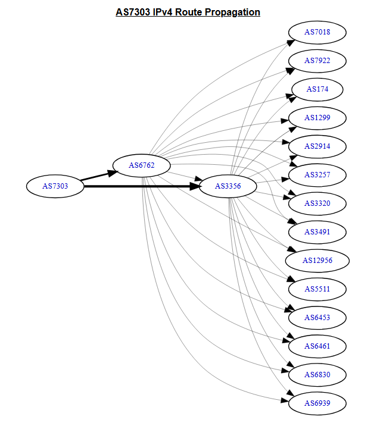
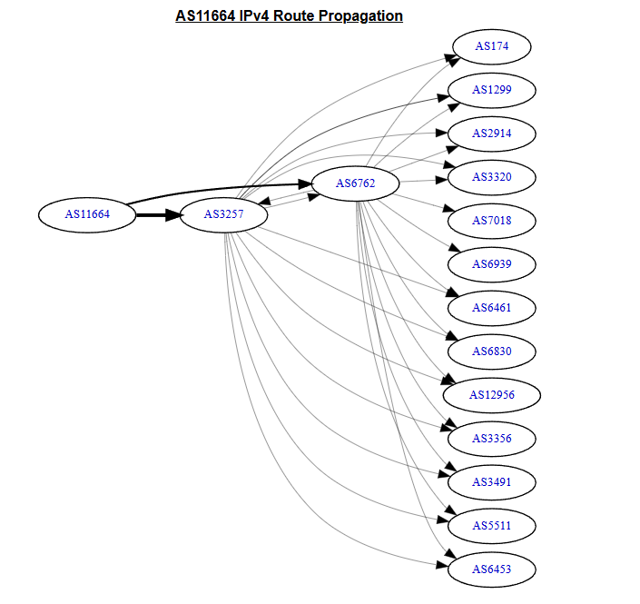
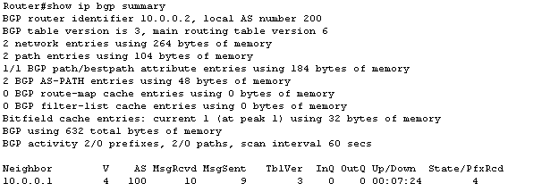
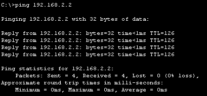
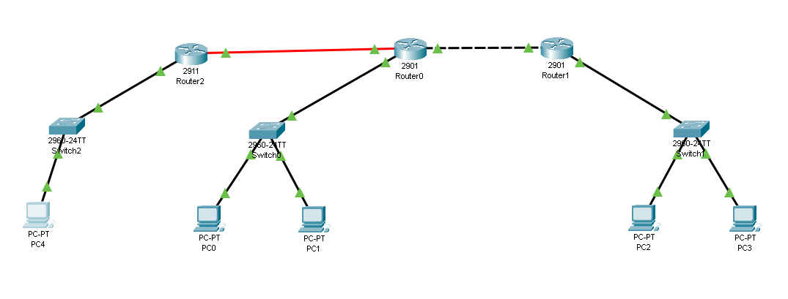
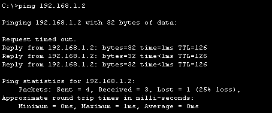
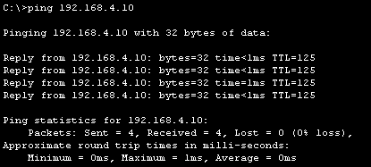

# Trabajo Práctico N° 4: Ruteo Externo Dinámico y Sistemas Autónomos

**Grupo**  
*NoLoSonIEEE*

**Integrantes**  
*Fernando E. Stefanovic Carroza*  
*Francisco J. Vásquez*  
*Sofía A. Ávalos*  
*Sofía Viale*  
*Tomás G. Daniel*

**Institución Educativa**  
*Universidad Nacional de Córdoba - Facultad de Ciencias Exactas, Físicas y Naturales*

**Curso**  
*Cátedra de Redes de Computadoras - Ciclo Lectivo 2025*

**Profesores**  
*Facundo N. Oliva Cuneo*  
*Santiago M. Henn*

**Fecha**  
*20/03/2025*

### Información de los Autores

**Fernando E. Stefanovic Carroza:** [*fernando.stefanovic@mi.unc.edu.ar*](mailto:fernando.stefanovic@mi.unc.edu.ar)  
**Sofia Viale:** [*sofia.viale@mi.unc.edu.ar*](mailto:sofia.viale@mi.unc.edu.ar)  
**Francisco J. Vásquez:** [*javier.vasquez@mi.unc.edu.ar*](mailto:javier.vasquez@mi.unc.edu.ar)  
**Tomas G. Daniel:** [*tomas.daniel@mi.unc.edu.ar*](mailto:tomas.daniel@mi.unc.edu.ar)  
**Sofía Aldana Ávalos:** [*aldana.avalos@mi.unc.edu.ar*](mailto:aldana.avalos@mi.unc.edu.ar)

## 1. Resumen
Este trabajo práctico explora los conceptos fundamentales del ruteo externo dinámico, centrándose en los Sistemas Autónomos (AS) y el Protocolo de Gateway Fronterizo (BGP). Se detalla la definición, estructura y función de los AS y sus números identificatorios (ASN), incluyendo la identificación del ASN de conexiones de red reales. Posteriormente, se profundiza en BGP, su funcionamiento, tipos de mensajes, y la distinción entre eBGP e iBGP. El informe también analiza las conexiones BGP de AS específicos, investiga un incidente de enrutamiento BGP con impacto significativo y concluye con una simulación práctica de una red con dos AS interconectados mediante BGP, explorando la configuración y el comportamiento del protocolo tanto en IPv4 como en IPv6.

## 2. Introducción
Internet es una vasta red de redes interconectadas, cuya operación coordinada depende de mecanismos de enrutamiento robustos y escalables. A gran escala, estas redes se organizan en Sistemas Autónomos (AS), cada uno con su propia política de enrutamiento y administración. La comunicación entre estos AS se gestiona principalmente a través del Border Gateway Protocol (BGP), el protocolo de enrutamiento exterior estándar de facto.

El presente trabajo tiene como objetivo principal comprender la estructura y el funcionamiento de los Sistemas Autónomos y el protocolo BGP. Se investigarán los números de AS (ASN), su conformación y ejemplos relevantes. Se analizará en detalle BGP, sus procedimientos funcionales, tipos de mensajes, y las diferencias entre sus variantes interna y externa. Además, se realizarán análisis prácticos de conexiones AS y se estudiará un caso histórico de fallo de enrutamiento BGP. Finalmente, se llevará a cabo una simulación en Packet Tracer para consolidar los conocimientos adquiridos sobre la configuración y operación de BGP en un entorno controlado.

## 3. Desarrollo

### 3.1. Sistemas Autónomos (AS) y Números de Sistema Autónomo (ASN)

#### 3.1.1. Definición de Sistema Autónomo (AS)
Un **Sistema Autónomo (Autonomous System - AS)** es un conjunto de redes IP (bloques de direcciones IP llamados "prefijos") que operan bajo una **única política de enrutamiento externa claramente definida** y son administradas por una **única entidad administrativa**.

**Características Clave:**

En esencia, Internet está compuesto por una vasta red de Sistemas Autónomos interconectados que intercambian información de alcance (reachability) usando BGP. Esto se evidencia debido a que esta  tecnología presenta características como las siguientes:


*   **Administración Única:** Una sola organización (como un proveedor de servicios de Internet (ISP), una gran empresa, una universidad o una agencia gubernamental) es responsable de la gestión y operación del AS.
*   **Política de Enrutamiento Común:** Todas las redes dentro del AS comparten y siguen las mismas reglas sobre cómo se enruta el tráfico hacia y desde otras redes externas (otros AS).
*   **Identificación Única:** Cada AS se identifica globalmente mediante un número único llamado ASN (Autonomous System Number).
*   **Protocolos de Enrutamiento:**
    *   **Internamente (Intra-AS):** Utilizan un Protocolo de Gateway Interior (IGP) como OSPF (Open Shortest Path First) o IS-IS (Intermediate System to Intermediate System) para intercambiar información de enrutamiento *dentro* del propio AS.
    *   **Externamente (Inter-AS):** Utilizan un Protocolo de Gateway Exterior (EGP), siendo **BGP (Border Gateway Protocol)** el estándar de facto en Internet, para intercambiar información de enrutamiento *entre* diferentes AS.


#### 3.1.2. El Número de Sistema Autónomo (ASN)
Un **Autonomous System Number (ASN)** es un **identificador numérico único** asignado a cada Sistema Autónomo. Es utilizado principalmente por el protocolo BGP para identificar de forma única a cada red en Internet y para aplicar políticas de enrutamiento entre ellas.

La asignación de ASN públicos requiere una justificación técnica ante el RIR correspondiente, demostrando la necesidad de una política de enrutamiento externa única o interconexión con múltiples AS.

**Conformación y Tipos:**

1.  **Formato Original (16 bits):**
    *   Inicialmente, los ASN eran números de 16 bits (rango 0-65535).
    *   **Rango Público:** 1 a 64511. Asignados por IANA a través de los Registros Regionales de Internet (RIRs como ARIN, RIPE NCC, APNIC, LACNIC, AFRINIC). Deben ser globalmente únicos.
    *   **Rango Privado:** 64512 a 65534. Pueden ser utilizados internamente por organizaciones para comunicación entre redes propias que usan BGP, pero *no deben* ser anunciados a la Internet pública global. Similar a las direcciones IP privadas (RFC 1918).
    *   **Reservados:** 0 y 65535 son reservados.

2.  **Formato Extendido (32 bits):**
    *   Debido al agotamiento del espacio de 16 bits, se introdujeron los ASN de 32 bits (definido en RFC 4893 y actualizado por RFC 6793).
    *   Esto amplió el rango a 0 a 4294967295 ($2^{32} - 1$).
    *   **Rango Público:** Incluye los números de 16 bits y se extiende hasta 4200000000 - 1.
    *   **Rango Privado:** 4200000000 a 4294967294.
    *   **Representación:** Los ASN de 32 bits se pueden escribir como un número entero simple (ej., `262144`) o en notación "asdot" (ej., `3.65536`, donde el primer número es el valor de los 16 bits superiores y el segundo el de los 16 bits inferiores).


#### 3.1.3. Ejemplos de ASN en Diferentes Entidades
A continuación, se presentan ejemplos de ASN pertenecientes a diversas organizaciones:

1.  **Empresa (Google LLC):**
    *   **ASN:** `AS15169`
    *   **Nombre:** GOOGLE
    *   **Descripción:** Este es uno de los principales ASN utilizados por Google para su infraestructura global y servicios como búsqueda, YouTube, Google Cloud, etc.

2.  **Universidad (Massachusetts Institute of Technology):**
    *   **ASN:** `AS3`
    *   **Nombre:** MIT-GATEWAYS
    *   **Descripción:** El MIT fue una de las primeras organizaciones en obtener un ASN, por eso tiene un número tan bajo. Lo utiliza para la red de su campus.

3.  **Organización (RIPE NCC - Réseaux IP Européens Network Coordination Centre):**
    *   **ASN:** `AS3333`
    *   **Nombre:** RIPE-NCC-AS
    *   **Descripción:** ASN perteneciente a uno de los Registros Regionales de Internet (RIR), responsable de la asignación de recursos de numeración de Internet (IPs, ASNs) en Europa, Medio Oriente y partes de Asia Central.

#### 3.1.4. Identificación del ASN de la Conexión Actual y Protocolos Soportados
Para averiguar el ASN de la conexión actual, se utilizó la herramienta en línea proporcionada por `bgp.he.net`.

*   **ASN:** `AS11664`
*   **Nombre de la Organización:** `Techtel LMDS Comunicaciones Interactivas S.A.`
*   **País:** `AR - Argentina`

**Protocolos Soportados por el AS:**
La información sobre qué protocolos específicos soporta un AS (más allá de BGP para interconexión) generalmente se deduce de los prefijos que anuncia y los servicios que ofrece el propietario del AS:

*   **IPv4:** Casi todos los AS del mundo anuncian prefijos IPv4. Esto se puede confirmar buscando los prefijos IPv4 anunciados por el ASN en herramientas como Hurricane Electric BGP Toolkit (`bgp.he.net`).
*   **IPv6:** La mayoría de los ISPs modernos y grandes organizaciones también anuncian prefijos IPv6. Si el ASN anuncia bloques IPv6, significa que soporta enrutamiento IPv6 en su red troncal.
*   **Multicast:** El soporte de multicast (para transmitir datos de uno a muchos) es más complejo. BGP puede usarse para transportar información de enrutamiento multicast entre AS (usando extensiones como MBGP), pero el soporte real depende de la implementación de protocolos multicast (como PIM) dentro de su red y acuerdos de peering multicast. Generalmente, se asume soporte básico si el ISP ofrece servicios que lo requieren (como IPTV gestionada).

Para el ASN `AS11664`, la verificación en `bgp.he.net` confirma el anuncio de prefijos IPv4. El soporte para IPv6 y multicast por parte de `Techtel LMDS Comunicaciones Interactivas S.A.` requeriría un análisis más detallado de sus anuncios y servicios.

### 3.2. Border Gateway Protocol (BGP)

#### 3.2.1. Definición de BGP
El **Border Gateway Protocol (BGP)** es el protocolo de enrutamiento exterior (Exterior Gateway Protocol - EGP) estándar de Internet. Su función principal es **intercambiar información de enrutamiento y alcanzabilidad entre diferentes Sistemas Autónomos (AS)**.

A diferencia de los protocolos de enrutamiento interior (Interior Gateway Protocols - IGPs) como OSPF o IS-IS, que se enfocan en encontrar la ruta más rápida *dentro* de una red única (un AS), BGP se enfoca en determinar las rutas *entre* las grandes redes que componen Internet (los AS).

**Características Clave de BGP:**

BGP es el protocolo que permite que las redes independientes (AS) se comuniquen y dirijan el tráfico globalmente basándose en rutas y políticas, y presenta las siguientes características:

1.  **Protocolo de Vector de Rutas (Path Vector):** BGP toma decisiones de enrutamiento basadas en **rutas (paths)**, que son secuencias de números de AS (AS_PATH) por los que debe pasar el tráfico para llegar a un destino. También considera **políticas** definidas por los administradores de red, no solo métricas técnicas como la velocidad o el número de saltos.
2.  **Fiabilidad:** Utiliza **TCP (Transmission Control Protocol)** como protocolo de transporte en el **puerto 179**. TCP garantiza una entrega ordenada y fiable de los mensajes BGP entre routers vecinos (peers).
3.  **Escalabilidad:** Está diseñado para manejar la enorme tabla de enrutamiento global de Internet. Utiliza actualizaciones incrementales.
4.  **Basado en Políticas:** Permite a las organizaciones implementar políticas complejas sobre cómo se anuncia su red y qué rutas prefieren.
5.  **Tipos de Sesiones:**
    *   **eBGP (External BGP):** Se establece entre routers en *diferentes* AS.
    *   **iBGP (Internal BGP):** Se establece entre routers *dentro* del mismo AS para distribuir rutas eBGP aprendidas.


#### 3.2.2. Funcionamiento de BGP: Procedimientos Funcionales
El funcionamiento de BGP se puede entender a través de tres procedimientos clave:

##### 3.2.2.1. Adquisición de Vecino (Neighbor Acquisition)
Este proceso establece una sesión BGP entre dos routers configurados como vecinos.
*   **Configuración Manual:** Los administradores configuran explícitamente la IP y el AS del vecino.
*   **Conexión TCP:** Se inicia una conexión TCP al puerto 179 del vecino.
*   **Intercambio de Mensajes `OPEN`:** Contienen:
    *   **Versión de BGP:** (Actual: BGP-4).
    *   **Mi AS (My Autonomous System):** ASN del emisor.
    *   **Hold Time:** Tiempo máximo sin recibir `KEEPALIVE` o `UPDATE` antes de declarar la conexión caída. Se negocia el mínimo.
    *   **BGP Identifier:** IP única (usualmente loopback) que identifica al router BGP.
    *   **Parámetros Opcionales:** Capacidades adicionales (soporte MP-BGP, ASN de 4 bytes, etc.).
*   **Establecimiento de la Sesión:** Si los parámetros son aceptados, se responde con `KEEPALIVE` y la sesión pasa a **Established**. Errores resultan en `NOTIFICATION` y cierre de conexión.

##### 3.2.2.2. Detección de Vecino Alcanzable (Neighbor Reachability)
Mecanismo para asegurar que el vecino sigue activo.
*   **Mensajes `KEEPALIVE`:** Intercambiados periódicamente (típicamente cada tercio del Hold Time).
*   **Detección de Fallo:** Si no se recibe `KEEPALIVE` o `UPDATE` dentro del Hold Time, se asume fallo.
*   **Acción ante Fallo:** Sesión BGP y conexión TCP se cierran, rutas aprendidas del vecino se eliminan. Se intenta restablecer la sesión.

##### 3.2.2.3. Detección de Red Alcanzable (Network Reachability)
Compartición de información sobre qué redes (prefijos IP) son alcanzables y por qué camino.
*   **Mensajes `UPDATE`:** Intercambian toda la información de rutas. Pueden anunciar nuevas rutas o retirar rutas inválidas.
*   **Contenido de un Mensaje `UPDATE`:**
    *   **Withdrawn Routes:** Lista de prefijos IP ya no alcanzables.
    *   **Path Attributes (PAs):** Características de la ruta (ej., `AS_PATH`, `NEXT_HOP`, `ORIGIN`, `LOCAL_PREF`, `MED`).
    *   **Network Layer Reachability Information (NLRI):** Lista de prefijos IP alcanzables a través de la ruta descrita.
*   **Proceso:** Se envían `UPDATE` solo con cambios (incremental).

##### 3.2.2.4. Tipos de Mensajes BGP
BGP utiliza cinco tipos principales de mensajes:

1.  **`OPEN` (Tipo 1):** Inicia una sesión BGP y negocia parámetros.
2.  **`UPDATE` (Tipo 2):** Transfiere información de enrutamiento (anuncia/retira rutas).
3.  **`NOTIFICATION` (Tipo 3):** Indica un error y cierra la sesión BGP.
4.  **`KEEPALIVE` (Tipo 4):** Mantiene activa la sesión BGP en ausencia de `UPDATEs`.
5.  **`ROUTE-REFRESH` (Tipo 5):** (Capacidad Opcional) Permite solicitar reenvío de información de enrutamiento sin reiniciar la sesión.

##### 3.2.2.5. Formato General de Paquetes BGP (Cabecera)
Todos los mensajes BGP comparten una cabecera común de 19 bytes, donde el payload específico asociado al mensaje seguira a esta cabecera y variará segu el `Type`:

*   **Marker (16 bytes):** Originalmente para autenticación/sincronización. En BGP-4 sobre TCP, usualmente todo a unos (`0xFF...FF`). La autenticación se maneja con opciones TCP (MD5, TCP-AO).
*   **Length (2 bytes):** Longitud total del mensaje BGP (cabecera + payload), mín. 19, máx. 4096 bytes.
*   **Type (1 byte):** Tipo de mensaje BGP (1-OPEN, 2-UPDATE, 3-NOTIFICATION, 4-KEEPALIVE, 5-ROUTE-REFRESH).


#### 3.2.3. Diferencias entre BGP Externo (eBGP) y BGP Interno (iBGP) y Análisis de AS de Tránsito
El Border Gateway Protocol (BGP) tiene dos variantes principales:

*   **BGP Externo (eBGP):** Se utiliza para el intercambio de información de enrutamiento entre routers de *diferentes* Sistemas Autónomos. En eBGP, el atributo `AS_PATH` se actualiza añadiendo el ASN del AS desde el cual se anuncia la ruta, lo que es crucial para la detección de bucles y la aplicación de políticas. Las sesiones eBGP típicamente se establecen entre routers directamente conectados.

*   **BGP Interno (iBGP):** Se emplea para propagar información de rutas *dentro* de un mismo Sistema Autónomo. Las rutas aprendidas vía eBGP por un router de borde se distribuyen a otros routers dentro del mismo AS mediante iBGP. Una regla fundamental de iBGP es que las rutas aprendidas de un par iBGP no se anuncian a otros pares iBGP (para evitar bucles dentro del AS). Esto implica la necesidad de una topología full-mesh entre routers iBGP, o el uso de mecanismos como *route reflectors* o *confederaciones*. En iBGP, el atributo `AS_PATH` no se modifica.

**Análisis de AS de Tránsito:**
Considerando un escenario con AS1 (R1), AS2 (R2, R3) y AS3 (R4), donde R1-R2 y R3-R4 son eBGP, y R2-R3 es iBGP (dentro de AS2). Si un paquete se origina en AS1 (destinado a AS3), AS2 actúa como un **AS de tránsito**. Recibe tráfico de AS1 y lo reenvía hacia AS3, utilizando iBGP para comunicar la ruta externa dentro de sus propios routers (R2 a R3).

#### 3.2.4. Análisis de Conexiones eBGP del AS de la Conexión Actual
Utilizando la herramienta `bgp.he.net`, se analizaron las conexiones del AS `AS7303` (identificado en una de las pruebas de conexión, diferente al `AS11664` mencionado anteriormente, asumimos que esta sección corresponde a otra prueba).
El AS7303 muestra conexiones eBGP directas con:
*   AS6762
*   AS3356

Ambas son conexiones con AS diferentes, constituyendo dos sesiones eBGP.



#### 3.2.5. Comparativa de Conexiones eBGP en una Red Alternativa
Al cambiar a otra red (por ejemplo, 4G), se identificó un nuevo AS para la conexión. Una similitud observada con el AS anterior (AS7303) es que ambos pueden tener un número similar de pares eBGP directos o compartir algunos pares comunes, como `AS6762`. Esto puede indicar que `AS6762` es un proveedor de tránsito importante en la región. Las diferencias radicarán en los otros pares eBGP, reflejando las distintas políticas de interconexión del nuevo AS.



#### 3.2.6. Incidente de Enrutamiento BGP: Caso de BGP Hijacking (Cloudflare, junio de 2019)
El BGP Hijacking (secuestro de rutas) ocurre cuando un AS anuncia prefijos que no le pertenecen, desviando tráfico.

**Incidente de Cloudflare (24 de junio de 2019):**
Afectó a servicios globales como Cloudflare, Google, Facebook y AWS.
*   **Origen:** AS37282 (MainOne Cable Company, Nigeria) propagó por error rutas de otros AS, incluyendo prefijos de Cloudflare.
*   **Agravante:** China Telecom (AS4134), un proveedor Tier-1, aceptó y retransmitió estas rutas erróneas, magnificando el impacto globalmente.

**Causas Identificadas:**
*   Hubo configuración incorrecta de los anuncios BGP en AS37282.
*   Ausencia de políticas de filtrado adecuadas en AS4134 (y otros) para validar la legitimidad de los anuncios de ruta.
*   Falta de implementación generalizada de mecanismos de validación, como RPKI (Resource Public Key Infrastructure).

**Consecuencias Observadas:**
*   Interrupciones parciales en la conectividad de servicios, causando pérdida de paquetes, aumento de latencia y desconexiones.
*   Riesgo potencial de interceptación de tráfico (ataques Man-in-the-Middle).
*   Renovado debate sobre la urgencia de implementar medidas de seguridad en BGP (ej., RPKI, BGPsec).


### 3.3. Simulación Práctica en Packet Tracer

Se realizó una simulación configurando dos Sistemas Autónomos, AS100 y AS200, interconectados mediante BGP.

**Configuración Inicial y BGP IPv4:**

1.  Se asignaron direcciones IP a los hosts y a las interfaces de los routers (R0 en AS100, R1 en AS200) según la tabla de direccionamiento.
2.  Se configuró BGP en R0 (AS 100) y R1 (AS 200):

    *   **Router 0 (AS100):**
        ```routeros
        enable
        configure terminal
        router bgp 100
        bgp router-id 10.0.0.1
        neighbor 10.0.0.2 remote-as 200
        network 192.168.1.0 mask 255.255.255.0
        end
        write memory
        ```

    *   **Router 1 (AS200):**
        ```routeros
        enable
        configure terminal
        router bgp 200
        bgp router-id 10.0.0.2
        neighbor 10.0.0.1 remote-as 100
        network 192.168.2.0 mask 255.255.255.0
        end
        write memory
        ```
3.  Se verificó el establecimiento de la adyacencia BGP con `show ip bgp summary` en ambos routers.\
    
4.  Se probó la conectividad IPv4 entre un host en AS100 (h0: 192.168.1.2) y un host en AS200 (h2: 192.168.2.2) mediante ping, resultando exitoso.\
    

    
**Simulación de Fallo de Enlace/Router:**

Se realizó una prueba de tráfico continuo (`ping -t 192.168.2.2` desde h0) y se deshabilitó R0.
*   **Observaciones:** La comunicación entre AS100 y AS200 se interrumpió. Los paquetes ICMP de h0 no pudieron ser enrutados más allá de Switch0. En R1, la adyacencia BGP con R0 expiró, y R1 eliminó la ruta hacia 192.168.1.0/24 de su tabla de enrutamiento.

**Configuración IPv6:**

Se procedió a configurar IPv6 en las interfaces de los routers y en los hosts:

*   **Router 0:**
    *   Gi0/0 (a R1): `2001:DB8:12:1::1/64`
    *   Gi0/1 (a LAN AS100): `2001:DB8:100:1::1/64`
*   **Router 1:**
    *   Gi0/0 (a R0): `2001:DB8:12:1::2/64`
    *   Gi0/1 (a LAN AS200): `2001:DB8:200:2::1/64`
*   **Hosts:**
    *   h0: `2001:DB8:100:1::10/64` (Gateway: `2001:DB8:100:1::1`)
    *   h1: `2001:DB8:100:1::11/64` (Gateway: `2001:DB8:100:1::1`)
    *   h2: `2001:DB8:200:2::20/64` (Gateway: `2001:DB8:200:2::1`)
    *   h3: `2001:DB8:200:2::21/64` (Gateway: `2001:DB8:200:2::1`)

**Desafíos con BGP IPv6 en Packet Tracer:**

La versión de simulación del IOS en Packet Tracer utilizada presentó limitaciones para configurar BGP para la familia de direcciones IPv6 (`address-family ipv6 unicast`).

Esta problemática es de público conocimiento (https://learningnetwork.cisco.com/s/question/0D53i00000Kt6P3CAJ/bgp-with-ipv6-in-packet-tracer).

Por lo tanto, para probar la conectividad IPv6 entre AS, se recurrió a la configuración de rutas estáticas IPv6 entre los routers.

Con rutas estáticas IPv6 configuradas:
```routeros
R0(config)# ipv6 route 2001:DB8:200:2::/64 2001:DB8:12:1::2
R1(config)# ipv6 route 2001:DB8:100:1::/64 2001:DB8:12:1::1
```

Un `traceroute` desde h0 a h2 (IPv6) indicó que el paquete llegaba a la interfaz WAN de R1. Sin embargo, la simulación del flujo de paquetes en Packet Tracer sugirió un manejo incorrecto posterior en R1, con paquetes que parecían ser reenviados prematuramente o devueltos, indicando una posible anomalía en la simulación o un problema de procesamiento en R1 a pesar de tablas de enrutamiento aparentemente correctas. El tráfico IPv6 end-to-end no se completó satisfactoriamente en este escenario simulado con rutas estáticas inter-AS.

### 3.4. Tabla de Direccionamiento de Red para la Simulación

| Equipo | Interfaz           | IP de Red (Subred IPv4) | IPv4          | Máscara IPv4  | IP de Red (Subred IPv6) | IPv6                | Prefijo IPv6 | Gateway por Defecto (IPv4) | Gateway por Defecto (IPv6) | Comentarios                       |
| :----- | :----------------- | :---------------------- | :------------ | :------------ | :---------------------- | :------------------ | :----------- | :------------------------- | :------------------------- | :-------------------------------- |
| **R0** | GigabitEthernet0/0 | 10.0.0.0/24             | 10.0.0.1      | 255.255.255.0 | 2001:DB8:12:1::/64      | 2001:DB8:12:1::1    | /64          | N/A                        | N/A                        | Interfaz WAN a R1 (AS200)         |
| **R0** | GigabitEthernet0/1 | 192.168.1.0/24          | 192.168.1.1   | 255.255.255.0 | 2001:DB8:100:1::/64     | 2001:DB8:100:1::1   | /64          | N/A                        | N/A                        | Interfaz LAN para AS100           |
| **R1** | GigabitEthernet0/0 | 10.0.0.0/24             | 10.0.0.2      | 255.255.255.0 | 2001:DB8:12:1::/64      | 2001:DB8:12:1::2    | /64          | N/A                        | N/A                        | Interfaz WAN a R0 (AS100)         |
| **R1** | GigabitEthernet0/1 | 192.168.2.0/24          | 192.168.2.1   | 255.255.255.0 | 2001:DB8:200:2::/64     | 2001:DB8:200:2::1   | /64          | N/A                        | N/A                        | Interfaz LAN para AS200           |
| **h0** | FastEthernet0      | 192.168.1.0/24          | 192.168.1.2   | 255.255.255.0 | 2001:DB8:100:1::/64     | 2001:DB8:100:1::10  | /64          | 192.168.1.1                | 2001:DB8:100:1::1          | Host en AS100                     |
| **h1** | FastEthernet0      | 192.168.1.0/24          | 192.168.1.3   | 255.255.255.0 | 2001:DB8:100:1::/64     | 2001:DB8:100:1::11  | /64          | 192.168.1.1                | 2001:DB8:100:1::1          | Host en AS100                     |
| **h2** | FastEthernet0      | 192.168.2.0/24          | 192.168.2.2   | 255.255.255.0 | 2001:DB8:200:2::/64     | 2001:DB8:200:2::20  | /64          | 192.168.2.1                | 2001:DB8:200:2::1          | Host en AS200                     |
| **h3** | FastEthernet0      | 192.168.2.0/24          | 192.168.2.3   | 255.255.255.0 | 2001:DB8:200:2::/64     | 2001:DB8:200:2::21  | /64          | 192.168.2.1                | 2001:DB8:200:2::1          | Host en AS200                     |

### 3.5. Agregado de Dispositivos y Configuración de Enrutamiento Interno

En esta sección, se procede a expandir la topología de red del Sistema Autónomo AS100. Se incorporará un nuevo router (Router2), un switch adicional y una nueva estación de trabajo (PC4). La disposición física de estos nuevos componentes se ilustra a continuación:



### 3.5.1. Configuración de OSPF para Enrutamiento Intra-AS
Para asegurar la conectividad interna completa dentro de AS100, permitiendo que todos los dispositivos alcancen todas las subredes internas, se configurará el protocolo de enrutamiento OSPF (Open Shortest Path First) en Router0 y Router2. Se utilizará el proceso OSPF ID 1 y el área 0 (área de backbone).

*   **Configuración en Router0:**
    Se anuncian tanto la red LAN original (`192.168.1.0/24`) como la nueva red de interconexión con Router2 (`192.168.3.0/24`).

    ```routeros
    Router0(config)# router ospf 1
    Router0(config-router)# router-id 0.0.0.1
    Router0(config-router)# network 192.168.1.0 0.0.0.255 area 0
    Router0(config-router)# network 192.168.3.0 0.0.0.255 area 0
    Router0(config-router)# end
    ```

*   **Configuración en Router2:**
    Se anuncian la nueva red LAN (`192.168.4.0/24`) y la red de interconexión con Router0 (`192.168.3.0/24`).

    ```routeros
    Router2(config)# router ospf 1
    Router2(config-router)# router-id 0.0.0.2
    Router2(config-router)# network 192.168.4.0 0.0.0.255 area 0
    Router2(config-router)# network 192.168.3.0 0.0.0.255 area 0
    Router2(config-router)# end
    ```

Una vez aplicada la configuración OSPF, se verifica la conectividad interna dentro de AS100 mediante un ping entre PC0 (en la red `192.168.1.0/24`) y PC4 (en la red `192.168.4.0/24`).



La imagen confirma que la comunicación entre PC4 y PC0 es exitosa, indicando que OSPF ha establecido correctamente las rutas internas en AS100.

### 3.5.2. Redistribución de Rutas OSPF en BGP
Para que el Sistema Autónomo AS200 pueda conocer y alcanzar la nueva subred es necesario que Router0 anuncie esta red a Router1 (en AS200) a través de BGP. Dado que Router0 aprendió la ruta hacia `192.168.4.0/24` mediante OSPF, se debe realizar una redistribución de las rutas OSPF en el proceso BGP de Router0.

Los siguientes comandos se ejecutan en Router0:

```routeros
Router0> enable
Router0# configure terminal
Router0(config)# router bgp 100
Router0(config-router)# redistribute ospf 1
Router0(config-router)# end
```

Tras la redistribución, se puede verificar la tabla BGP en Router0 con `show ip bgp`. En Router1 (AS200), la misma red debería aparecer con `10.0.0.1` (IP de Router0) como next-hop.

### 3.5.3. Prueba de Conectividad Inter-AS
Con las rutas OSPF redistribuidas en BGP, se procede a verificar la conectividad desde un host en AS200 (PC2) hacia el nuevo host en AS100 (PC4).



Como se observa en la captura, el ping es exitoso. Esto demuestra que Router1 (AS200) ha aprendido la ruta hacia la red a través de BGP, gracias a la redistribución configurada en Router0 (AS100).

## 4. Conclusión

La fase práctica de este trabajo, desarrollada a través de la simulación en Packet Tracer, ha sido fundamental para consolidar los conceptos teóricos del enrutamiento inter-AS con BGP y la interacción con protocolos de enrutamiento intra-AS como OSPF.

Inicialmente, se estableció con éxito una comunicación básica entre dos Sistemas Autónomos (AS100 y AS200) mediante la configuración de eBGP para IPv4. Esta etapa permitió verificar el intercambio de información de alcanzabilidad y la correcta formación de adyacencias BGP, así como observar la respuesta del protocolo ante fallos simulados en la red. Si bien se exploró la configuración de direccionamiento IPv6, las limitaciones de la herramienta de simulación para la implementación completa de BGP para esta familia de direcciones dirigieron el enfoque hacia el uso de rutas estáticas para demostrar la conectividad IPv6 inter-AS.

Posteriormente, el trabajo se centró en la expansión de la infraestructura interna de AS100. La introducción de un nuevo router, switch y host, junto con la implementación de OSPF como protocolo de gateway interior (IGP), demostró la capacidad de establecer y verificar la conectividad completa dentro de un mismo Sistema Autónomo. Este paso fue crucial para preparar el escenario para un concepto más avanzado: la interacción entre el IGP y el EGP.

El hito principal de esta fase extendida fue la configuración de la redistribución de rutas OSPF en el proceso BGP del router de borde (Router0). Este procedimiento es esencial en redes reales para anunciar las redes internas de un AS al mundo exterior. Las pruebas de conectividad subsiguientes, que permitieron a un host en AS200 alcanzar la nueva red interna de AS100 (previamente conocida solo vía OSPF), validaron de manera concluyente el éxito de la redistribución.

Estos ejercicios prácticos han subrayado la importancia de una configuración meticulosa tanto de BGP como de los IGPs, y cómo la redistribución de rutas actúa como un puente vital entre estos dos mundos del enrutamiento. La capacidad de verificar cada paso mediante comandos como `show ip bgp summary`, `show ip route`, y pruebas de `ping`, reforzó la comprensión del flujo de información y la toma de decisiones de los routers.

En resumen, esta sección práctica del trabajo no solo ha permitido aplicar los conocimientos teóricos sobre BGP y OSPF, sino también comprender de manera tangible cómo las redes se interconectan y cómo la información de enrutamiento se propaga y se gestiona a través de diferentes dominios de enrutamiento para lograr la conectividad global o interdepartamental.
